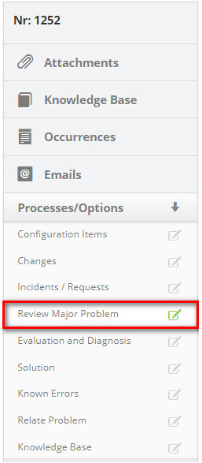

title: Registering serious problem resolution
Description: This functionality enables you to record serious problem
resolution.

# Registering serious problem resolution

This functionality enables you to record serious problem resolution.

How to access
-------------

1.  Access the serious problem solving logging feature by navigating the main
    menu **Process Management > Problem Management > Problem
    Management**.

Preconditions
-------------

1.  No applicable.

Filters
-------

1.  The following filter enables the user to restrict the participation of items
    in the standard feature listing, making it easier to find the desired items:

-   Problem Number.

**Figure 1 - Filters screen**

Items list
----------

1.  The following cadastral fields are available to the user to facilitate the
    identification of the desired items in the standard listing of the
    functionality: Number, Title, Contract, Created on, Priority, Time
    limit, User, Status, Current Task, Executor Group and Current
    Responsible.

2.  There are action buttons available to the user in relation to each item in
    the listing, they are: *View*, *Reports* and *Action*.

**Figure 2 - Problem listing screen**

Filling in the registration fields
----------------------------------

In this step, you should verify that the solution you have applied solved the
problem. Check if a change, if any, is required to submit a change request (RDM)
to the Change Management process. If a change is not required, take the
necessary actions to solve the problem and recover the service. Record the
complete details of the solution and actions in the Problem.

1.  On the Management tab, locate the problem record that you want to log the
    resolution to, click the *Action* button and select the Start/Execute task
    option, as shown in the image below:

   
   
   **Figure 3 - Problem management screen**

2.  The **Problem Log** screen with the filled fields for the selected record
    will be displayed.

   -   In the **Closure** frame, record the information needed to complete the
    task:

   -   Click the *Add an Execution Register button*;

   -   Describe the information about the execution of your activity.

   -   Record the serious problem review information;

   -   Click the** Processes/Options** tab, and then click **Review Major Problem
    ,** located on the right-hand corner of the screen, as shown in the figure
    below:

   
   
   **Figure 4 - Serious problem review guide**

   -   The critical problem review screen appears, as shown in the figure below:

   
   
   **Figure 5 - Serious problem review registration screen**

   -   Fill in the fields with the required information.

   -   Inform the change if necessary to solve the problem.

   -   Click on the **Processes/Options** tab and then on **Changes**, located in
    the right corner of the screen, as indicated in the figure below:

   
   
   **Figure 6 - Change guide**

   -   Click on the icon  to search for the change that will be made to solve the
    problem;

   -   A change search screen will be displayed. Perform the search and select the
    desired change. After this, the change will be related to the problem;

   
   
   **Figure 7 - Change relationships screen**

   -   If you want to remove a change that was related to solve the problem, just
    click the change icon  .

   -   If you do not find the change and need to register a change request, you can
    register it in the system from this screen, just click the change icon  .

   -   In the **Closure** table, record the information about the solution that was
    performed:

   -   **Cause**: select the cause of the problem;

   -   **Solution**: select the problem solution category, that is, what was used
    to solve the problem;

   -   **Closure**: enter the details of the solution found for the problem.

   -   After recording the problem resolution information, click the *Save and
    Forward Flow* button to perform the operation, where the problem and related
    incidents will be successfully completed;

   -   If you want to save only the logged information about the problem resolution
    and keep the current job, click the *Save and Keep the Current Task* button;

   -   In both previous cases, the date, time and user will be automatically saved
    for a future audit.

!!! tip "About"

    <b>Product/Version:</b> CITSmart | 8.00 &nbsp;&nbsp;
    <b>Updated:</b>08/29/2019 – Anna Martins
