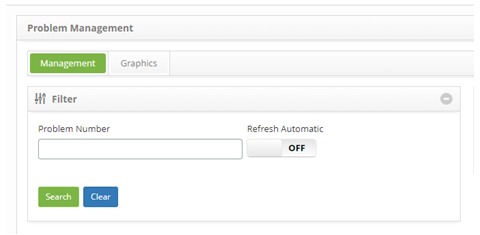

title: Problem resolution registration
Description: This functionality allows you to log the problem resolution.

# Problem resolution registration

This functionality allows you to log the problem resolution.

How to access
-------------

1.  Access the problem resolution logging feature by navigating to the main
    menu **Process Management > Problem Management > Problem Management**.

Preconditions
-------------

1.  Have problem registered.

Filters
-------

1.  The following filter enables the user to restrict the participation of items
    in the standard feature listing, making it easier to find the desired items:

    - Problem Number.

    

    **Figure 1 - Filters screen**

Items list
----------

1.  The following cadastral fields are available to the user to facilitate the
    identification of the desired items in the standard listing of the
    functionality: Number, Title, Contract, Created on, Priority, Time
    limit, User, Status, Current Task, Executor Group and Current
    Responsible.

2.  There are action buttons available to the user in relation to each item in
    the listing, they are: *View*, *Reports* and *Action*.

**Figure 2 - Problem listing screen**

Filling in the registration fields
----------------------------------

In this step, you should verify that the solution you have applied solved the
problem. Check if a change, if any, is required to submit a change request (RDM)
to the Change Management process. If a change is not required, take the
necessary actions to solve the problem and recover the service. Record the
complete details of the solution and actions in the Problem.

!!! note "NOTE"

    The member of the group designated for resolution must capture the problem and start the activity.

1.  On the Management tab, locate the problem record that you want to log the
    resolution to, click the *Action* button and select the *Start/Execute
    task* option, as shown in the image below:

    
   
    **Figure 3 - Problem management screen**

2.  The **Problem Registration** screen with the filled fields for the selected
    problem will be displayed. In the **Closing** table, record the necessary
    information:

-   Record the execution information of the problem resolution task;

    -   Click the *Closure* button and describe the information about running
        your activity.

-   Record the information about the solution that was performed:

    - **Cause**: select the cause of the problem;

   -  **Closure**: enter the details of the solution found for the problem.

   - **Solution**: select the problem solution category, that is, what was used
    to solve the problem;

-   After recording the problem resolution information, click the *Save and
    Forward Flow* button and advance the flow to perform the operation, where
    the problem and related incidents will be successfully completed;

-   If you want to save only the logged information about the problem resolution
    and keep the current job, click the *Save and Keep the Current Task* button
    and keep the current task;

-   In both previous cases, the date, time and user will be automatically saved
    for a future audit.

!!! tip "About"

    <b>Product/Version:</b> CITSmart | 8.00 &nbsp;&nbsp;
    <b>Updated:</b>08/29/2019 – Anna Martins
