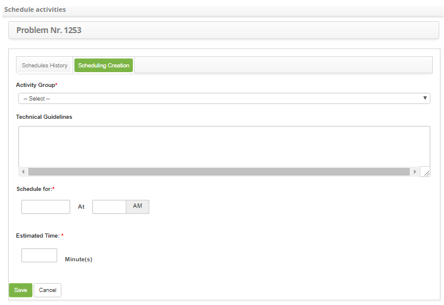

title: Problem activity scheduling
Description: This functionality allows you to create and view activity scheduling for the problem log.

# Problem activity scheduling

This functionality allows you to create and view activity scheduling for the
problem log.

How to access
-------------

1.  Access the activity scheduling feature by navigating the main menu **Process
    Management > Problem Management > Problem Management**.

Preconditions
-------------

1.  Have at least one problem registered (see knowledge[Problem
    registration][1]);

2.  Have the periodic activity group registered (see knowledge [Periodic
    activity group registration and search][2]).

Filters
-------

1.  The following filter enables the user to restrict the participation of items
    in the standard feature listing, making it easier to find the desired items:

-   Problem number.

**Figure 1 - Problem search screen**

Items list
----------

1.  The following cadastral fields are available to the user to facilitate the
    identification of the desired items in the standard listing of the
    functionality: Number, Title, Contract, Created on, Priority, Time
    limit, User, Status, Current Task, Executor Group and Current
    Responsible.

2.  There are action buttons available to the user in relation to each item in
    the listing, they are: *View*, *Reports* and *Action*.

**Figure 2 - Problem listing screen**

Activity scheduling
-------------------

1.  On the **Management** tab, locate the problem record that you want to
    schedule the activity, click the *Action* button and select the *Schedule
    Activity* option, as shown in the image below:

   
   
   **Figure 3 - Problem management screen**

2.  A window will appear to schedule activities containing two tabs, one
    for **Scheduling History** and one for **Create Scheduling**;

   -   In the **Schedule History** tab, the Schedules of the activities that were
    created will be listed;

**Figure 4 - Activity scheduling history**

Filling in the registration fields
----------------------------------

1.  In the **Scheduling Creation** tab, there are fields that must be filled in
    to schedule the activity for the log problem, as follows:

   
   
   **Figure 5 - Creating activity scheduling**

   -   **Activity Group:** select the Activity Group to schedule the activity;

   -   **Technical Guidance**: inform the Technical Guidance of the activity;

   -   **Schedule for**: inform the date and time, period that will be scheduled to
    carry out the activity;

   -   **Estimated Time**: enter the estimated duration in minutes, ie the time it
    will take to perform the activity.

2.  Click the *Save* button to perform the operation, where the date, time and
    user will be saved automatically for a future audit;

3.  A message confirming the successful scheduling of the activity will be
    displayed.

[1]:/en-us/citsmart-platform-7/processes/problem/register-problem.html
[2]:/en-us/citsmart-platform-7/additional-features/automation-of-operation/configuration/periodic-activity-group.html

!!! tip "About"

    <b>Product/Version:</b> CITSmart | 8.00 &nbsp;&nbsp;
    <b>Updated:</b>08/28/2019 – Anna Martins
