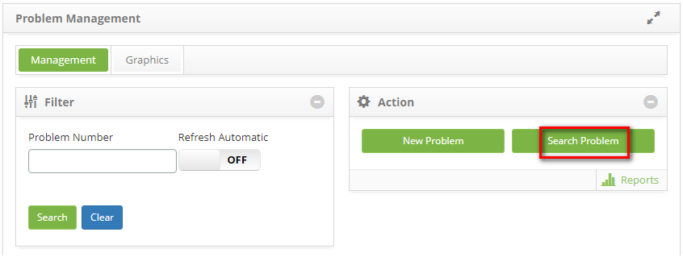
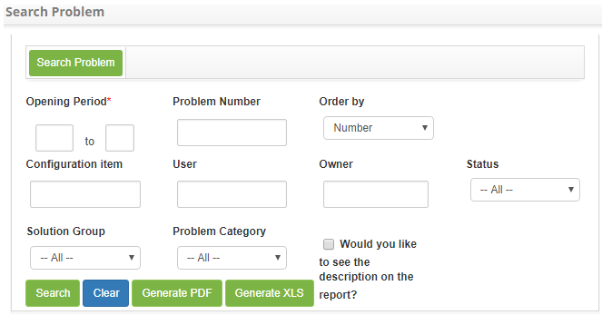
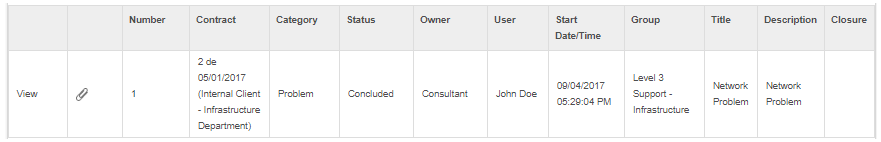
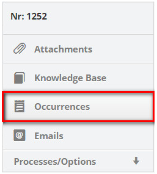
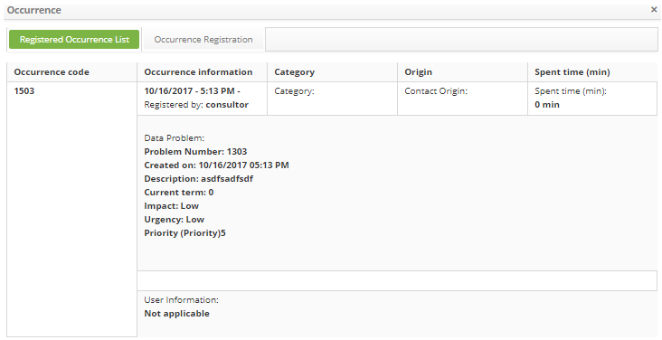

title: Problems searching
Description: The purpose is to look for problems that occur according to user-defined filters.

# Problems searching

The purpose is to look for problems that occur according to user-defined
filters.

How to access
-------------

1.  Access the problem search functionality by navigating the main
    menu **Process Management > Problem Management > Problem
    Management**.

Preconditions
-------------

1.  Not applicable.

Filters
-------

1.  The following filters enable the user to restrict the participation of items
    in the standard feature listing, making it easier to locate the desired
    items:

   -   Problem Number.

2.  On the Management tab, click the *Problem Search* button as indicated in the
    figure below:

   

   **Figure 1 - Problem management screen**

3.  The **Problem Search** screen is displayed containing fields where you can
    define the filters necessary for your search;

   
   
   **Figure 2 - Problem screen**

   -   **Opening period**: enter the desired period;

   -   **Problem Number**: enter the problem registration number;

   -   **Order by**: select sorting;

   -   **Configuration Item**: enter the configuration item for the problem you
    want to search;

   -   **User**: inform the applicant of the problem you wish to search;

   -   **Owner**: please inform the owner of the problem you want to search for;

   -   **Status**: select the status for the problem you want to search;

   -   **Solution group**: select the solver group for the problem you want to
    search;

   -   **Problem Category**: select the category of the problem;

   -   If you want the problem description to be displayed in the report, check
    the **Would you like to see the description on the report?**.

4.  After the filters are defined, click the *Search* button to perform the
    operation;

5.  The problem logs, according to the filters chosen, will be listed below the
    Search, Clear, and Generate reports buttons;

6.  Next to each problem record in the list, there are icons that allow you to
    perform the following actions: view the information and the attachments of
    the problem record;

7.  If necessary, click the *Generate PDF* button to generate the problem report
    in PDF format;

8.  If necessary, click the *Generate XLS* button to generate the problem report
    in Excel format.

Items list
----------

1.  The following cadastral fields are available to the user to facilitate the
    identification of the desired items in the standard listing of the
    functionality: Number, Contract, Category, Status, Owner, User, Start
    Date/Time, Group, Title, Description and Closure.

2.  There are action buttons available to the user for each item in the listing,
    they are: *View* and *View attachments*.

    
    
    **Figure 3 - Problem search listing screen**

3.  To view the request attachments, click the icon  . A window will open
    displaying the record of the given problem for viewing.

Filling in the registration fields
----------------------------------

1.  Not applicable.

Viewing trouble ticket information
----------------------------------

1.  After the search, you can view the information in the problem log by simply
    clicking *View* (according to previous figure);

   -   The registration screen for the given problem will be displayed for viewing.
    Click the **Occurrence** tab, located in the upper right corner of the
    screen, as shown in the figure below:

   
   
   **Figure 4 - Occurrences guide**

-   The occurrence screen will be displayed, as shown in the figure below:

   
   
   **Figure 5 - Occurrence history screen**

!!! tip "About"

    <b>Product/Version:</b> CITSmart | 8.00 &nbsp;&nbsp;
    <b>Updated:</b>08/29/2019 – Anna Martins
