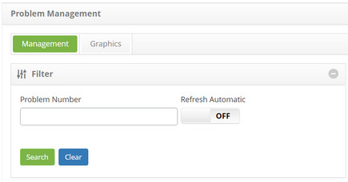

title: Problem suspension
Description: This functionality allows you to suspend the problem log.

# Problem suspension

This functionality allows you to suspend the problem log.

How to access
-------------

1.  Access the problem suspension feature by navigating the main menu **Process
    Management > Problem Management > Problem Management**.

Preconditions
-------------

1.  Have problem registered (see knowledge [Problem registration][1]);

2.  Enter problem justification (see knowledge [Problem justification
    registration and search][2]).

Filters
-------

1.  The following filters enable the user to restrict the participation of items
    in the standard feature listing, making it easier to locate the desired
    items:

-   Problem Number

**Figure 1 - Problem Search Screen**

Items list
----------

1.  The following cadastral fields are available to the user to facilitate the
    identification of the desired items in the standard listing of the
    functionality: Number, Title, Contract, Created on, Priority, Time
    limit, User, Status, Current Task, Executor Group and Current
    Responsible.

2.  There are action buttons available to the user in relation to each item in
    the listing, they are: *View*, *Reports* and *Action*.

**Figure 2 - Problem listing screen**

Filling in the registration fields
----------------------------------

1.  Not applicable.

Suspending problem
------------------

1.  On the **Management** tab, locate the problem log that you want to suspend,
    click the *Action* button and the Suspend/Reactivate option, as shown in the
    figure below:

   
   
   **Figure 3 - Problem management screen**

2.  A window will appear to record the justification for suspending the problem:

   
   
   **Figure 4 - Record of suspension justification of the problem**

   -   **Justification**: select the justification for suspending the problem. This
    justification must already be previously registered in the system so that
    you can select it;

   -   **Justification Complement**: inform the complement of the justification of
    suspension of the problem;

   -   After the data is entered, click the *Save* button. A message will appear to
    confirm the suspension, click the *OK* button to perform the operation,
    where the date, time and user will be automatically saved for a future
    audit.

3.  The problem situation will be updated in the problem log list
    for **Suspend**, as shown in the figure below:

**Figure 5 - Problem management screen**

[1]:/en-us/citsmart-platform-7/processes/problem/register-problem.html
[2]:/en-us/citsmart-platform-7/processes/problem/justification.html

!!! tip "About"

    <b>Product/Version:</b> CITSmart | 8.00 &nbsp;&nbsp;
    <b>Updated:</b>08/29/2019 – Anna Martins
