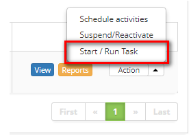

title: Registering a service request from a problem
Description: This feature allows you to register a service request from a problem.

# Registering a service request from a problem

This feature allows you to register a service request from a problem.

How to access
-------------

1.  Access the service request registration functionality from a problem by
    navigating the main menu **Process Management > Problem
    Management > Problem Management**.

Preconditions
-------------

1.  No applicable.

2.  The following filter enables the user to restrict the participation of items
    in the standard feature listing, making it easier to find the desired items:

-   Problem Number.

**Figure 1 - Problem search screen**

Items list
----------

1.  The following cadastral fields are available to the user to facilitate the
    identification of the desired items in the standard listing of the
    functionality: Number, Title, Contract, Created on, Priority, Time
    limit, User, Status, Current Task, Executor Group and Current
    Responsible.

2.  There are action buttons available to the user in relation to each item in
    the listing, they are: *View*, *Reports* and *Action*.

**Figure 2 - Problem listing screen**

Filling in the registration fields
----------------------------------

1.  On the Management tab, locate the problem you want, click
    the *Action* button and select the *Start/Run task* from it, as shown in the
    figure below:

   
   
   **Figure 3 - Action button**

2.  The **Problem Log** screen appears, click the **Processes/Options** tab, and
    then click on **Incidents/Requests**, located on the right-hand corner of
    the screen, as shown in the figure below:

   
   
   **Figure 4 - Selection of Incidents/Requests**

3.  The incident/Request relationship screen is displayed;

   
   
   **Figure 5 - Relate Incidents/Requests**

4.  To register a service request, click the icon . The Service Request/Incident
    registration screen appears, as shown in the figure below:

   
   
   **Figure 6 - Service Request/Incident record screen**

-   Fill in the step by step with the necessary information and click *Save* to
    register;

-   A message confirming the successful registration of the new service request
    will be displayed.

Linking service request to the problem
--------------------------------------

1.  To link the service request to the problem, click the icon  . The screen will
    be displayed to search for it, as shown in the figure below:

   
   
   **Figure 7 - Service Request/Incident search screen**

-   Enter the number of the service request you want to search for and click
    the *Search* button. If you want to list all Request/incident records,
    simply click the *Search* button directly;

-   Select the desired record and it will be displayed on the incident/Request
    relationship screen;

-   Once you have done this, simply click the *Save and Forward Flow* button ,
    or *Save and Keep the Current Task* if you want to save only the registered
    information about the service request relationship and maintain the current
    request task.

!!! tip "About"

    <b>Product/Version:</b> CITSmart | 8.00 &nbsp;&nbsp;
    <b>Updated:</b>08/29/2019 – Anna Martins
