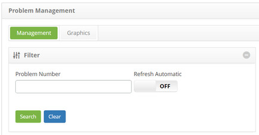
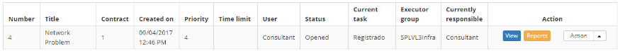
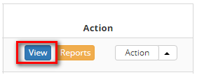

title: Problem visualization
Description: This functionality lets you view the information in the problem log.

# Problem visualization

This functionality lets you view the information in the problem log.

How to access
-------------

1.  Access the problem log view functionality by navigating the main
    menu **Process Management > Problem Management > Problem
    Management**.

Preconditions
-------------

1.  Have a problem registered (see knowledge [Problem registration][1]).

Filters
-------

1.  The following filters enable the user to restrict the participation of items
    in the standard feature listing, making it easier to locate the desired
    items:

-   Problem Number

**Figure 1 - Problem search screen**

Items list
----------

1.  The following cadastral fields are available to the user to facilitate the
    identification of the desired items in the standard listing of the
    functionality: Number, Title, Contract, Created on, Priority, Time
    limit, User, Status, Current Task, Executor Group and Current
    Responsible.

2.  There are action buttons available to the user in relation to each item in
    the listing, they are: *View*, *Reports* and *Action*.

**Figure 2 - Problem listing screen**

Filling in the registration fields
----------------------------------

1.  Not applicable.

Viewing a problem
-----------------

1.  On the Management tab, locate the problem record that you want to view, and
    then click to *View*. As shown in the image below:

   
   
   **Figure 3 - Problem management screen**

2.  The screen will be opened to display the necessary information;

3.  If you want to print the trouble ticket information, click the *Print
    PDF* button or *Print XLS*.

[1]:/en-us/citsmart-platform-7/processes/problem/register-problem.html

!!! tip "About"

    <b>Product/Version:</b> CITSmart | 8.00 &nbsp;&nbsp;
    <b>Updated:</b>08/29/2019 – Anna Martins
