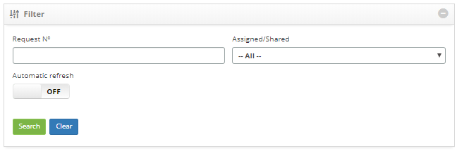
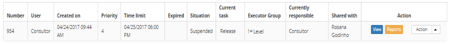
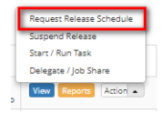

title: Release activity scheduling
Description: This feature allows scheduling activities related to the release request for execution.

# Release activity scheduling

This feature allows scheduling activities related to the release request for
execution.

How to access
-------------

1.  Access the Release Management feature navigating through the main
    menu **Process Management > Release Management > Release Management**.

Preconditions
-------------

1.  Register a release request (see knowledge [Release record registration and
    search][1]);

2.  Registered periodic activity group (see knowledge [Periodic activity group
    registration and search][2]).

Filters
-------

1.  The following filter enable the user to restrict the participation of items
    in the standard feature listing, making it easier to locate the desired
    items as shown in the figure below:

   -   Request number;

   -   Assigned/Shared.

**Figure 1 - Search screen**

Items list
----------

1.  The following cadastral fields are available to the user to facilitate the
    identification of the desired items in the standard list of
    functionality: Number, User, Created on, Priority, Time
    limit, Expired, Situation, Current task, Executer
    group, Current responsible and Shared with.

2.  There are action buttons available to the user for each item in the listing,
    they are: *View* and *Reports*.

**Figure 2 - Listing screen**

Scheduling an activity
----------------------

1.  The release management screen will be displayed;

2.  On the **management** tab, locate the release request in order to schedule
    an activity, click on the *Action* button and select the *Request Release
    Schedule* option.

**Figure 3- Release request activity schedule**

Filling in the registration fields
----------------------------------

1.  When you select the *Request Release Schedule *option (according to the
    previous figure), the Activity Schedule screen will be displayed. Click on
    the **Scheduling Creation** tab;

2.  Afterwards, the screen where the activity related to the release request can
    be scheduled will be displayed, according to the figure below:

    
    
    **Figura 4 - Scheduling activities**

3.  Fill in the following fields:

    -   **Activity Group (for scheduling)**: select the group which will exectue the
    release activity;

    -   **Technical Guidelines**: insert the technical guidelines for the activity
    execution;

    -   **Schedule For**: insert the time and date at which the activity will be
    performed;

    -   **Estimated Time**: insert the estimated duration, in minutes, that is, the
    time taken to perform the activity.

4.  After inserting the data, click on the *Save* the button to confirm the
    entry, at which date, time and user will automatically be stored for a
    future audit.

[1]:/en-us/citsmart-platform-7/processes/release/requisition.html
[2]:/en-us/citsmart-platform-7/additional-features/automation-of-operation/configuration/periodic-activity-group.html

!!! tip "About"

    <b>Product/Version:</b> CITSmart | 8.00 &nbsp;&nbsp;
    <b>Updated:</b>08/27/2019 – Anna Martins
