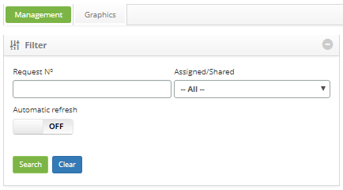
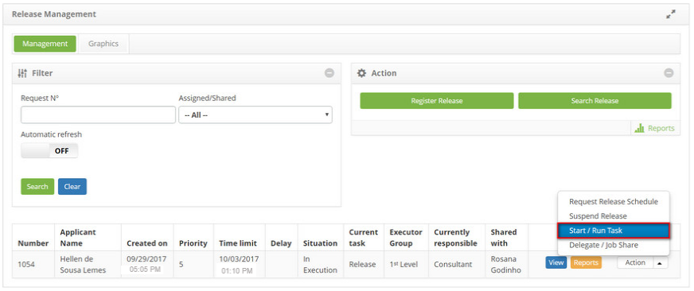

title: Release execution authorization
Description: This feature allows authorizing the release request execution.

# Release execution authorization

This feature allows authorizing the release request execution.

How to access
-------------

1.  Access the **Release Management** feature navigating through the main
    menu **Process Management > Release Management > Release
    Management**.

Preconditions
-------------

1.  Have permission to execute the release request (see knowledge [Access
    profile registration and search][1]).

Filters
-------

1.  The following filter enables the user to restrict the participation of items
    in the standard feature listing, making it easier to find the desired items:

-   Request Nº;

-   Assigned/Shared.

**Figure 1 - Release search screen**

Items list
----------

1.  The following cadastral fields are available to the user to facilitate the
    identification of the desired items in the standard feature
    listing: Number, Applicant Name, Created on, Priority, Time limit, Delay
    Situation, Current task Executor Group, Current Responsible and Share
    With.

2.  There are action buttons available to the user for each item in the listing,
    they are: *View*, *Reports*, and *Action*.

    
 
    **Figure 2 - Release listing screen**

   !!! info "IMPORTANT"

      Only the "applicant" may authorize the release request execution.

3.  The release management screen will be displayed;

4.  On the **Management** tab, locate the release request which will be cleared
    to be executed, click on the *Action* button and select the *Start/Run
    Task* option;

   
   
   **Figure 3 - Authorize release request for execution**

5.  The **Release Request Entry** screen will be displayed with all the fields
    filled out with the content related to the selected request;

6.  Check if the release request registry data is correct and click on the *Save
    and Forward Flow* button to perform the operation, at which the release
    request will be sent to the perform group so it can be executed, on this
    case the date, time and user will automatically be stored for a future
    audit.

Filling in the registration fields
----------------------------------

1.  No applicable.

[1]:/en-us/citsmart-platform-7/initial-settings/access-settings/profile/user-profile.html

!!! tip "About"

    <b>Product/Version:</b> CITSmart | 8.00 &nbsp;&nbsp;
    <b>Updated:</b>08/27/2019 – Anna Martins
