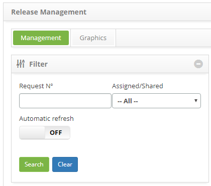
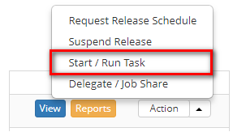

title: Release record cancellation
Description: This feature allows cancelling the release request.

# Release record cancellation

This feature allows cancelling the release request.

How to access
-------------

1.  Access the Release Management feature navigating through the main
    menu **Process Management > Release Management > Release Management**.

Preconditions
-------------

1.  Register a release request (see knowledge [Release record registration and
    search][1]);

2.  Clearance to cancel the release request.

Filters
-------

1.  The following filters enable the user to restrict the participation of items
    in the standard feature listing, making it easier to locate the desired
    items:

    - Request number;

    - Assigned/Shared.

    

    **Figure 1 - Filters screen**

Items list
----------

1.  The following cadastral field (s) are available to the user to facilitate
    the identification of the desired items in the standard listing of the
    functionality: Number, Applicant Name, Created on, Priority, Time limit,
    Delay, Situation, Current task, Executor Group, Currently
    Responsible and Shared with.

2.  There are action buttons available to the user in relation to each item in
    the listing, they are: *View*, *Reports* and *Action*.

**Figure 2 - Problem listing screen**

Filling in the registration fields
----------------------------------

1.  Not applicable.

Cancelling the release request
------------------------------

1.  The release management screen will be displayed.

2.  On the **Management** tab, locate the release request which will be
    cancelled, click on the *Action* button and select
    the *Start/RunTask* option, as indicated on the image below:

    
   
    **Figure 3 - Cancel the release request**

3.  The **Release Request Entry** screen will be displayed with all the fields
    filled out with the content related to the selected request;

    - On the **Request** area, on the Status field, change the release request status to "Cancelled";

    - On the **Closure** area, on the Closure field, describe the release request cancellation reason.

4.  After registering the information concerning the release cancellation, click
    on the *Save and Forward Flow* button to perform the operation, at which the
    release will be successfully cancelled;

5.  To save only the release's cancellation information and maintain the current
    task, click on the *Save and Keep Current* *Task* button;

6.  In both cases, clicking on the "save" button will automatically store the
    date, time and user for a future audit.

[1]:/en-us/citsmart-platform-7/processes/release/requisition.html

!!! tip "About"

    <b>Product/Version:</b> CITSmart | 8.00 &nbsp;&nbsp;
    <b>Updated:</b>08/27/2019 – Anna Martins
