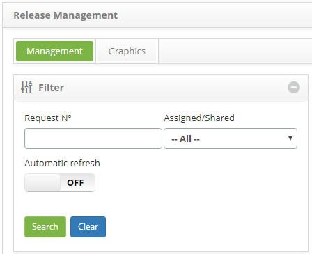
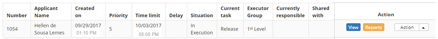
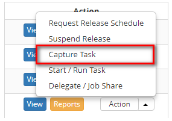

title: Release record capture
Description: This feature allows atributing a release request to itself, making the current user the responsible for executing it.

# Release record capture

How to access
-------------

1.  Access the Release Management feature navigating through the main
    menu **Process Management > Release Management > Release
    Management**.

Preconditions
-------------

1.  Register a release request (see knowledge [Release record registration and
    search][1]).

Filters
-------

1.  The following filters enable the user to restrict the participation of items
    in the standard feature listing, making it easier to find the desired items:

-   Request Number;

-   Assigned/Shared.

**Figure 1 - Filters screen**

Items list
----------

1.  The following registration fields are available to the user to facilitate
    the identification of the desired items in the default listing of the
    functionality: Number, Applicant Name, Created
    on, Priority, Time limit, Delay, Situation, Current
    task, Executor Group, Current Responsible and Shared with.

2.  There are action buttons available to the user for each item in the listing,
    they are: Preview, Reports, Schedule Release Request, Suspend Release,
    Capture Task, Start/Execute Task, and Delegate/Share Task.

**Figure 2 - Task listing screen**

Filling in the registration fields
----------------------------------

1.  Not applicable.

Capturing a release request
---------------------------

1.  To capture the release request, access the **Management** tab, locate the
    release request which will be cleared to be executed, click on
    the *Action* button and click on the *Capture Task* option, as indicated on
    the image below:

  
  
  **Figure 3 - Release request capture**

1.  A message confirming the task capture will be displayed;

2.  Click on *Ok* to confirm the operation. Afterwards, the current responsible
    for the task's execution will be displayed on the system registry.

[1]:/en-us/citsmart-platform-7/processes/release/requisition.html

!!! tip "About"

    <b>Product/Version:</b> CITSmart | 8.00 &nbsp;&nbsp;
    <b>Updated:</b>08/28/2019 - Anna Martins
