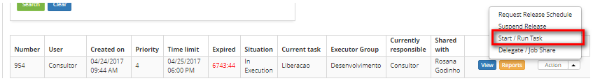

title: Release record closing down
Description: This feature allows closing down a release request.

# Release record closing down

This feature allows closing down a release request.

!!! note "NOTE"

    Only the "applicant" may close down the release request.

How to access
------------

1.  Access the **Release Management** feature navigating through the main
    menu **Process Management > Release Management > Release
    Management**.

Preconditions
------------

1.  Solved release request.

Filters
------

1.  The following filters enable the user to restrict the participation of items
    in the standard feature listing, making it easier to find the desired items:

    - Request Number;

    - Assigned/Shared.

    

    **Figure 1 - Release search screen**

Items list
---------

1.  The following cadastral fields are available to the user to facilitate the
    identification of the desired items in the default listing of the
    functionality: Number, Applicant Name, Created on, Priority, Time
    limit, Delay, Situation, Current task, Executor Group, Current
    Responsible and Shared with;

2.  There are action buttons available to the user for each item in the listing,
    they are: *View*, *Reports*, *Request Release Schedule* , *Suspend
    Release*, *Start/Run Task* and *Delegate/Share Task (Job Share)*;

3.  To closedown a release request, access the **Management** tab, locate the
    release request which will closed down, click on the *Action*button and
    select the *Start/Run Task* option, as indicated on the image below:

    
   
    **Figure 2 - Execute current release management task**

4.  The **Release Request Entry** screen will be displayed with all the fields
    filled out with the content related to the selected request

    -   Check if the release changes were attended as requested;

    -   Register the necessary information concerning the closure of the release
    request.

5.  On the **Closure** area, click on the *Add an Execution Registry* button.
    Afterwards, describe the information regarding the closure.

    -   After registering the information concerning the closure, click on the *Save
    and Forward Flow* button to perform the operation, at which the release will
    be successfully closed down.

6.  To save only the registered information concerning the release closure and
    maintain the current task, click on the *Save and Keep the Current
    Task* button;

7.  In both previous cases, clicking on the *save button*, The date, time and
    user will be automatically stored for a future audit.

!!! info "IMPORTANT"

    After closing down the release request, the configuration items related to
    it which are in development will be set to the production envirnment to be
    verified.

Filling in the registration fields
--------------------------------

1.  Not applicable.

!!! tip "About"

    <b>Product/Version:</b> CITSmart | 8.00 &nbsp;&nbsp;
    <b>Updated:</b>08/27/2019 – Anna Martins
