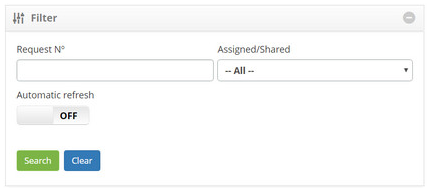
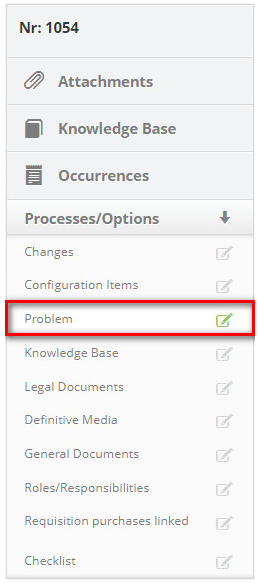
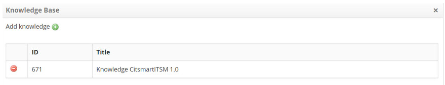
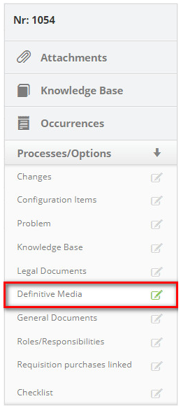
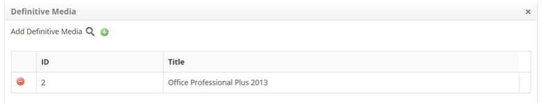
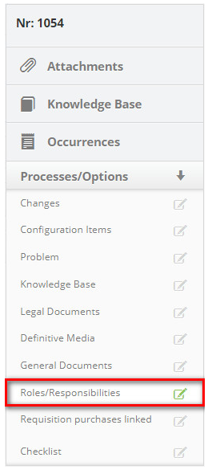
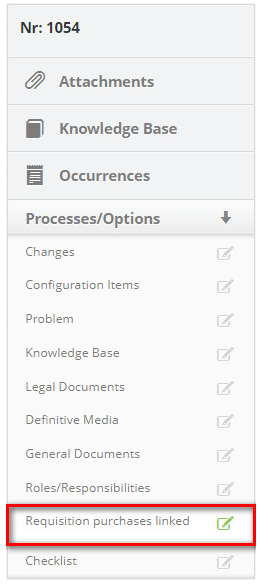
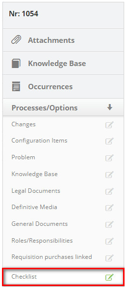
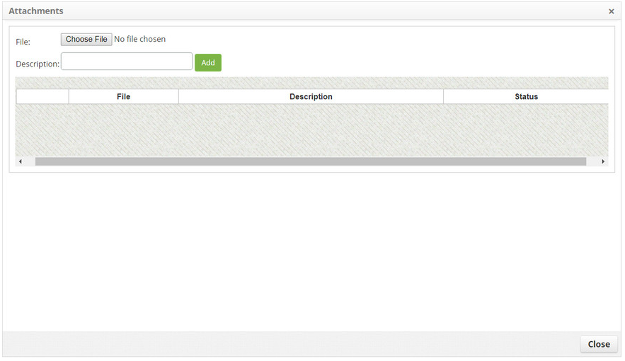

title: Release execution
Description: This functionality allows you to record information regarding the execution of the change release request.

# Release execution

This functionality allows you to record information regarding the execution of
the change release request.

How to access
-------------

1.  Access the Release Management functionality through navigation in the main
    menu **Process Management > Release Management > Release Management**.

Preconditions
-------------

1.  Have registered release Request (see knowledge [Release record registration
    and search][1]);

2.  Be allowed to execute the release request.

Filters
-------

1.  The following filters enables the user to restrict the participation of
    items in the standard feature listing, making it easier to find the desired
    items:

    -   Request Nº;

    -   Assigned/Shared.

**Figure 1 - Request search screen**

Items list
----------

1.  The following cadastral fields are available to the user to facilitate the
    identification of the desired items in the standard feature
    listing: Number, Applicant Name, Created on, Priority, Deadline, Delay,
    Situation, Current task, Executor Group, Current responsible and Shared
    with;

2.  There are action buttons available to the user for each item in the listing,
    they are: *View*, *Reports* and *Action*;

3.  The Release Management screen will be displayed;

4.  On the **Management** tab, locate the release request that will be recorded
    on your execution, click on the *Action* button and select the *Start/Run
    task* option, as indicated in the figure below:

    
    
    **Figure 2 - Execute release request**

5.  The **Release Request Registration** screen appears with the fields filled,
    with the contents of the selected Request;

6.  Record the information needed to execute the release request:

-   In the **Closing** area, click on the *Add an Execution Record* button.
    After that, describe the information about the execution of your
    activity.

Linking configuration items
---------------------------

1.  List the configuration items affected by the release:

    -   On the right side of the release request screen, click
        on **Processes/Options** and then on the **Configuration Items** option,
        as indicated in the figure below:

    
    
    **Figure 3 - Configuration items guide**

2.  The setup items link screen will be displayed. Click on the icon   for
    search of the configuration item;

3.  The IC Search screen will be displayed. Enter the necessary filter for your
    search and click on the *Search* button. The ICs will be presented according
    to the filter informed;

4.  Click on the IC icon   you want. Once this has been done, the IC will be
    linked to the;

    
    
    **Figure 4 - Related configuration item**

-   If you want to delete the link from the configuration item with the release
    request, just click on the icon   for it;

-   If you want to check the IC's detailed information, just click on the icon .

Linking problem
---------------

1.  Relate the problems to the release request, if necessary:

    -   On the right side of the release request screen, click
        on **Processes/Options** and then on the **Problem** option, as shown in
        the figure below:

    
    
    **Figure 5 - Problem guide**

2.  The problem link screen will be displayed. Click on the icon   to add
    problems;

3.  The troubleshooting screen will be displayed. Perform the search and select
    the problem relating to the release Request. Once this is done, it will be
    related to the release request.

**Figure 6 - Problem link screen**

Linking knowledge base
----------------------

1.  List the knowledge related to the release request:

    -   On the right side of the release request screen, click
        on **Processes/Options** and then on the **Knowledge Base** option, as
        shown in the figure below:

     
     
     **Figure 7 - Knowledge base guide**

-   The knowledge link screen will be displayed. Click on the icon   to add
    knowledge;

-   The Knowledge Search screen appears. Perform the survey and select the
    knowledge. Once this is done, the knowledge will be related to the release
    request.

    
    
    **Figure 8 - Knowledge link to release request screen**

Linking legal documents
-----------------------

1.  Add legal documents pertaining to release procedures:

    -   At the right side of the release request screen, click
        on **Processes/Options** and then on the **Legal Documents** option, as
        indicated in the figure below:

    
    
    **Figure 9 - Legal documents guide**

   -   The Document Attachment screen will be displayed, as shown in the following
    figure:

   
    
   **Figure 10 - Adding legal documents screen**

   -   Click on the *Choose File* button. A window for selecting the file will be
    displayed;

   -   Select the file (legal document) and after that, inform the description of
    it and click on the *Add* button to carry out the operation.

Linking definitive media
------------------------

1.  If necessary, list the definitive media for configuration items related to
    the release Request:

    -   On the right side of the release request screen, click
        on **Processes/Options** and then on the **Definitive Media** option, as
        shown in the following figure:

     
    
    **Figure 11 - Definitive media guide**

    -   The link for the definitive media will be displayed. Click on the media
    search icon   ;

    -   The final media search screen appears. Perform the search and select the
    media related to the CIs related to the release request. Once this is done,
    the definitive media will be related to the release request;

     
    
    **Figure 12 - Related definitive media**

-   If you want to delete a media that was related to the release request, just
    click on the media icon   .

Linking general documents
-------------------------

1.  Add the general documents related to the release request:

    -   On the right side of the release request screen, click
        on **Processes/Options** and then on the **General Documents** option,
        as shown in the following figure:

     
    
    **Figure 13 - General documents guide**

    -   The Document Attachment screen will be displayed, as shown in the following
    figure:

     
    
    **Figure 14 - General documents addition screen**

-   Click the *Choose File* button. A window for selecting the file will be
    displayed;

-   Select the file and after that, enter the description of the file and click
    on the *Add* button to perform the operation.

Linking roles/responsabilities
------------------------------

1.  Inform the roles/responsibilities, ie the resources involved in implementing
    the release of change:

    -   On the right side of the release request screen, click on
        the **Processes/Options tab** and select
        the **Roles/Responsibilities** option, as shown in the following figure:

     
    
    **Figure 15 - Role/responsibility guide**

-   The screen for adding roles/responsibilities will be displayed. Click on the
    icon    to search for the employees involved in the execution of the release;

-   The collaborator search screen appears. Perform the survey and select the
    developer involved in the execution of the release. Once this is done, a
    screen will be displayed to inform the description of the role granted to
    the particular collaborator;

-   Enter the description of the role that the employee will exercise and
    click *Ok* to carry out the operation. After this, the employee involved in
    the execution of the release request will be added to the registry.

 

**Figure 16 - Roles/responsibility**

Linking request purchases linked
--------------------------------

1.  If you have made a purchase Request to execute the release of the change,
    relate it to the release Request:

    -   On the right side of the release request screen, click on
    the **Processes/Options** tab and select the **Request purchases
    linked** option as shown in the following figure:

     
    
    **Figure 17 - Purchasing request guide**

    -   The screen for linking the purchase Request will be displayed, as shown in
    the figure below:

    
   
   **Figure 18 - Purchasing request link screen**

-   Click on the icon    to add the purchase Request. The Purchase Request Search
    screen appears. Perform the search and select the purchase Request you want
    to associate with the release Request. Once this has been done, the purchase
    Request will be related to the release Request.

Linking checklist
-----------------

1.  If necessary, respond to the checklist regarding the execution of the
    release of the change:

    -   On the right side of the release request screen, click on
        the** Processes/Options** tab and select the **Checklist** option, as
        shown in the following figure:

     
    
    **Figure 19 - Checklist guide**

    -   The Checklist screen will be displayed, as shown in the following figure:

     
    
    **Figure 20 - Release checklist**

    -   Select the questionnaire and fill it in according to the execution of the
    release request;

    -   After completing the questionnaire, click on the *Save* button to perform
    the operation. Once this is done, the questionnaire will be presented, which
    was answered in "History";

-   If you want to edit the information of the questionnaire, click on the icon   
    of the questionnaire, change the desired data and click on the
    button *Record* to carry out the operation.

Linking attachments
-------------------

1.  If you want to view the attachment attachments or attach a file to the
    release request, proceed as follows:

    -   To the right side of the release request screen, click **Attachments**,
        as shown in the following figure:

     
    
    **Figure 21 - Attachments guide**

    -   The file attachment screen will be displayed, as shown in the figure below:

     
    
    **Figure 22 - File addition screen**

2.  To add a file, click on the *Choose File* button. The screen will appear to
    select the desired file:

-   Select the file and after that, enter the description of the file and click
    on the *Add* button;

-   After adding the file, click on the *Close* button to return to the release
    request screen.

Linking occurrences
-------------------

1.  If you want to insert an instance of the release request, proceed as
    follows:

    -   On the right side of the release request screen, click **Occurrence** as
        shown in the following figure:

     
    
    **Figure 23 - Occurrence guide**

    -   The **Occurrences** screen will be displayed containing two tabs, one for
    displaying the list of recorded occurrences and another for registering an
    occurrence.

2.  In the tab **Record of Occurrences**, has fields that must be filled as
    described below:

     
    
    **Figure 24 - Record of occurrences**

    -   **Category**: Select the category of the occurrence. If the category is not
    found, it is possible to perform a quick registration by clicking on the
    "Category" icon  ;

    -   **Source**: Select the source of the occurrence. If the origin is not found,
    it is possible to make a quick register by clicking on the icon "Source"  ;

    -   **Time Spent (min)**: report the time spent in minutes;

    -   **Registered by**: inform by whom the occurrence is being recorded;

    -   **Description**: report the description of the occurrence;

    -   **Occurrence**: report the occurrence;

    -   **Contact Information**: Describe the contact information.

3.  Click on the *Save* button. After this, a message will be displayed
    confirming the success of the operation and will return to the release
    request screen.

Consulting knowledg base
------------------------

1.  If you want to consult the knowledge base, just click on the **Knowledge
    Base** tab, located on the right side of the screen, as shown in the
    following figure:

     
    
    **Figure 25 - Knowledge base guide**

-   After recording the information of the execution of the release request,
    click on the button *Save and Forward flow* to carry out the operation,
    where the release will be sent to the test phase;

-   If you want to save only the logged release information and keep the current
    job, click on the *Save and Keep the Current Task* button;

-   In both cases prior to clicking the *Save* button the date, time and user
    will be stored automatically for a future audit.

[1]:/en-us/citsmart-platform-7/processes/release/requisition.html

!!! tip "About"

    <b>Product/Version:</b> CITSmart | 8.00 &nbsp;&nbsp;
    <b>Updated:</b>08/27/2019 – Anna Martins
