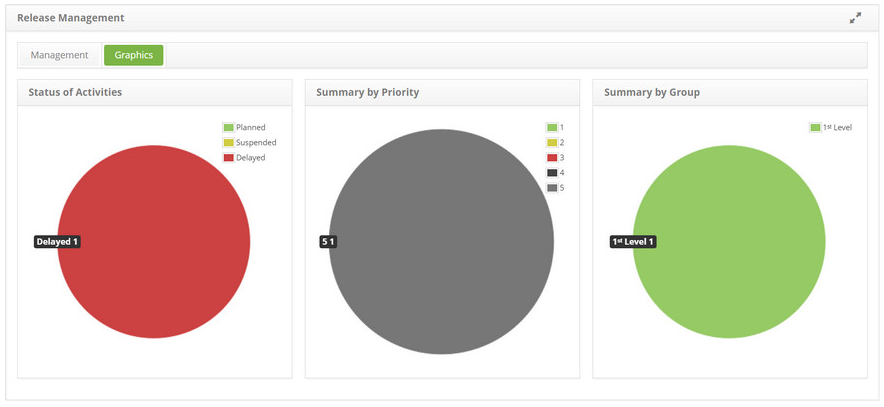

title: Release view graphs
Description: Release view graphs

# Release view graphs

How to access
-------------

1.  Access the **Release Management** feature navigating through the main
    menu **Process Management > Release Management > Release
    Management**. The release management screen will be displayed.

Viewing release charts
----------------------

1.  Click on the **Charts** tab. Afterwards, the information on the release
    entries by situation will be displayed (In Execution, Suspended and
    Delayed), by priority and by performer group, which are demonstrated in
    charts, as illustrated on the image below:

**Figure 1 - Release charts**

!!! tip "About"

    <b>Product/Version:</b> CITSmart | 8.00 &nbsp;&nbsp;
    <b>Updated:</b>08/27/2019 – Anna Martins
