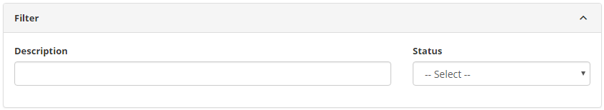
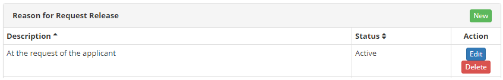
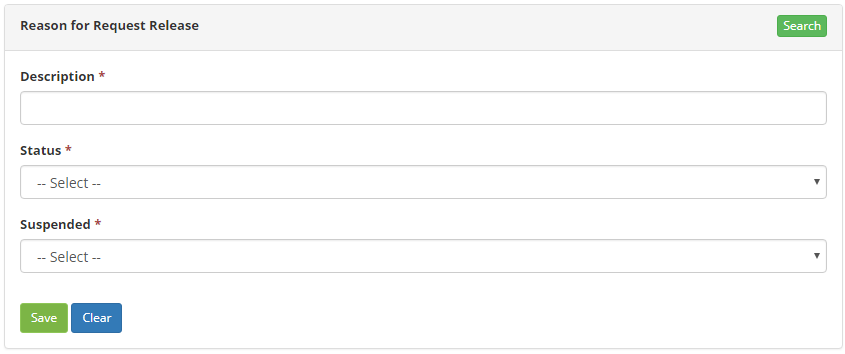

title: Release justification registration and search
Description: The goal of this feature is to register a release request justification which will be used in other system routines.

# Release justification registration and search

The goal of this feature is to register a release request justification which
will be used in other system routines.

How to access
-------------

1.  Access the Release Request Justification feature navigating through the main
    menu **Process Management > Release Management > Release Justification**.

Preconditions
-------------

1.  No applicable.

Filters
-------

1.  The following filter enables the user to restrict the participation of items
    in the standard feature listing, making it easier to find the desired items:

    - Description;

    - Status.

    

    **Figure 1 - Search for reason for release request**

Items list
----------

1.  The following cadastral fields are available to the user to facilitate the
    identification of the desired items in the standard feature
    listing: **Description** and **Status.**

2.  There are action buttons available to the user for each item in the listing,
    they are: *Edit* and *Delete.*

    
   
    **Figure 2 - Listing of release request justification**

3.  To edit a release request justification entry, click on the *Edit* button.
    Afterwards, the user will be redirected to the registry screen displaying
    the content in the entry.

Filling in the registration fields
----------------------------------

1.  The Release Request Justification Screen will be displayed;

2.  Click the *New* button. Afterwards, the **Release Request
    Justification** entry screen will be displayed, as illustrated on the image
    below:

    
   
    **Figure 3 - Release request justification entry screen**

3.  Fill out the fields as instructed below:

    - **Description**: describe the reason for the release request;

    - **Status**: insert the release request justification status;

    - **Suspended**: insert if the justification will be used to suspend a release request; check one of the options (Yes or No).

4.  Click on the *Save* the button to confirm the entry, at which date, time and
    user will automatically be stored for a future audit.

!!! tip "About"

    <b>Product/Version:</b> CITSmart | 8.00 &nbsp;&nbsp;
    <b>Updated:</b>07/12/2019 – Anna Martins
