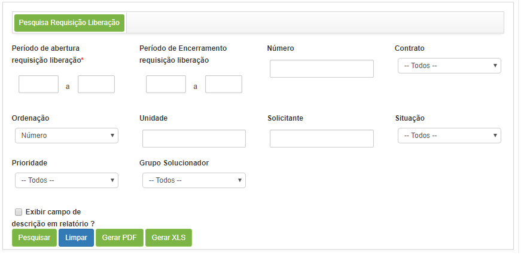
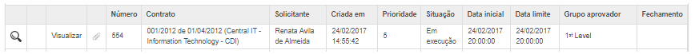

title: Release record search
Description: This feature allows you to search for release requests according to defined filters.

# Release record search

This feature allows you to search for release requests according to defined
filters.

How to access
-------------

1.  Access the Release Search feature navigating through the main
    menu **Process Management > Release Management > Search Release**.

Preconditions
-------------

1.  Not applicable.

Filters
-------

1.  The following filters enable the user to restrict the participation of items
    in the standard feature listing, making it easier to find the desired items:

    - **Opening Period**: insert the release request entry period;

    - **Closing Period**: insert the release request closing period to search for requests that were closed in the given period;

    - **Number**: enter the identification number of the release request, to
    search for a specific request;

    - **Contract**: insert the contract to look for related release requests;

    - **Order By**: define the order that the requests will be presented;

    - **Unit**: insert the intended unit to check the release requests related to it;

    - **User**: insert the employee which will verify the change releases requested by them;

    - **Situation**: insert a situation to check for related release requests;

    - **Priority**: insert the priority to check for related release requests;

    - **Solution Group**: insert the perfrormer group to check the release
    requests that were forwarded to it;

    - **Would you like to see the description on the report?**: if you want the description of the release request to appear in 
    the report, check this option.

2.  To perform the search: access the functionality, soon after the **Release
    Request Search** screen will be displayed, where necessary search filters
    can be defined, according to the figure below:

    
   
    **Figure 1 - Release request search screen**

3.  After the filters are set, click the *Search* button. Afterwards, the
    release requests will be listed, according to the chosen filters;

4.  To generate a release request report in PDF format, click the *Generate
    PDF* button;

5.  To generate a release request report in Excel format, click the *Generate
    XLS* button.

Items list
----------

1.  The following registration fields are available to the user to facilitate
    the identification of the desired items in the default listing of the
    functionality: Number, Contract, Requester, Built
    in, Priority, Situation, Start Date, Final
    Date, Approver Group and Closure;

2.  There are action buttons available to the user in relation to each item in
    the listing, they are: *Search Ticket history*, *View* and *Occurrence
    Release*;

    
   
    **Figure 2 - Release request listing screen**

3.  Next to each release request entry, there are icons which can be used to
    check the releases' history, reopen the release request and view its
    attachments;

4.  To view the history of the release request, proceed as follows:

    -   Click the  icon;

    -   A window will be opened and display the entire history of the release
        request.

5.  To reopen the release request, proceed as follows:

    -   Click the  icon;

    -   A message will be displayed confirming the reopening of the request;

    -   Click *OK* to perform the operation;

    -   A message will be displayed confirming the request was successfully
        reopened.

6.  To view the attachments for the release request, proceed as follows:

    -   Click the icon ;

    -   A window will display the release's attachments.

Filling in the registration fields
----------------------------------

1.  Not applicable.

!!! tip "About"

    <b>Product/Version:</b> CITSmart | 8.00 &nbsp;&nbsp;
    <b>Updated:</b>08/27/2019 – Anna Martins

