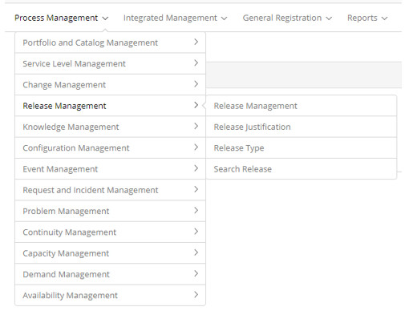

title: Release management module
Description: Release management module

# Release management module

Module objective
----------------

Release is defined as a significant change in the organization's IT
infrastructure, which may be the introduction of new ICs, or the updating of
current ones.

The Release Management process provides the physical management of software and
hardware, allowing the planning of the releases to be made in the IT
infrastructure, based on information about CIs and their relationships stored in
the BDGC.

According to ITIL, the main goals of the Release Management process are:

-   Plan, coordinate and implement software and hardware;

-   Design and implement efficient procedures for the distribution and
    installation of changes in IT systems;

-   Ensure that hardware and software related to changes can be tracked,
    secured, and that only correct, authorized, and tested versions are
    installed;

-   Communicate users and consider their expectations during the planning and
    implementation of new releases;

-   Determine together with Change Management the composition and planning of an
    implementation;

-   Implement new releases of software and new hardware in the operational
    infrastructure, under the control of Change Management and with

-   Configuration Management support;

-   Ensure that the original copies of software are stored securely in the BSD
    and that the BDGC is updated. The same thing goes for the hardware that is
    on DHD.

Where are the features
----------------------

To access the functionality click on the main menu **Process Management
> Release Management**.

**Figure 1 - Release Management module menu**

Main feature (in highlight)
---------------------------

In the *See also* section you can access the main functionality(ies) of this
module, in order to obtain a more detailed knowledge.

!!! Abstract "TIPS"

    Depending on your access permission, you can perform a series of actions on
    the existing release requests, such as: viewing the registration information
    of the release Request, scheduling activity for the release Request,
    suspending the request for release, Reactivate the request for release that
    has been suspended for service, delegate the request for release to another
    person or group, capture a request for release, execute the request for
    release, and others.

See also
--------

-   [Release Record registration and search](/en-us/citsmart-platform-7/processes/release/requisition.html).

!!! tip "About"

    <b>Product/Version:</b> CITSmart | 7.00 &nbsp;&nbsp;
    <b>Updated:</b>08/30/2019 - Anna Martins
