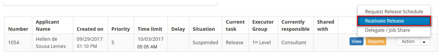

title: Release record reactivation
Description: The goal of this feature is to allow reactivating a suspended
release request.

# Release record reactivation

The goal of this feature is to allow reactivating a suspended release request.

How to access
-------------

1.  Access the **Release Management** feature navigating through the main
    menu **Process Management > Release Management > Release
    Management**.

Preconditions
-------------

1.  Clearance to reactivate the release request.

Filters
-------

1.  The following filters enable the user to restrict the participation of items
    in the standard feature listing, making it easier to find the desired items:

-   Request Number;

-   Assigned/Shared.

**Figure 1 - Release search screen**

Items list
----------

1.  The following cadastral fields are available to the user to facilitate the
    identification of the desired items in the default listing of the
    functionality: Number, Applicant Name, *Created
    on, Priority, Time limit, Delay, Situation, Current
    task, Executor Group, Current responsible and Shared with;

2.  There are action buttons available to the user for each item in the listing,
    they are: *View*, *Reports*, *Request Release Schedule* , *Reactivate
    Release*, and *Delegate/Share Task (Job Share)*;

3.  To reactivate the release request, access **Management** tab, locate the
    suspended release request which will be reactivated, click on
    the *Action* button and select the *Reactivate Release* option, as indicated
    on the image below:

  
  
  **Figure 2 - Reactivate release request**

1.  A message will be displayed confirming the reactivation;

2.  Click on *Ok* to perform the operation;

3.  The status of the release will be updated on the release request list.

Filling in the registration fields
----------------------------------

1.  Not applicable.

!!! tip "About"

    <b>Product/Version:</b> CITSmart | 8.00 &nbsp;&nbsp;
    <b>Updated:</b>07/15/2019 – Anna Martins

