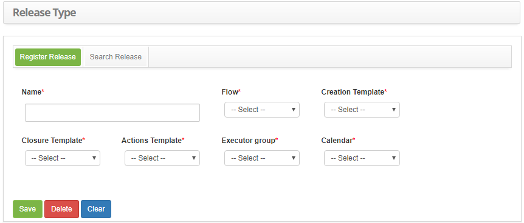

title: Release type registration and search
Description: The goal of this feature is to register the release type which will be used to define the entire workflow followed by the release.

# Release type registration and search

The goal of this feature is to register the release type which will be used to
define the entire workflow followed by the release.

How to access
-------------

1.  Access the release type feature navigating through the main menu **Process
    Management > Release Management > Release Type**.

Preconditions
-------------

1.  Have the flow related to the release management registered (see
    knowledge [Workflow maintenance][1]);

2.  Configure the e-mail templates (see knowledge [E-mail Template Configuration
    registration and search][2]);

3.  Have the performer group registered (see knowledge [Group registration and
    search][3]);

4.  Have the calendar registered (see knowledge [Calendar registration and
    search][4]).

Filters
-------

1.  The following filter enables the user to restrict the participation of items
    in the standard feature listing, making it easier to find the desired items:

   -   Name.

2.  On the **Release Type** screen, click the **Search Release** tab. The search
    screen will be displayed as illustrated on the image below:

   
   
   **Figure 1 - Release type search screen**

3.  Perform a release type search:

-   Insert the name of the intended release type and click on
    the *Search* button. Afterwards, the release type entry will be displayed
    according to the description provided;

-   If you want to list all release type entries, just click directly on
    the *Search* button.

Items list
----------

1.  The following cadastral field is available to the user to make it easier to
    identify the desired items in the default listing of the
    functionality: **Name**.

   
   
   **Figure 2 - Items screen**

2.  After searching, select the intended entry. Afterwards, they will be
    redirected to the registry screen displaying the content belonging to the
    selected entry;

3.  To edit a release type entry, just modify the information on the intended
    fields and click on the *Save* button to confirm the changes to the
    database, at which date, time and user will be stored automatically for a
    future audit.

Filling in the registration fields
----------------------------------

1.  On the **Release Type** screen, click the **Search Release** tab. The search
    screen will be displayed as illustrated on the image below:

   
   
   **Figure 3 - Release type registration screen**

2.  Fill out the fields as instructed below:

   -   **Name**: insert the name of the release type;

   -   **Flow**: select the release flow so it can be associated to the release
    type being registered;

   -   **Creation Template**: select the creation e-mail template which will be
    used to notify the applicant the release has been registered;

   -   **Closure Template**: select the closure e-mail template which will be used
    to notify the applicant the release has been completed;

   -   **Actions Template**: select the actions e-mail template which will be used
    to notify the applicant of the release's progress;

   -   **Executor Group**: insert the executor group, which will be the default
    group for this release type, responsible for executing the change request;

   -   **Calendar**: insert the release type's calendar.

3.  Click on the *Save* the button to confirm the entry, at which date, time and
    user will automatically be stored for a future audit.

[1]:/en-us/citsmart-platform-7/workflow/workflow-management.html
[2]:/en-us/citsmart-platform-7/plataform-administration/email-settings/configure-email-template.html
[3]:/en-us/citsmart-platform-7/initial-settings/access-settings/user/group.html
[4]:/en-us/citsmart-platform-7/plataform-administration/time/create-calendar.html

!!! tip "About"

    <b>Product/Version:</b> CITSmart | 8.00 &nbsp;&nbsp;
    <b>Updated:</b>07/12/2019 – Anna Martins
