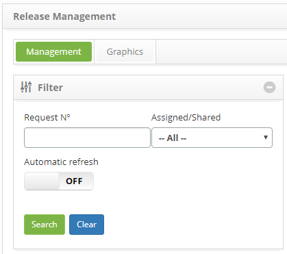

title: Release approval
Description: This feature allows the approval of the changes release that have been executed and tested.

# Release approval

How to access
-------------

1.  Access the **Release Management** feature navigating through the main
    menu **Process Management > Release Management > Release
    Management**.

Preconditions
-------------

1.  Have the release request at the homologation stage;

2.  Have permission to execute the approval of the release request.

Filters
-------

1.  The following filters enable the user to restrict the participation of items
    in the standard feature listing, making it easier to find the desired items:

    - Request Number;

    - Assigned/Shared.

    

    **Figure 1 - Release search screen**

Items list
----------

1.  The following cadastral fields are available to the user to facilitate the
    identification of the desired items in the default listing of the
    functionality: Number, Applicant Name, Created on, Priority, Time
    limit, Delay, Situation, Current task, Executor Group, Current
    responsible and Shared with;

2.  There are action buttons available to the user for each item in the listing,
    they are: *View*, *Reports*, *Request Release Schedule* , *Suspend
    Release*, *Start/Run Task*, and *Delegate/Share Task (Job Share)*;

3.  To approve the Release request, access the **Management** tab, locate the
    release request which will be cleared approved, click on the *Action* button
    and click on the **Start/Run Task** option, as indicated on the image below:

    

    **Figure 2 - Execute current release request task**

4.  The Release Request entry screen will the fields filled out will be
    displayed, with the contents concerning the selected entry:

    -   Make sure the execution of the change release was performed as requested;

    -   In the **Request** area, in the **Status** field, insert the current
    situation of the release request (Solved or Unresolved);

    -   Register the necessary information on the approval:

    -   In the **Closure** area, click the on the *Add an Execution
    Register* button. Afterwards, describe the information about the activity's
    execution.

5.  If you have reported the situation as **Unresolved**:

    -   In the **Closure** field, insert the reason why the changes were not
    released;

    -   Click on the *Save and Forward Flow* button to carry out the operation, at
    which the release request will be forwarded to the applicant to release the
    request for a new execution of the activity.

6.  If you have reported the situation as **Solved**:

    -   In the **Release Date** field, insert the date when the changes were
    released;

    -   In the **Solution** field, select the solution's category, that is, describe
    what was done to execute the change release;

    -   In the **Closure** field, insert the details concerning the execution of the
    change release;

    -   Click the *Save and Forward Flow* button to perform the operation, at which
    the release request will be forwarded to the applicant to close it down;

    -   If you want to save only the registered information on the approval carried
    and wish to keep the current task, click the *Save and Keep the Current
    Task* button.

Filling in the registration fields
----------------------------------

1.  Not applicable.

!!! tip "About"

    <b>Product/Version:</b> CITSmart | 8.00 &nbsp;&nbsp;
    <b>Updated:</b>08/27/2019 – Anna Martins

