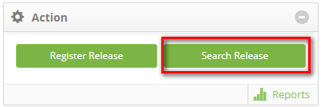
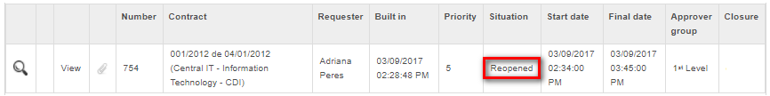

title: Release record reopening
Description: This feature allows reopening the change release request.

# Release record reopening

This feature allows reopening the change release request.

How to access
-------------

1.  Access the **Release Management** feature navigating through the main
    menu **Process Management > Release Management > Release
    Management**.

2.  The release management screen will be displayed. On the **Management** tab,
    click on the *Search Release* button to search for release requests, as
    indicated on the image below:

**Figure 1 - Release Request search**

Preconditions
-------------

1.  Have the permission to reopen the release request;

2.  Reopening Release Request.

Filters
-------

1.  The following filters enable the user to restrict the participation of items
    in the standard feature listing, making it easier to find the desired items:

    - Opening Period;

    - Closing Period;

    - Number;

    - Contract;

    - Order by;

    - Unity;

    - User;

    - Situation;

    - Priority;

    - Solution Group;

    - Would you like to see the description report?.

2. By accessing the functionality, the **Release Request Search** window will be displayed, at which the necessary search filters 
can be inserted

   
**Figure 2 - Release request search screen**

- Search the intended release request to be reopened;

- Afterwards, click the reopen  icon on the release request. Once this is
    done, a message will be displayed to confirm the reopening of the release
    request;

- Click *Ok* to perform the operation;

- The release request will be reopened and sent to the applicant in order to
    be executed again.

Items list
----------

1.  The following registration fields are available to the user to facilitate
    the identification of the desired items in the default listing of the
    functionality: Number, Contract, Requester, Built
    in, Priority, Situation, Start date, Final
    date, Approver group and Closure;

2.  There are action buttons available to the user for each item in the listing,
    they are: *Search Ticket History*, *View* and *View Attachments*;

3.  It will appear on the release request list, as illustrated on the image
    below:

**Figure 3 - Reopened release request**

Filling in the registration fields
----------------------------------

1.  Not applicable.

!!! tip "About"

    <b>Product/Version:</b> CITSmart | 8.00 &nbsp;&nbsp;
    <b>Updated:</b>08/27/2019 – Anna Martins
