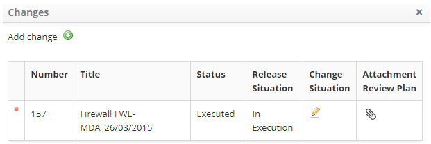

title: Release record registration and search
Description: This feature allows you to record the change release request in the IT infrastructure.

# Release record registration and search

This feature allows you to record the change release request in the IT
infrastructure.

How to access
-------------

1.  Access the Release Management functionality through navigation in the main
    menu **Process Management > Release Management**.

Preconditions
-------------

1.  Have the employee registered (see knowledge [Staff registration and
    search][1]);

2.  Have the executor group registered (see knowledge [Group registration and
    search][2]);

3.  Have the unit registered (see knowledge [Unit registration and
    search][3]);

4.  Have the contract signed (see knowledge [Contract registration and
    search][4]);

5.  Have the group bound to the contract (see knowledge [How to relate group to
    contract?][5]);

6.  Have the unit linked to the contract (see knowledge [How to relate unit to
    contract?][6]);

7.  Have the type of release registered (see knowledge [Release type
    registration and search][7]);

8.  Have the periodic activity group registered (see knowledge [Periodic
    activity group registration and search][8]).

Filters
-------

1.  The following filters enable the user to restrict the participation of items
    in the standard feature listing, making it easier to locate the desired
    items:

-   Request number;

-   Assigned/Shared.

**Figure 1 - Release search screen**

Items list
----------

1.  The following cadastral fields are available to the user to facilitate the
    identification of the desired items in the standard listing of the
    functionality: Number, User, Created on, Priority, Time limit, Delay,
    Situation, Current task, Executor Group, Currently
    Responsible and Shared with.

2.  There are action buttons available to the user in relation to each item in
    the listing, they are: *View*, *Reports* and *Action*.

**Figure 2 - Release listing screen**

Filling in the registration fields
----------------------------------

1.  The Release Management screen will be displayed. Click the *Register new
    release* button .The respective **Release Registration** screen will be
    displayed, containing a series of steps to follow to complete the
    registration;

2.  Understanding the main screen of the feature:

   
   
   **Figure 3 - Release Management screen**

A quick overview of the functionality:

- **1**   : extends the Release Management screen;

- **2**:  Management - the release Request records for attendance and management
    are presented;

- **3**:  Graphs - graphs the information of the release Requests by situation (in
    progress, suspended and delayed), by priority and by group;

- **4**: Filters - displays the filters for search of release Request;

- **5**: Actions - allows you to register a new problem and perform a quick
    search for a release request;

- **6**: Reports - displays the release reports for release management.

   
   
   **Figure 4 - Release management screen**

4.  Record the contract information as indicated below:

   
   
   **Figure 5 - Release request record - contract information**

   -  **Contract**-: report the contract regarding the release request.

5.  Record the information of the requester, as indicated below:

   
   
   **Figure 6 - Release request record - applicant information**

   -   **Requested by**: enter the name of the person requesting the release
    request;

   !!! note "NOTE"

      After informing the requesting party, if they already have the personal
      data (contact information, e-mail, telephone, extension and/or unit)
      registered in the system, the fields referring to this data will be filled
      by the system with the information.

   -   **Username**: enter the name of a contact person about the release request;

   -   **E-mail**: inform the contact e-mail;

   -   **Phone**: enter area code and contact phone number;

   -   **Extension**: enter the extension number of the contact, if any;

   -   **Unit**: select the unit on which the contact is full;

   -   **Location**: enter the location of the contact;

   -   **Note**: describe the observations about the contact, if necessary.

6.  Record the Request information, as indicated below:

    
    
    **Figure 7 - Release request record - request information**

    -   **Title**: set the title of the release Request;

    -   **Executor Group**: inform the executing group, which will be
        responsible for executing the release request;

    -   **Status**: state the status of the release request;

    -   **Risk**: inform the risk of the release request;

    -   **Type**: enter the type of the release Request;

    -   **Release Date**: please state the date of release;

    -   **Version**: report release version;

    -   **Impact**: report the impact of release on the organizational
        environment;

    -   **Urgency**: inform the urgency of the release in the organizational
        environment;

    -   **Priority**: priority will be set after reporting impact and urgency.
        Priority is used to identify the importance of release and to identify
        the times required for appropriate action to be taken. The priority is
        from 1 to 5, with 1 being the highest priority and 5 being the lowest.

    
    
    **Figure 8 - Urgency X impact**

7.  The combination of this information will define the priority needed to
    achieve the release.

    -   **Description**: enter the description of the change release being
    requested. The description must be objective, including all information
    necessary for the release;

   -   **Appointment**: schedules the activity of the release Request for
    execution:

   -   **Start Date**: enter the scheduled start date of the release Request;

   -   **Start Time**: enter the time programmed to start the execution of the
    release request;

   -   **End Date**: enter the scheduled date for the end of the release request
    execution;

   -   **End Time**: enter the scheduled time for the end of the release request
    execution;

   -   **Activity Group (for scheduling)**: select the group that will perform the
    activity of the release Request.

   -   **E-mail Notification**: check the options for sending notification about
    the release request that will be sent to the requestor.

Linking changes
---------------

1.  List the changes that will be released:

   -   On the right side of the screen, click on **Processes/Options** and then on
    the **Changes** option;

   
   
   **Figure 9 - Change guide**

   -   The change link screen will be displayed. Click the icon  . After that, the
    change search screen will be displayed;

   -   Perform the search and select the change that will be released. Once this is
    done, the change log will be added to the screen, as shown in the following
    figure.

!!! note "NOTE"

    If the change has related configuration items, they will be added to the
    release.

   
   
   **Figure 10 - Change to release relationship**

-   If you want to change the release status of the change that has been added,
    just click on the icon  ;

-   Click the icon  to see the change reversion plan that will be released;

-   If you want to delete the link from the change with the release, just click
    the change icon .

Linking attachments
-------------------

1.  If you want to attach a file to the release request record, do the
    following:

   -   On the right side of the screen, click **Attachments**;

   
   
   **Figure 11 - Attachments guide**

   -   A file attachment window will appear;

   
   
   **Figure 12 - File attachment**

-   Click the *Choose File* button. After that, select the desired file, enter
    its description and click the *Add* button;

-   After adding the file, click the *Close* button to return to the release
    request log screen;

-   Click the *Save* button to register the release request, where the date,
    time and user will be automatically saved for a future audit;

-   A message confirming the successful registration of the release request will
    be displayed.

[1]:/en-us/citsmart-platform-7/initial-settings/access-settings/user/employee.html
[2]:/en-us/citsmart-platform-7/initial-settings/access-settings/user/group.html
[3]:/en-us/citsmart-platform-7/plataform-administration/region-and-language/register-unit.html
[4]:/en-us/citsmart-platform-7/additional-features/contract-management/use/register-contract.html
[5]:/en-us/citsmart-platform-7/processes/tickets/relate-group.html
[6]:/en-us/citsmart-platform-7/processes/tickets/relate-unit.html
[7]:/en-us/citsmart-platform-7/processes/release/register-type.html
[8]:/en-us/citsmart-platform-7/additional-features/automation-of-operation/configuration/periodic-activity-group.html

!!! tip "About"

    <b>Product/Version:</b> CITSmart | 8.00 &nbsp;&nbsp;
    <b>Updated:</b>08/27/2019 – Anna Martins
