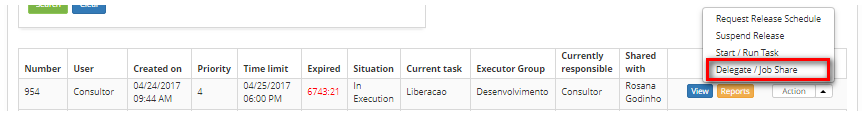
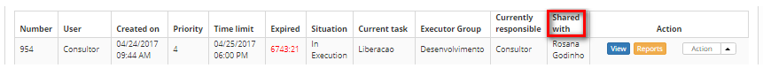

title: Release record sharing

Description: This feature allows sharing a release request with another
performer group or user.

\# Release record sharing

This feature allows sharing a release request with another performer group or
user.

How to access
-------------

1.  Access the **Release Management** feature navigating through the main
    menu **Process Management > Release Management > Release
    Management**.

Preconditions
-------------

1.  Register a release request (see knowledge [Release record registration and
    search][1]);

2.  Clearance to share/delegate the release request.

Filters
-------

1.  The following filter enables the user to restrict the participation of items
    in the standard feature listing, making it easier to find the desired items:

-   Request Nº;

-   Assigned/Shared.

**Figure 1 - Release search screen**

Items list
----------

1.  The following cadastral field is available to the user to facilitate the
    identification of the desired items in the standard feature
    listing: Number, Applicant Name, Created on, Priority, Deadline, Delay,
    Situation, Current task, Executor Group, Current responsible and Shared
    with;

2.  There are action buttons available to the user for each item in the listing,
    they are: *View*, *Reports* and *Action;*

3.  The Release Management screen will be displayed;

4.  On the management tab, locate the release request which will be shared,
    click on the *Action* button and select the *Delegate/Job Share*option;

   
   
   **Figure 2 - Shared release request**

5.  A screen to select the group or user whom the request will be shared with
    will be displayed.

   
   
   **Figure 3 - Request release sharing**

6.  Select the group or or user who wants to share the request. Once this is
    done, click the *Save* button;

7.  After performing the operation, the name of the user or group with which the
    release request was shared will be displayed in **Shared with**, as shown in
    the figure below:

**Figure 4 - Shared release request**

Filling in the registration fields
----------------------------------

1.  No applicable.

[1]:/en-us/citsmart-platform-7/processes/release/requisition.html

!!! tip "About"

    <b>Product/Version:</b> CITSmart | 8.00 &nbsp;&nbsp;
    <b>Updated:</b>08/27/2019 - Anna Martins

