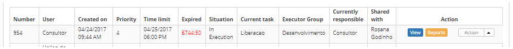

title: Release record suspension
Description: This feature allows suspending the execution of the release request.

# Release record suspension

This feature allows suspending the execution of the release request.

How to access
-------------

1.  Access the **Release Management** feature navigating through the main
    menu **Process Management > Release Management > Release
    Management**.

Preconditions
-------------

1.  Clearance to suspend the release request;

2.  Register a release request justification (see knowledge [Release
    justification registration and search][1]).

Filters
-------

1.  The following filters enables the user to restrict the participation of
    items in the standard feature listing, making it easier to find the desired
    items:

-   Request Nº;

-   Assigned/Shared.

**Figure 1 - Release search screen**

Items list
----------

1.  The following cadastral fields are available to the user to facilitate the
    identification of the desired items in the standard feature
    listing: Number, Applicant Name, Created on, Priority, Deadline, Delay,
    Situation, Current task, Executor Group, Current responsible and Shared
    with.

2.  There are action buttons available to the user for each item in the listing,
    they are: *View*, *Reports* and *Action*.

**Figure 2 - Release listing screen**

Filling in the registration fields
----------------------------------

1.  The release management screen will be displayed. On the **Management** tab,
    locate the release request which will be suspended, click on
    the *Action* button and click on the *Suspend Release* option, as indicated
    on the image below:

   
   
   **Figure 3 - Release request suspension**

2.  The release request suspension justification entry screen will be displayed:

   
   
   **Figure 4 - Release request suspension justification entry screen**

   -   **Justification**: select the reason for the release request suspension (an
    option **must** be selected);

   -   **Justification Complement**: insert a complimentary information on the
    release request's suspension;

   -   After inserting all data, click on the *Save* button, at which date, time
    and user will be automatically stored for a future audit.

3.  After suspending the release request, the situation will be updated to
    Suspended, as indicated on the image below:

**Figure 5 - Suspended release request**

[1]:/en-us/citsmart-platform-7/processes/release/justification.html

!!! tip "About"

    <b>Product/Version:</b> CITSmart | 8.00 &nbsp;&nbsp;
    <b>Updated:</b>08/28/2019 – Anna Martins

