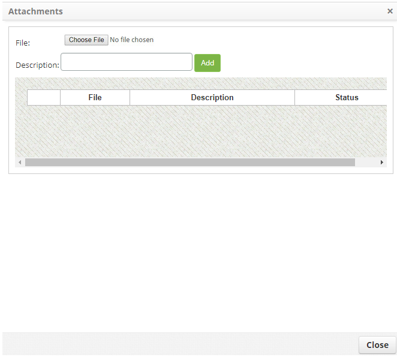

title: Release test
Description: This feature allows you to register information on the test execution regarding the changes that were made during the execution of the release request.

# Release test

his feature allows you to register information on the test execution regarding
the changes that were made during the execution of the release request.

How to access
-------------

1.  Access the **Release Management** feature navigating through the main
    menu **Process Management > Release Management > Release
    Management.**

Preconditions
-------------

1.  Have the release request in the test phase.

Filters
-------

1.  The following filters enables the user to restrict the participation of
    items in the standard feature listing, making it easier to find the desired
    items:

-   Request Nº;

-   Assigned/Shared.

**Figure 1 - Release search screen**

Items list
----------

1.  The following cadastral fields are available to the user to facilitate the
    identification of the desired items in the standard feature
    listing: Number, Aplicant Name, Created on, Prority, Time limit, Delay,
    Situation, Current task, Executor Group, Current responsible e Shared
    with.

2.  There are action buttons available to the user for each item in the listing,
    they are: *View*, *Report*, and *Action*.

3.  The release management screen will be displayed. On the Management tab,
    locate the release request, where the test information will be registerd,
    click on the *Action* button and click on the *Start/Run Task* option, as
    indicated on the image below:

   
   
   **Figure 2 - Execute current release request task**

4.  The **Release Request Registration** screen appears with the fields filled,
    with the contents of the selected request:

-   Record the necessary information about the tests;

-   In the **Closing **area, click the *Add an Execution Record* button. After
    that, describe the information about the execution of your activity.

Linking attachments
-------------------

1.  To attach a file to the release request, proceed as explained below:

   -   On the right side of the release request screen, click on
    the **Attachments** tab, as illustrated on the image:

   
   
   **Figure 3 - Attachments guide**

   -   The file attachment screen will be displayed, as illustrated on the image
    below:

   
   
   **Figure 4 - File addition screen**

   -   To add a file, click the *Choose File* button. The screen will appear to
    select the desired file;

   -   Select the file and after that, enter the description of the file and click
    the *Add* button;

   -   After adding the file, click the *Close* button to return to the release
    request screen.

2.  After saving the information regarding the test performed, click on
    the *Save and Forward Flow* button perform the operation, at which the
    release will be sent to the approval phase;

3.  To save only the registerec information on the test performed and keep the
    current task, click the *Save and Keep the Current Task* button:

-   In both cases prior to clicking the *Save* button the date, time and user
    will be automatically stored for a future audit.

Filling in the registration fields
----------------------------------

1.  Not Applicable.

!!! tip "About"

    <b>Product/Version:</b> CITSmart | 8.00 &nbsp;&nbsp;
    <b>Updated:</b>08/28/2019 – Anna Martins
