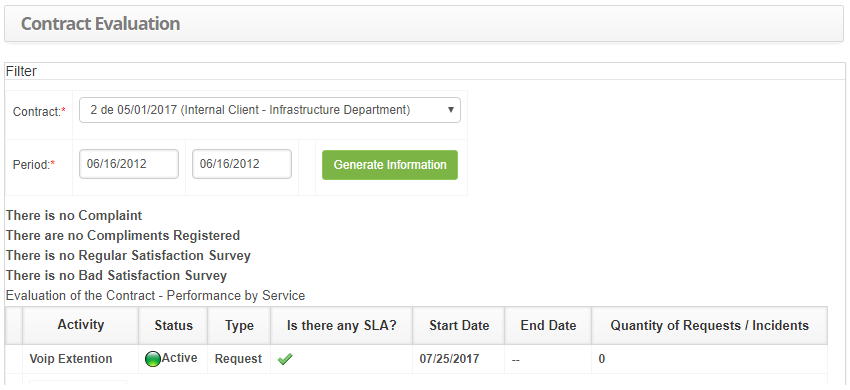

title: Contract evaluation
Description: The goal of this feature is to check the performance of the service contract.

# Contract evaluation

How to access
------------

1.  Access the Contract Evaluation feature navigating through the main
    menu **Process Management > Service Level Management > Contract
    Evaluation**.

Preconditions
------------

1.  Have the contract registered (see knowledge [Contract registration and
    search][1]);

2.  Have activities registered (see knowledge [Service activity
    registration][2]).

Filters
------

1.  The following filters enables the user to restrict the participation of
    items in the standard feature listing, making it easier to find the desired
    items:

-   Contract;

-   Period.

Items list
----------

1.  The following cadastral fields are available to the user to facilitate the
    identification of the desired items in the standard feature
    listing: Activity, Status, Type, Is there any SLA?, Start Date, End
    Date and Quantity of Requests/ Incidents.

2.  The **Contract Evaluation** screen will be displayed, as illustrated on the
    image below:

    
    
    **Figure 1 - Service Contract Performance Screen**

3.  Select the contract and insert the intended period;

4.  After setting the filters, click on the *Generate Information* button.
    Afterwards, the service performance report will be generated.

Filling in the registration fields
--------------------------------

1.  No applicable.

[1]:/en-us/citsmart-platform-7/additional-features/contract-management/use/register-contract.html
[2]:/en-us/citsmart-platform-7/processes/portfolio-and-catalog/activity.html

!!! tip "About"

    <b>Product/Version:</b> CITSmart | 8.00 &nbsp;&nbsp;
    <b>Updated:</b>08/27/2019 - Anna Martins
