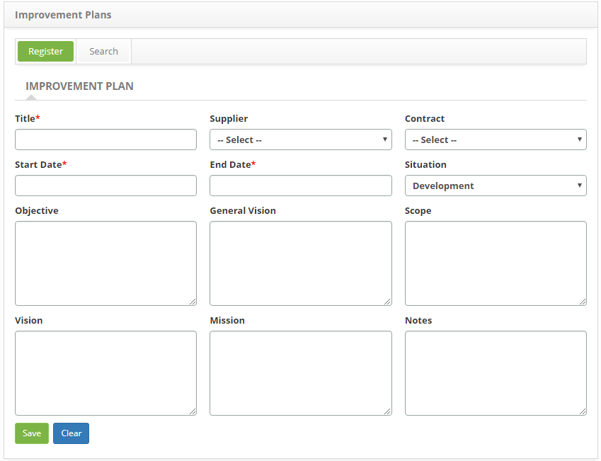

title: Improvement plan registration and search
Description: This feature is intended to record improvement plans aimed at implementing improvements to the IT service.

# Improvement plan registration and search

This feature is intended to record improvement plans aimed at implementing
improvements to the IT service.

Preconditions
-------------

1.  Have the supplier registered (see knowledge [Supplier registration and
    search][1]);

2.  Have the contract registered (see knowledge [Contract registration and
    search][2]).

How to access
-------------

1.  Access the Improvement Plan functionality through navigation in the main
    menu **Process Management > Service Level Management > Improvement
    Plan**.

Filters
-------

1.  The following filter enables the user to restrict the participation of items
    in the standard feature listing, making it easier to find the desired items:

  -   Title.

   
    
   **Figure 1 - Improvement plans search screen**

2.  Perform the improvement plan search;

3.  Enter the title of the improvement plan you want to search for and click
    the *Search* button. After that, the registration of the improvement plan
    will be displayed according to the title informed;

4.  If you want to list all the improvement plan records, simply click
    the *Search* button directly.

Items list
----------

1.  The following cadastral field is available to the user to facilitate the
    identification of the desired items in the standard feature
    listing: **Title**;

2.  On the Improvement Plan screen, click the **Search** tab. The search screen
    will be displayed as shown in the figure below:

    
    
    **Figure 2 - List of titles of improvement plans**

3.  After the survey, select the desired improvement plan record. Once this is
    done, it will be directed to the registration screen displaying the contents
    of the selected registry;

4.  To change the data of the improvement plan record, simply modify the
    information of the desired fields and click the *Save* button to save the
    change made to the record, where the date, time and user will be saved
    automatically for a future audit.

Filling in the registration fields
----------------------------------

1.  The **Improvement Plan Master** screen will be displayed, as shown in the
    following figure:

    
    
    **Figure 3 - Improvement Plan screen**

2.  Fill in the fields as directed below:

    -  **Title**: report the title of the improvement plan;

    -  **Supplier**: inform the supplier;

    -  **Contract**: report the contract;

    -  **Start Date**: enter the start date of the improvement plan;

    -  **End Date**: report the end date of the improvement plan;

    -  **Situation**: select the situation where the improvement plan is;

    -  **Objective**: describe the objective of the improvement plan, ie what
        is expected after implementation of the improvement plan;

    -  **Overview**: describe the overview of the improvement plan;

    -  **Scope**: describe the scope of the improvement plan;

    -  **Vision**: describe the vision of the improvement plan;

    -  **Mission**: describe the mission of the improvement plan;

    -  **Notes**: report the improvement plan notes.

3.  Click the *Save* button to perform the operation, where the date, time and
    user will be automatically saved for a future audit.

Registering goals for improvement plan
--------------------------------------

1.  After recording the improvement plan, an area for recording the objective
    will be displayed, as shown in the figure below:

    
    
    **Figure 4 - Improvement Plan screen**

2.  Click the *Register Target* button. Once this is done, a screen will appear
    for recording the information of the improvement plan objective, as shown in
    the figure below:

    
    
    **Figure 5 - Plan of Improvement Plan Objective Record**

    -   **Object**: report the description of the specific objective of the
    improvement plan;

    -   **Details**: enter the details of the goal of the improvement plan;

    -   **Expected Result**: report the expected result of the improvement plan
    goal;

    -   **Measurement**: report the measurement of the objective of the improvement
    plan;

    -   **Type of Responsible**: inform the type of person responsible for the
    objective of the improvement plan: user or group;

    -   **Responsible**: inform the person responsible for the objective of the
    improvement plan.

3.  After the data is entered, click the *Save* button for recording and adding
    the objective in the improvement plan record;

4.  To change the registration information for the improvement plan goal, click
    the  , modify the data you want and click *Save* to make the change, where
    the date, time and user will be saved automatically for a future audit;

5.  To check/record actions and monitor the goal, click on the icon .

Registering actions and monitoring the purpose of the improvement plan
----------------------------------------------------------------------

1.  After defining the objective of the improvement plan, one area will be
    presented for registration of actions and another for recording of
    monitoring as shown in the figure below:

**Figure 6 - Area for Record of Actions and Monitoring**

### **Actions**

1.  Click the *Register Action* button. Once this is done, a screen will appear
    for recording the action information as shown in the figure below:

    

    **Figure 7 - Action Registration screen**

    -   **Action**: report the description of the action of the goal of the
    improvement plan;

    -   **Start Date**: enter the start date of the action plan for the improvement
    plan;

    -   **End Date**: report the end date of the action plan for the improvement
    plan

    -   **Type of Person in charge**: inform the type of person responsible for the
    action of the objective of the improvement plan: user or group;

    -   **Responsible**: inform the person responsible for the action of the
    objective of the improvement plan;

    -   **Details**: describe what will be done to achieve the goal and how it will
    be done.

2.  After the data is entered, click the *Save* button to save and add the goal
    action to the improvement plan record;

3.  To change the action log information, click the  , modify the data you need
    and click *Save* to make the change, where the date, time and user will be
    saved automatically for a future audit.

Monitoring
----------

1.  Click the *Register Monitoring* button. Once this is done, a screen will be
    displayed to record the monitoring information as shown in the figure below:

    
    
    **Figure 8 - Monitoring screen**

    -   **Title**: report the title of the monitoring;

    -   **Critical Success Factor**: report the critical success factor of
    monitoring;

    -   **Type of Person in charge**: inform the type of person responsible for
    monitoring: user or group;

    -   **Responsible**: inform the person in charge of the monitoring;

    -   **Metrics**: describe the metrics of monitoring;

    -   **Measurement**: describe the monitoring measurement;

    -   **Reports**: report the monitoring report;

    -   **KPI**: report the monitoring KPI and click the *Insert* button to insert
    the KPI into the monitoring log. You can insert multiple KPIs into the log
    as many as needed.

2.  After the data is entered, click the *Save* button for recording and adding
    the objective monitoring in the improvement plan record;

3.  To change the tracking log information, click the  , modify the data you
    want and click *Save* to make the change, where the date, time and user will
    be saved automatically for a future audit.

[1]:/en-us/citsmart-platform-7/processes/portfolio-and-catalog/provider.html
[2]:/en-us/citsmart-platform-7/additional-features/contract-management/use/register-contract.html

!!! tip "About"

    <b>Product/Version:</b> CITSmart | 8.00 &nbsp;&nbsp;
    <b>Updated:</b>07/12/2019 – Anna Martins

