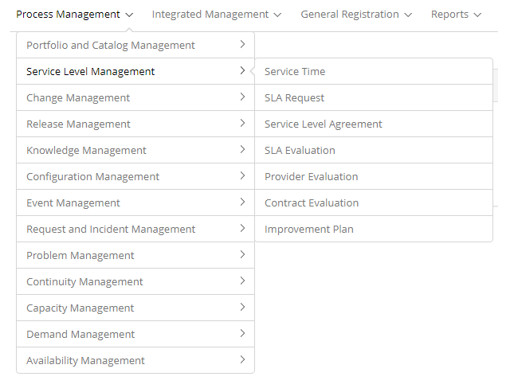

title: Service level management module
Description: Service level management module

# Service level management module

Module objective
----------------

Service Level Management is a process responsible for maintaining, improving and
delivering the quality expected by the business, through agreements, contracts,
measuring performance, justifying the costs related to the business. It also
aims to ensure that current and planned IT services are delivered with tangible
goals. This can be done through a constant cycle of negotiation, agreement,
monitoring, reporting and review of goals and results obtained and through
actions to correct and improve the level of service delivered.

The main information provided by the Service Level Management process includes
Service Level Agreement (SLA) and Operational Level Agreement (OLA). The SLA is
the formal definition of the level of service delivered by the IT department or
a service provider external to your customers. It should include the service
level objectives, which will define their quality and availability. The OLA, in
turn, is an operational agreement established between the service providers of
the company that makes up the provision of an IT service.

Where are the features
----------------------

To access the functionality click on the main menu **Process Management > Service Level Management**.

**Figure 1 - Service Level Management module menu**

Main feature (in highlight)
---------------------------

In the *See also* section you can access the main functionality(ies) of this
module, in order to obtain a more detailed knowledge.

See also
--------

-   [Time attendance registration and
    search](/en-us/citsmart-platform-7/processes/service-level/time-attendance.html)

-   [Service level agreement condition registration and
    search](/en-us/citsmart-platform-7/processes/service-level/sla-requiriment.html)

!!! tip "About"

    <b>Product/Version:</b> CITSmart | 7.00 &nbsp;&nbsp;
    <b>Updated:</b>08/30/2019 - Anna Martins
