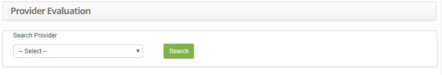

Title:Provider evaluation
Description: The goal of this feature is to check the performance of the provider by service.

# Provider evaluation

The goal of this feature is to check the performance of the provider by service.

How to access
-------------

1.  Access the Provider Evaluation feature navigating through the main
    menu **Process Management > Service Level Management > Provider
    Evaluation**.

Preconditions
-------------

1.  Have the provider registered (see knowledge [Supplier registration and
    search][1]);

2.  Have a service registered (see knowledge [Service activity
    registration][2]).

Filters
-------

1.  The following filter enables the user to restrict the participation of items
    in the standard feature listing, making it easier to find the desired items:

    - Search Provider.

2.  The **Provider Evaluation** screen will be displayed, as illustrated on the
    image below:

**Figure 1 - Provider Performance Evaluation Screen**

Items list
----------

1.  The following cadastral fields are available to the user to facilitate the
    identification of the desired items in the standard feature
    listing: Service, Status, Type, Is there any SLA?, Star Date and End
    Date.

2.  The provider performance report by service will be generated, as illustrated
    on the image below:

**Figure 2 - Provider Evaluation Report**

Filling in the registration fields
----------------------------------

1.  Not applicable.

[1]:/en-us/citsmart-platform-7/processes/portfolio-and-catalog/provider.html
[2]:/en-us/citsmart-platform-7/processes/portfolio-and-catalog/activity.html

!!! tip "About"

    <b>Product/Version:</b> CITSmart | 8.00 &nbsp;&nbsp;
    <b>Updated:</b>08/27/2019 – Anna Martins
