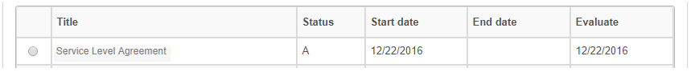

title: General service level agreement registration and search
Description: This feature allows you to record the service level agreement of type *availability*, *time (byphases)* and *miscellaneous information captured from other sources*.

# General service level agreement registration and search

This feature allows you to record the service level agreement of
type *availability*, *time (by phases)* and *miscellaneous information captured
from other sources*.

How to access
-------------

1.  Access the General Service Level Agreement functionality by navigating the
    main menu **Processes Management > Service Level
    Management >  Service Level Agreement**.

Preconditions
-------------

1.  Have the priority registered (see knowledge [Priority registration and search][1]);

2.  Have the group registered (see knowledge [Group registration and search][2]);

3.  Have defined e-mail templates (see knowledge [E-mail template configuration registration and search][3]);

4.  Have the unit registered (see knowledge [Unit registration and search][4]);

5.  Have the user registered (see knowledge [User registration and search][5]);

6.  Have the service level agreement requirement registered (see knowledge [Service level agreement condition registration and search][6]).

Filters
-------

1.  The following filter allows the user to restrict the participation of items
    in the standard listing of the functionality, facilitating the location of
    the desired items, as shown in the figure below:

   -   Title;

   -   Status;

   -   Agreement Type.

2.  On the General Service Level Agreement screen, click the Search Service
    Level Agreement (General) tab. The search screen will be displayed as shown
    in the figure below:

    
    
    **Figure 1 - General Service Level Agreement search screen**

3.  Perform service level agreement search:

    -   **Title**: enter the title of the service level agreement you want to
        search;

    -   **Status**: select the status of the service level agreement;

    -   After the filter is set, click the *Search* button. Once this is done,
        the service level agreement record will be displayed according to the
        data reported;

    -   If you want to list all of the service level agreement records, simply
        click the *Search* button directly.

4.  To change the log data according to the service level agreement, simply
    modify the information of the desired fields and click the Record button to
    save the change made to the record, where the date, time and user will be
    saved automatically for a future audit.

Items list
----------

1.  The following cadastral fields are available to the user to facilitate the
    identification of the desired items in the standard listing of the
    functionality: Title, Status, Start Date, End
    Date and Evaluate.

**Figure 2 - Items screen**

Filling in the registration fields
----------------------------------

1.  The **General Service Level Agreement Master** screen will be displayed, as
    shown in the following figure:

    
    
    **Figure 3 - General Service Level Agreement Record screen**

2.  Fill in the fields as directed below:

    -  **Agreement Title**: enter the title of the service level agreement;

    -  **Agreement Type**: select the type of service level agreement;

       -  **Availability**: this type of agreement indicates the availability of
          the service, that is, if it is accessible for an agreed period of time.
          Eg: Have the service provider monitoring the client's company site full
          time to make sure that users can access the content of the site full
          time;

       -  **Time (by phases)**: this type of agreement links the service time to a
          phase, that is, instead of calculating by time, the SLA will be
          calculated by a phase that corresponds to an agreed period for the
          capture period and execution;

       -  **Information captured from several other sources**: this type of
          agreement stipulates the limits of the OS (Service Order) to the chosen
          service.

    -   **Seasonality**: inform the time when services and service level agreement
    will be evolved in accordance with the business;

    -   **Impact**: report the impact that causes the absence of service operation
    within the organizational environment. Example: the local network stops
    working, the impact on the organization is very high, since nobody accesses
    the services provided by the servers;

    -   **Urgency**: inform the urgency of the restoration of the service within the
    organizational environment. Example: following the above example, the
    urgency to reestablish the local network link is high since the company is
    dependent on the communication with the servers for the storage of its
    operational information, damaging all the productivity of the company in
    this stop;

    -   **Allows impact/urgency change?**: define if it will be allowed to change
    the impact and urgency in the registration of the service request;

    -   **Situation**: report the service level agreement status: Active (in current
    use) or Inactive (disabled);

    -   **Agreement Description**:describe the details of the service level
    agreement;

    -   **Agreement Scope**: describe a macro view on the service level agreement;

    -   **Start Date**: Enter the start date of the service level agreement;

    -   **End Date**: Enter the future date for termination of the service level
    agreement. It may be informed at the time of closure of the agreement;

    -   **Evaluate**: enter the date on which the service level agreement will be
    evaluated;

    -   **Contacts**: describe the contact information about the service level
    agreement;

    -   If the type of informed agreement is **Availability**, enter the service
    availability index:

    
    
    **Figure 4 - Availability Index Log**

       -   Inform the percentage of availability of the service, that is, if 90% means
           that from 10% of downtime on the service the contract may suffer some type
           of agreed penalty on itI

    -   If the type of informed agreement is **Time (per phase)**, set the SLA
    (Service Level Agreement) deadlines, taking into account the priority. The
    priority is from 1 to 5, with 1 being the highest priority and 5 being the
    lowest:

    
    
    **Figure 5 - Time recording (per phase)**

    -   **Capture**: set the capture time of the service request, according to
    priority;

    -   **Resolution**: set the resolution time of the service, according to
        priority;

    -   **Action Time**: enter the time for execution of the service request;

    -   **Priority**: enter the priority of the service;

    -   **Group**: report the executing group of the service;

    -   **E-mail Model**: select the e-mail template, which will be sent when
        the service request is not met by the specified SLA deadline.

After the N minutes (informed in the action time) and if you have not taken
any action on the service request linked to this SLA, the system will assign the
priority and escalate the group to execute the service request.

   -  Select the units and assign a priority to each;

         -  **Search Unit**: enter the unit that receives priority;

         -  **Priority**: Indicate the priority of the service for the unit;

         -  Once this is done, click the  to add unit priority information;

         -  If you want to remove some priority information from the drive that was
        added, just click the  .

   -  Select the users and assign a priority to each;

         -   **Search User**: inform the user; 
    
         -   **Priority**: indicate the priority of the service for the user;

         -   Once this is done, click the  for adding user priority information;

         -   If you want to remove some priority information from the user that
            was added, just click on the icon .

   -  If the type of agreement informed is Information captured from several
    other sources, please inform the service agreement data:

   
    
   **Figure 6 - Recording of Information captured from several other sources**

   -   **Value limit**: enter the limit value for gloss. This value can be a p
    rcentage of attendance or number of events. Example: the service must reach
    99.7% of availability per month or up to 4 incidents of the contracted
    organization may occur in the month. The excess of this limit will be
    penalized with the value specified in the Glare limit field;

   -   **Unit (Limit** **Value)**: enter the unit of the value limit for gloss.
    Example: percentage or quantity of events;

   -   **Gloss**: Please provide details of what has been agreed regarding gloss.
    Example: Availability of use for critical services should be 24x7;

   -   **Gloss of Limit**: enter the percentages to be paid on the value of the
    contract in case of non-compliance. Example: 0.5% gloss for every tenth of
    service failure or 0.2% for each reporting failure above the target up to 10
    occurrences, 0.5% up to 20 occurrences, etc.

3.  After entering the data, click the *Save* button to register, where the
    date, time and user will be saved automatically for a future audit.

Verifying the audit history of the service level agreement
----------------------------------------------------------

1.  After searching, select the desired record. Once this is done, it will be
    directed to the registration screen displaying the contents of the selected
    registry;

    -   The relationship between the service level agreement and customer contracts
    is provided in the Client Contracts tab;

    -   The relationship between the service level agreement and the operational
    level agreement is provided in the Operational Level Agreement tab;

    -   The third-party Contracts tab is the association between the service level
    agreement with third-party contracts;

    -   The history of the changes made to the service level agreement record is
    displayed in the History tab, as shown in the figure below:

**Figure 7 - Audit History screen**

[1]:/en-us/citsmart-platform-7/processes/portfolio-and-catalog/priority-register.html
[2]:/en-us/citsmart-platform-7/initial-settings/access-settings/user/group.html
[3]:/en-us/citsmart-platform-7/plataform-administration/email-settings/configure-email-template.html
[4]:/en-us/citsmart-platform-7/plataform-administration/region-and-language/register-unit.html
[5]:/en-us/citsmart-platform-7/initial-settings/access-settings/user/user-register.html
[6]:/en-us/citsmart-platform-7/processes/service-level/sla-requiriment.html

!!! tip "About"

    <b>Product/Version:</b> CITSmart | 8.00 &nbsp;&nbsp;
    <b>Updated:</b>08/27/2019 – Anna Martins
