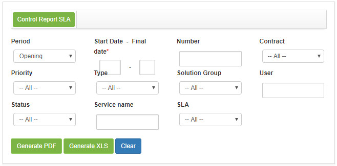

title: Report generation – Service level management
Description: Report generation – Service level manageme

# Report generation – Service level management

Generating SLA control report
-----------------------------

*This report aims to present the deadlines for service requests*.

### How to access

1.  Access SLA Control Report functionality through navigation in the main
    menu **Reports > Service Level Management > SLA Control**.

### Filters

1.  The following filter enable the user to restrict the participation of items
    in the standard feature listing, making it easier to locate the desired
    items as shown in the figure below:

    - **Period**: enter the opening period of the service requests that you want to check the SLA;

    - **Start date - Final date**: inform the start date and end date for the selected period;

    - **Number**: enter the service request number you want to check the SLA;

    - **Contract**: inform the contract that you want to check the SLA of your respective service requests;

    - **Priority**: enter the priority to check the SLA of the related service requests;

    - **Type**: enter the type of service request you want to check the SLA;

    - **Solution Group**: Inform the executing group of the service request that you want to check the SLA;

    - **User**: inform the requestor of the service request that you want to verify the SLA;

    - **Status**: inform the situation of the service request that you want to check the SLA;

    - **Service Name**: enter the name of the service that was requested to check the SLA;

    - **SLA**: enter the deadline for the execution of the service request.

2.  The **SLA Control Report** screen will be displayed, as shown in the following figure:

    
  
    **Figure 1 - SLA control report generation screen**

3.  Set the filters as needed.

Generating late sla control report
----------------------------------

*This report aims to present the number of priority service requests that are
with the SLA out of date and on time.*

### How to access

1.  Access the Delayed SLA Control Reporting functionality through the main menu
    navigation **Reports > Service Level Management > Delayed SLA
    Control Report**.

### Filters

1.  The following filter enable the user to restrict the participation of items
    in the standard feature listing, making it easier to locate the desired
    items as shown in the figure below:

    - **Opening Period**: enter the period you want to check the number of SLA service requests outside and on time;

    - **Contract**: inform the contract that you want to check the number of SLA service requests outside and on time;

    - **Priority**: tell the priority you want to check the number of related requests that are with the SLA outside and on time;

    - **Solution Group**: inform the executing group to check the quantity of service requests of the same as with SLA outside 
    and on time;

    - **Unit**: inform the unit to check the amount of requests related to it that are SLA out and on time;

    - **Service**: inform the service to check the amount of requests related to the same that are with SLA outside and on time;

    - **Service Type**: enter the type of service to check the number of requests for the type selected with SLA outside and on 
    time;

    - **Status**: inform the request situation to check the number of requests that are with SLA outside and within the deadline;

    - **Classification**: inform the classification of the request to verify the number of requests that are with SLAs
    outside and within the deadline;

    - **Origin**: enter the origin of the request to verify the number of requests that are SLA-compliant and out-of-date.

2.  The Late SLA Control Report screen will be displayed, as shown in the
    following figure:

    
   
    **Figure 2 - Delayed SLA control report generation screen**

3.  Set the filters as needed.

!!! tip "About"

    <b>Product/Version:</b> CITSmart | 7.00 &nbsp;&nbsp;
    <b>Updated:</b>08/29/2019 - Anna Martins
    
