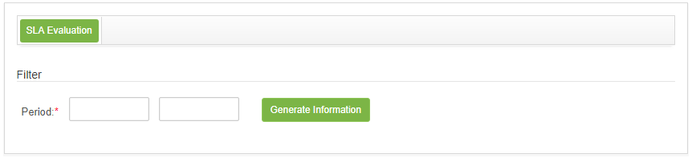

title: SLA evaluation
Description: This feature aims to generate information according to the level of service, where they will assist in the preparation of a quality plan.

# SLA evaluation

This feature aims to generate information according to the level of service,
where they will assist in the preparation of a quality plan.

How to access
-------------

1.  Access the SLA Evaluation feature by navigating the main menu **Processes
    Management > Service Level Management > SLA Evaluation**.

Preconditions
-------------

1.  No applicable.

Filters
-------

1.  The following filter enables the user to restrict the participation of items
    in the standard feature listing, making it easier to find the desired items:

    - Period.

2.  The SLA Information Generation screen will be displayed, as shown in the
    following figure:

    
    
    **Figure 1 - SLA Information generation screen**

3.  Enter the desired period and click the *Generate Information* button;

4.  The SLA information will be displayed according to the reporting period.

Items list
----------

1.  No applicable.

Filling in the registration fields
----------------------------------

1.  No applicable.

!!! tip "About"

    <b>Product/Version:</b> CITSmart | 8.00 &nbsp;&nbsp;
    <b>Updated:</b>08/27/2019 – Anna Martins
