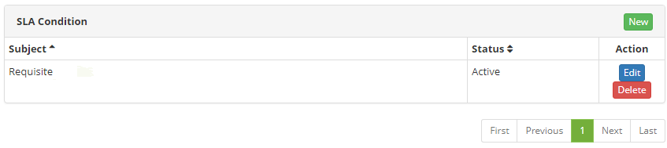

title: Service level agreement condition registration and search
Description: The goal of this feature is to register the service level agreement conditions to be used in other system routines.

# Service level agreement condition registration and search

The goal of this feature is to register the service level agreement conditions
to be used in other system routines.

How to access
-------------

1.  Access the Service Level Agreement Condition feature navigating through
    the main menu **Process Management > Service Level
    Management > SLA Request**.

Preconditions
-------------

1.  Have the employee registered (see knowledge [Staff registration and
    search][1]).

Filters
-------

1.  The following filters enable the user to restrict the participation of items
    in the standard feature listing, making it easier to locate the desired
    items as shown in the figure below:

   -   Subject;

   -   Status.

   
   
   **Figure 1 - Service Level Agreement Condition search screen**

2.  To search for a service level agreement condition entry, insert the subject
    and/or status of the service level agreement condition. Afterwards, the
    entries will be displayed according to the filters provided.

Items list
----------

1.  The following cadastral fields are available to the user to facilitate the
    identification of the desired items in the standard listing of the
    functionality: **Subject** and **Status**;

2.  There are action buttons available to the user for each item in the listing,
    they are: *Edit* and *Delete* (according to the figure 1);

    

    **Figure 2 - SLA condition listing screen**

3.  To edit a service level agreement condition, click on the *Edit* button.
    Afterwards, they will be directed to the registry screen displaying the
    content of the selected entry;

4.  To create another SLA condition using the current one, just click on
    the *Create SLA from this Requirement*.

Filling in the registration fields
----------------------------------

1.  The Service Level Agreement condition screen will be displayed;

2.  Click on the *New* button. Then, the **Service Level Agreement Requirement
    Master Data** screen will be displayed, as illustrated on the image below:

    
    
    **Figure 3 - Service Level Agreement Condition Entry screen**

3.  Complete the fields as instructed below:

    -   **User**: insert the condition's applicant;

    -   **Ordered in:** insert the date on which the service level agreement
        condition was requested;

    -   **Status**: insert the status of the service level agreement condition;

    -   **Subject**: insert the subject of service level agreement condition;

    -   **Details**: insert the details of the service level agreement
        condition.

4.  After inserting the data, click on the *Save* button to confirm the entry,
    at which date, time and user will be automatically stored for a future
    audit.

[1]:/en-us/citsmart-platform-7/processes/tickets/ticket-management.html

!!! tip "About"

    <b>Product/Version:</b> CITSmart | 8.00 &nbsp;&nbsp;
    <b>Updated:</b>08/27/2019 – Anna Martins
