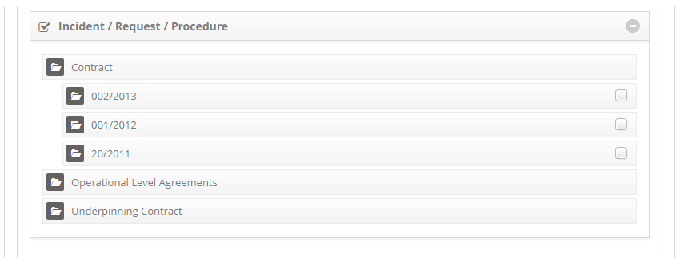

title: Time attendance registration and search
Description: The service time feature allows you to record the service time of the Global type (applies to all services), Customer (applies to contract services) and Incident/Request/Procedure (applies to a specific service).

# Time attendance registration and search

The service time feature allows you to record the service time of the Global
type (applies to all services), Customer (applies to contract services) and
Incident/Request/Procedure (applies to a specific service).

Preconditions
-------------

1.  Have defined the portfolio of services to apply the time of service to the
    services (see knowledge [Service Portfolio registration][1], [Service
    registration][2], [Service Attributes configuration][3]).

How to access
-------------

1.  Access the Call Time feature by browsing the main menu **Process
    Management > Service Level Management > Service Time**.

Filters
-------

1.  The following filter enables the user to restrict the participation of items
    in the standard feature listing, making it easier to find the desired items:

    - SLA Title.

2.  On the Time of Service screen, click the Search tab, the respective
    search screen will be displayed as shown in the figure below:

**Figure 1 - Service level target screen**

Items list
----------

1.  The following cadastral fields are available to the user to facilitate the
    identification of the desired items in the standard feature listing: SLA
    Title, Description and Situation.

    
    
    **Figure 2 - Service time listing screen**

2.  Perform the survey of the time of service:

    -  The consultation is performed by type of service (Global, Customer and
    Request/Incident/Procedure). Select the type of service you want, enter the
    title of the record and click the *Search* button. Once this is done, the
    registration will be displayed according to the title informed;

    -  If you want to list all service time records for a service type, simply
    click directly on the *Search* button, where all the records related to the
    type of service selected will be displayed.

3.  After the search, select the desired service time record. Once this is done,
    you will be directed to the registration screen displaying the contents of
    the selected record;

4.  To change the time stamp data, simply change the information of the desired
    fields and click on the *Save* button to save the change made to the record,
    where the date, time and user will be saved automatically for a future
    audit.

Filling in the registrations fields
-----------------------------------

1.  The **Time Attendance Registration** screen will be displayed, as shown in
    the figure below:

    
    
    **Figure 3 - Attendance time master screen**

2.  Fill in the fields as directed below:

    -   Select the type of service time you want to
        create: **Global**, **Customer** or **Incident/Request/Procedure**;

    -   **Title**: inform the title of the time of service;

    -   **Situation**: select the service time situation: Active (in current
        use) or Inactive (disabled);

    -   **Impact**: report the impact that causes the absence of service
        operation within the organizational environment;

    -   **Urgency**: report the urgency of restoring service within the
        organizational environment;

    -   **Impact/Urgency Change**: define if it will be allowed to change the
        impact and urgency in the registration of service request;

    -   **Seasonal**: check this option if the service time is temporary;

    -   **Start date**: enter the start date of the service time;

    -   **End date**: enter a future date to deactivate the service time, or
        inform the date when the service is to be deactivated;

    -   **Evaluate in**: state the date on which the service time will be
        evaluated;

    -   **Description**: describe the details about the time of service;

    -   **Scope**: describe a macro view on the time of service rendering;

    -   **Contacts**: describe the contact information regarding the time of
        service;

    -   Define how long the service is serviced, taking priority into account.
        Priority is used to identify the times required for appropriate action
        to be taken. The priority is from 1 to 5, with 1 being the highest
        priority and 5 being the lowest. Select the priority for time setting:

        -   **Resolution**: set the resolution time of the service, according to the
            priority selected.

        -   **Capture**: set the capture time of the service request, according to
            the selected priority.

    !!! warning "ATTENTION"

        Before filling in the fields of the "Automation" tab it must be properly
        parameterized, for this it is necessary to perform the steps in the FAQ
        knowledge, "How to enable the service requests scheduling
        rule?" (available at the end of this knowledge), except for parameter 190 which should be equal to 'N' in this 
        context.

3.  Define the automation data:

    -   **Action Time**: enter the time for executing the service request;

    -   **E-mail Template**: select the e-mail template, which will be sent
        when the service request is not answered at the specified service time;

    -   **Priority**: enter the priority of execution of the service;

    -   **Group**: report the executing group of the service.

    !!! note "NOTE"

        After the N minutes (informed in the action time) and if you have not
        taken any actions in the request of the service linked to this service time,
        the system will assign the priority and escalate the group to execute the
        service request.

    -   In the **Incident/Request/Procedure** box, select the services to apply the
    settings, taking into account the type of service time selected:

    -  **Global**: allows you to select all contracts, as many as you wish, to
        apply the configuration of the service time in their services, according
        to the example shown in the figure below:

    
    
    **Figure 4 - Application of service time to contracts services**

    -   **Client**: allows to select only one contract to apply the configuration of
    the service time in the services of the same, as shown in the figure below:

    
    
    **Figure 5 - Application of customer service time (contract)**

    -   **Request/Incident/Procedure**: select only one service to apply the service
    time setting, as shown in the figure below:

    
    
    **Figure 6- Application of the time of service to the request/incident service**

4.  If type of service time selected is **Customer** or **Incident/Request/Procedur** e, list the units and
    employees (employees);

    
    
    **Figure 7 - Unit and employee relationships**

    -   Enter the unit and assign a priority. Once this is done, click the *Add* button to perform the:

        -   **Priority**: indicate the priority of the service for the unit;

        -   **Unit**: enter the desired unit.

    -   Inform the employee and assign a priority;

        -   **Employees**: report the employee;

        -   **Priority**: indicate the priority of the service for the employee;

        -   **Critical**: indicate if the employee is of the type "critical" to the
            business, that is, that must have the attendance of the service with
            high priority;

    -   Once this is done, click the *Add* button to perform the operation.

5.  After recording the data, click on the *Save* button to register, where the
    date, time and user will be saved automatically for a future audit.

[1]:/en-us/citsmart-platform-7/processes/portfolio-and-catalog/register.html
[2]:/en-us/citsmart-platform-7/processes/portfolio-and-catalog/services.html
[3]:/en-us/citsmart-platform-7/processes/portfolio-and-catalog/configure-service-attribute.html

!!! tip "About"

    <b>Product/Version:</b> CITSmart | 8.00 &nbsp;&nbsp;
    <b>Updated:</b>08/27/2019 – Anna Martins

[How to enable the service requests scheduling rule]:/en-us/citsmart-docs/user-guide/faq/faq.html
