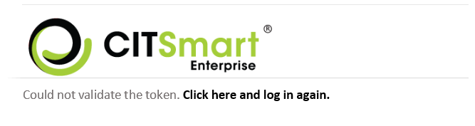

title: Request approval via e-mail
Description: This functionality aims to approve or reject the ticket request through the e-mail, without the need for the administrator to be logged in.

# Request approval via e-mail

Preconditions
-------------

1.  Enter the content below into the parameters (see knowledge [Parameterization
    rules - system][1]);

   -   Parameter 33: system URL ;

   -   Parameter 370: should be set to "Y";

2.  Have at least one user/group registered (see knowledge [User registration
    and search][2], [Group registration and search][3]);

3.  Know how to design request approval flow via registered e-mail. In this flow
    there should be an "Approval" task and the design for sending e-mail (for
    more details, see the section "Steps to setup e-mail on the flow");

4.  Register the e-mail template with the "Waiting Approval" template that is
    attached;

5.  The e-mail server must be set up correctly (see knowledge [Parameterization
    rules - e-mail][4]).

How to access
-------------

1.  Access the application functionality through navigation in the main
    menu **System > Flow Maintenance**.

Steps to setup e-mail on the flow
---------------------------------

1.  Select the request approval flow;

2.  In the request approval flow click the icon  to setup;

3.  Register the name and model of the e-mail to be used in the Identification
    tab (To register the e-mail template, check the next section);

    !!! warning "ATTENTION"

        Do not change the creation e-mail template (linked to the portfolio) to the
        approval template.

4.  Configure, in the Recipients tab, the recipients (group/user) of the e-mail
    to be sent;

    !!! warning "ATTENTION"

        The system does not search for recipients via "Expression".

    

**Figure 1 - Recipient configuration screen**

!!! warning "ATTENTION"

    If you choose the recipient to be "group", you must link the sending of the e-mail to the users of the selected group 
    (Access and Permission → Group).

   !!! warning "ATTENTION"

       If in the approving group, the user places to receive e-mail, "other users",
       it should be noted that this user may not be able to approve the request,
       since the condition for this is that the user is in the approving group and
       not only being informed that there is an approva

Setting the approval notification e-mail
----------------------------------------

1.  Access the feature via the menu **System > Settings > E-mail model**;

2.  The E-mail model master screen will be displayed;

3.  Record the approval notification e-mail.

    !!! warning "ATTENTION"

        This e-mail is made by HTML.

        The e-mail approval notification model to be used is available in the attachements.

        For more details on how to download the HTLM template when registering for a new notification, see knowledge
        [E-mail template configuration registration and search][5].

4.  Once you have passed the HTML model for the notification template, check the
    following guidelines:

    -   href="{TOKEN(serviceRequestIncident, \${IDSOLICITACAOSERVICO}, VIEW, 50)};

    -   serviceRequestIncident = Direcionamento da interface** **-this field can not
    be changed by the user;

    -   \${IDSOLICITACAOSERVICO} = Chave para incrementar o número da solicitação de
    serviço -this field can not be changed by the user;

    -   VIEW - calls the command to open the request -this field can not be changed
    by the user;;

    -   MM (50) - Tempo de expiração do token em Minutos - this field can be changed
    by the user;

5.  Following the instructions above, the e-mail template will be ready, as
    shown below:

    
    
    **Figure 2 - E-mail example**

6.  The user clicks View:

  -   Allows to observe the request details ;

7.  If the user clicks Approve:

  -   Allows the request approval and a dialog box is generated confirming the
    approval;

8.  If the user clicks Reject:

  -   Allows the request rejection of the and a dialog box is generated confirming
    the disapproval.

!!! warning "ATTENTION"

     When sending the e-mail, this tag would be replaced by a direct link to the request, with validity of 8 hours, for              example. After 8 hours, who clicks>   the link is redirected to a system error page (next figure).

    
**Figure 3 - Error message**

Attachments
-----------

[Dowload - Approval - email][5]

[1]:/en-us/citsmart-platform-7/plataform-administration/parameters-list/parametrization-system.html
[2]:/en-us/citsmart-platform-7/initial-settings/access-settings/user/user-register.html
[3]:/en-us/citsmart-platform-7/initial-settings/access-settings/user/group.html
[4]:/en-us/citsmart-platform-7/plataform-administration/parameters-list/parametrization-email.html
[5]:/en-us/docs/citsmart-platform-7/processes/tickets/images/aguardandoaprovacao-email.docx

!!! tip "About"

    <b>Product/Version:</b> CITSmart | 8.00 &nbsp;&nbsp;
    <b>Updated:</b>07/23/2019 – Anna Martins
