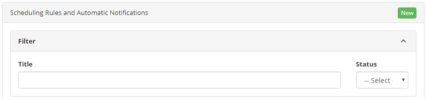
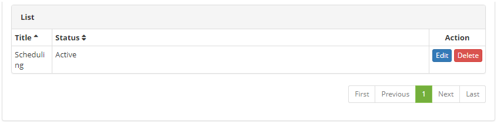
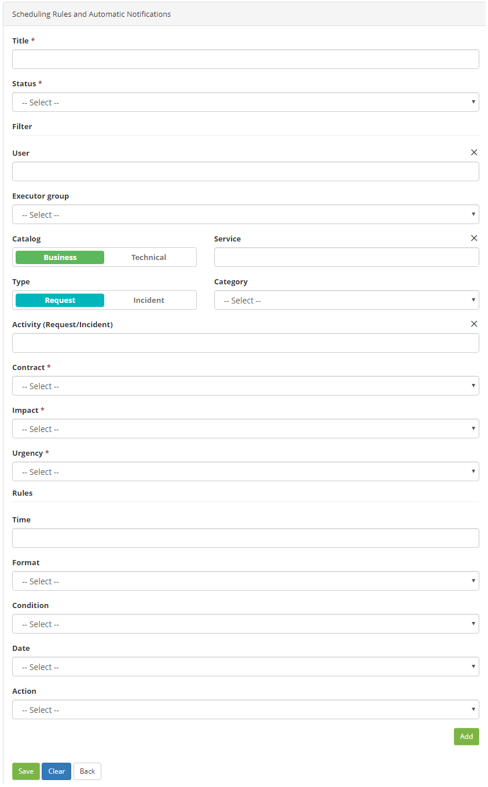

title: Registration and search of ticket scheduling rules
Description: Registration and search of ticket scheduling rules

# Registration and search of ticket scheduling rules

How to access
-----------

1.  Access the functionality through navigation in the main menu **Process Management > Ticket Management > Escalation rules**.

Preconditions
-------------

1.  In the citsmart.cfg file, you have set the START_MONITORA_INCIDENTES property to the parameter TRUE (see knowledge [On-premise installation guide (ITSM)][1]);

2.  Enter the content below into the parameter (see knowledge [Parameterization rules - ticket][2]);

    -   Parameter 190: with the value Y

3.  Have the contract registered. (see knowledge [Contract registration and search][3]);

4.  Have the staff registered. (see knowledge [Staff registration and search][4]);

5.  Have the group registered. (see knowledge [Group registration and search][5]);

6.  Have the service portfolio defined. (see knowledge [Service portfolio registration][6]).

Filters
-------

1.  The following filters enables the user to restrict the participation of items in the standard feature listing, making it easier to find the desired items:

    -   Títle;

    -   Situation.
    
    
    
    **Figure 1 - Scheduling rules search screen**

2.  Perform the scheduling rule record search by entering the name of the rule, the Situation filter can be used to further refine the search.

Itens list
-----------------

1.  The following cadastral fields are available to the user to facilitate the identification of the desired items in the standard feature listing: Title and Status.

2.  There are action buttons available to the user for each item in the listing, they are: *Edit* and *Delete*.

    

    **Figure 2 - Scheduling list screen**

3.  After the search, select the desired record by clicking the Edit button. Once this is done, you will be directed to the registration screen displaying the contents of the selected record.

Filling in the registratio fields
-----------------------------------

1.  When you click the New button, the Schedules Rules and Automatic Notifications screen appears, as shown in the figure below:

    

    **Figure 3 - Scheduling rules registration screen**

1.  Fill in the fields as directed below:

    -   **Title**: enter the name in the new scheduling rule;

    -   **Status**:state the status of the rule (active or inactive);

    -   **User**: inform the rule requester;

    -   **Executer group**: enter the name of the executing group;

    -   **Catalog**: select the type of catalog (Business or Technical);

    -   **Service**: inform the catalog service;

    -   **Type**: enter a request type (request or Incident);

    -   **Category**: select a category type;

    -   **Activity (Request/ Incident)**: enter the name of the service type (request or incident);

    -   **Contract**: select the contract to be linked;

    -   **Impact**: inform the impact level (Low, Medium or High);

    -   **Urgency**: inform the urgency level (Low, Medium or High);

    -   Rules

        -   **Time**: enter the amount of time per rule;

        -   **Format**: choose refers to minutes (rule time) or percentage (referring to SLA time);

        -   **Condition**: inform the condition (Before or After);;

        -   **Date**: choose the reference date (creation date, date of the last occurrence or final date);

        -   **Action**: inform the type of action.

1.  Click Add, and the new scheduling rule will appear in a new checklist, if rule is correct, click *Save*.

[1]:/en-us/citsmart-platform-7/get-started/installation.html
[2]:/en-us/citsmart-platform-7/plataform-administration/parameters-list/parametrizaion-ticket.html
[3]:/en-us/citsmart-platform-7/additional-features/contract-management/use/register-contract.html
[4]:/en-us/citsmart-platform-7/initial-settings/access-settings/user/employee.html
[5]:/en-us/citsmart-platform-7/initial-settings/access-settings/user/group.html
[6]:/en-us/citsmart-platform-7/processes/portfolio-and-catalog/register.html

!!! tip "About"

    <b>Product/Version:</b> CITSmart | 8.00 &nbsp;&nbsp;
    <b>Updated:</b>07/10/2019 – Anna Martins

