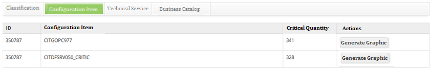

title: Event trend analysis

Description: This functionality aims to generate a Trend Analysis Chart by Business Service on a given period, in order to perform an analysis of the events. Trend analysis consists of using data to forecast future results.

# Event trend analysis

This functionality aims to generate a Trend Analysis Chart by Business Service
in a given period, in order to perform an analysis of the events. Trend analysis
consists of using data to forecast future results.

!!! note "NOTE"

    This functionality can only be used in instances where the client also
    deployed the Events module.

How to access
-------------

1.  Access the event trend analysis functionality by navigating the main
    menu **Processes Management > Tickets Management > Trend Analysis**;

2.  After accessing the functionality, the Trend Analysis screen will be
    displayed, click on the *Events* tab, which will allow the trend analysis of
    events.

Preconditions
-------------

1.  Have a registered and active contract (see knowledge [Contract registration
    and search][1]);

2.  Have a regsitered ticket (see knowlegde [Ticket management
    (services)][2]) and and be linked by the contract;

3.  Configure CITSmart Event Monitor connection (see knowlegde [CITSmart Event
    Monitor connection][3]);

4.  Configure and install the monitoring tool (see knowledge [Inventory
    component installation guide][4]).

Filters
-------

1.  The following filters enable the user to restrict the participation of items
    in the standard feature listing, making it easier to locate the desired
    items as shown in the figure below:

    
    
    **Figure 1 - Event trend analysis screen**

2.  Fill in the fields according to the following guidelines:

-   **EVM - CITSmart Event Monitor Connection**: connection of the CITSmart
    Event Monitor: inform the connection of the CITSmart Event Monitor;

-   **Global Events**: select the desired option;

-   **Classification**: enter the classification of the event you want to
    analyze;

-   **Monitoring Tool - Connection**: inform the monitoring tool;

-   **Parent Configuration Item**: enter the parent configuration item;

-   **Managed Configuration Item**: report the managed configuration item;

-   **Occurrence group category**: select the category of event occurrence
    category;

-   **Occurrence category**: select the occurrence category of events;

-   **Critical Quantity**: enter the critical quantity;

-   **Occurrence Period**: enter the desired period, with the start date and end
    date of event occurrence.

Items list
----------

1.  The following cadastral fields are available to the user to make it easier
    to identify the desired items in the standard feature listing. There are
    action buttons available to the user for each item in the listing, it
    is: *Generate Graphic*;

2.  After completing the filters, click the *Search* button. Once this is done,
    the system will filter and totalize the events that meet the selected
    filters and generate four results:

-   **Classification**: this tab shows the occurrence of events by
    classification;

-   **Configuration Item**: this tab shows the occurrence of events by
    configuration item;

-   **Technical Service**: this tab shows the occurrences of events by technical
    service;

-   **Business Catalog**: this tab shows the occurrences of events by business
    services.

-   Cassification tab:

    -   **Classification** and **Critical Quantity**.

   
   
   **Figure 2 - Events listing screen - Classification tab**

-   Configuration Item tab:

    -   **ID, Configuration Item** and **Critical Quantity**.

   
   
   **Figure 3 - Events listing screen - Configuration Item tab**

-   Technical Service tab:

    -   **ID, Configuration Item** and **Critical Quantity**.

   
   
   **Figure 4 - Events listing screen - Technical Service tab**

-   Business Catalog tab:

    -   **ID, Configuration Item** and **Critical Quantity**.

   
   
   **Figure 5 - Events listing screen - Business Catalog tab**

3.  Each result tab will contain a button for generating the trend analysis
    chart, which displays the dates that comprise the period reported in the
    filters and the number of occurrences of events on that particular date.
    Therefore, if you want to generate the graph for trend analysis of the
    events by classification, IC, technical service and/or business service,
    just click the *Generate Graph* button.

Filling in the registration fields
----------------------------------

1.  Not applicable.

See also
--------

-   [Trend analisys of service requests][5].

[1]:/en-us/citsmart-platform-7/additional-features/contract-management/use/register-contract.html
[2]:/en-us/citsmart-platform-7/processes/tickets/ticket-management.html
[3]:/en-us/citsmart-platform-7/additional-features/add-ons/event-monitor-connection.html
[4]:/en-us/citsmart-platform-7/additional-features/add-ons/inventory-installation.html

!!! tip "About"

    <b>Product/Version:</b> CITSmart | 8.00 &nbsp;&nbsp;
    <b>Updated:</b>08/29/2019 – Anna Martins
