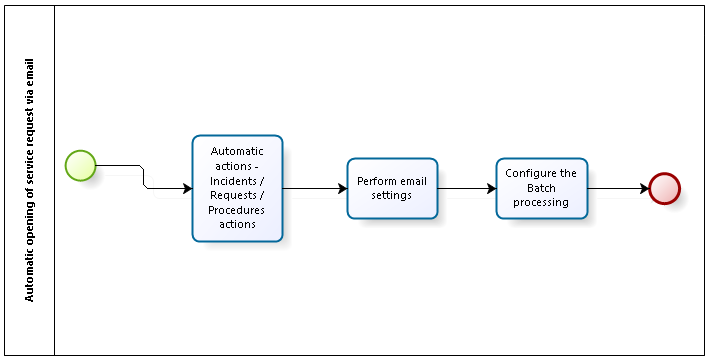

title:Passos para abertura automática de solicitação de serviço via e-mail
Description:Tem o objetivo de orientar quanto a abertura automática de solicitação de serviço via e-mail, agilizando o processo de abertura de Requisições de Serviço recebida pelo usuário

# Passos para abertura automática de solicitação de serviço via e-mail

Este conhecimento tem por objetivo orientar quanto a abertura automática de
solicitação de serviço via e-mail, agilizando o processo de abertura de
Requisições de Serviço recebida pelo usuário.

**Figura 1 - Diagrama do POP para abertura automática de solicitação de serviço
via e-mail**

Pré-condições
-------------

1.  O serviço deverá possuir um SLA do Tipo Tempo atribuído à ele.

Detalhes das atividades
-----------------------

#### Cadastro de template de ação automática - incidente / requisição / procedimento

1.  Cadastro de template de Ação automática - Incidente/Requisição/Procedimento
    (ver conhecimento [Cadastro e pesquisa de ações automáticas](1)),
    pois será utilizado como template para a abertura da solicitação de serviço.

#### Realizar as configurações de e-mail

1.  Realizar as configurações de e-mail (ver conhecimento [Manual de
    configuração de ação automática via e-mail.](2)), esse cadastro será utilizado para vincular o template cadastrado.

#### Realizar as configurações do processamento batch

1.  Realizar as configurações do processamento Batch (ver conhecimento [Cadastro
    e pesquisa de processamento Batch](3));

2.  Esse cadastro informa a cada quanto tempo o sistema fará a leitura dos
    e-mails.

!!! note "NOTA"

     É necessário colocar no campo Conteúdo a seguinte informação
     'br.com.centralit.citcorpore.quartz.job.JobConfiguracaoAberturaAutomaticaViaEmail'
     (sem aspas). Esse é o comando que executa o Job desejado para a ação de
     Abertura Automática via E-mail.

Informações adicionais
----------------------

1.  Após a realização da configuração, o sistema irá disparar o Job no horário
    desejado;

2.  Os e-mails que estiverem na caixa sem marcação de leitura, serão lidos e
    deles serão abertas Solicitações de Serviços;

3.  O sistema marca automaticamente o e-mail como lido para que não haja
    duplicação de cadastro (ver conhecimento [Regras sobre a abertura automática
    de solicitação de serviço via e-mail](4));

4.  Caso o sistema identifique que o colaborador é usuário do sistema, através
    do e-mail do remetente e o usuário estiver em um grupo vinculado ao mesmo
    contrato que o template foi criado (Ações Automáticas -
    Incidentes/Requisições/Procedimentos), então, a solicitação de serviço será
    criada com o solicitante do e-mail;

5.  Caso o sistema não identifique o solicitante, então, o sistema atribuirá a
    solicitação de serviço, ao usuário informado no cadastro de Ação Automática
    Incidente/Requisição/Procedimento.

[1]:/pt-br/citsmart-platform-7/plataform-administration/configuring-automatic-actions/automatic-actions.html
[2]:/pt-br/citsmart-platform-7/plataform-administration/configuring-automatic-actions/automatic-action-email.html
[3]:/pt-br/citsmart-platform-7/plataform-administration/configuring-automatic-actions/batch-processing.html
[4]:/pt-br/citsmart-platform-7/processes/tickets/rules-open-ticket.html

!!! tip "About"

    <b>Product/Version:</b> CITSmart | 8.00 &nbsp;&nbsp;
    <b>Updated:</b>07/12/2019 – Anna Martins
