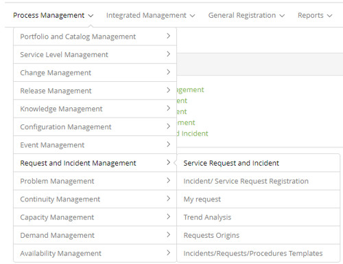

title:  Ticket Management module
Description: Request Fulfillment is responsible for managing the life cycle of all requests. 
# Ticket Management module

Module objective
----------------

Compliance requirement
----------------------

According to ITIL, the Compliance Requiriment is responsible for managing the
life cycle of all service requests made by users and seeks to maintain their
satisfaction by efficiently and professionally handling all service requests, as
well as Provides a channel for users to request and receive standard services,
with defined access and quality controls. This process also provides information
to users and customers about the availability of services and procedures to
obtain them, as well as help with general information, complaints or comments.

The activities in this process vary according to what is being requested.
Service requests are handled by a specific process.

Incident management
-------------------

Incident Management is the process responsible for managing the entire life
cycle of incidents. Incidents can be reported by the technical team, by event
detection tools - monitoring systems and alarmism - by users and vendors.

Incident Management aims to restore the normal operation of the service quickly
and thus ensure the best levels of service quality and availability.

Where are the features
----------------------

To access the functionality click on the main menu **Process Management > Ticket Management**.

**Figure 1 - Ticket Management module menu**

Main feature (in highlight)
---------------------------

In the *See also* section you can access the main functionality(ies) of this
module, in order to obtain a more detailed knowledge.

!!! info "IMPORTANT"

    From version 7.1.0.8 onwards, CITSmart Enterprise ITSM no longer presents
    the "Graphics" icon in this functionality, because it is a powerful option
    that deserves a lot of attention in relation to the consumption of
    computational resources, it was decided by its transferred into the Smart
    Decision option so that there the Administrator can prudently configure the
    access permission for each type of management chart, according to the logged
    in user.

!!! Abstract "TIPS"

    Depending on your access permission, you can perform a series of actions on
    existing Requests (requests and incidents), such as: viewing the service
    request description, reclassifying the request information, delegating the
    request to another person or group, suspending the request service,
    reactivate the request that was suspended for service, change the SLA
    (response time) of the request, create sub-requests, display sub-requests,
    create related request, schedule activity for the request to be performed
    (attended) in a scheduled date; Print request, cancel request, perform
    request service and so on.

See also
--------

-   [Ticket management
    (services)](/en-us/citsmart-platform-7/processes/tickets/ticket-management.html).

!!! tip "About"

    <b>Product/Version:</b> CITSmart | 7.00 &nbsp;&nbsp;
    <b>Updated:</b>07/29/2019 - Larissa Lourenço
