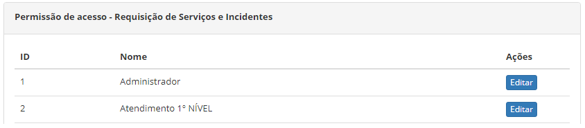
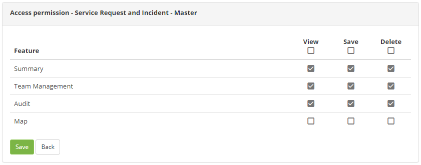

title: Ticket management module access permissions

Description: The Access Permission feature allows you to define who will have access to the features of the Request and Incident Management screen and what type of access is allowed (read, write and/or delete).

# Ticket management module access permissions

The Access Permission feature allows you to define who will have access to the
features of the Request and Incident Management screen and what type of access
is allowed (read, write and/or delete).

How to access
-------------

1.  Access the Requests and Incidents Management Access Permission feature by
    navigating the main menu **Access and Permission > Request/Incident
    Management**.

Preconditions
-------------

1.  Have access profile registered (see knowledge [Access profile registration
    and search][1]).

Filters
-------

**No applicable**.

Items list
----------

1.  The following cadastral fields are available to the user to facilitate the
    identification of the desired items in the standard feature
    listing: **ID** and **Name**.

2.  There is an action button available to the user for each item in the
    listing, it is: *Edit:*

3.  The screen for defining the **Access Permission** to the functionalities of
    the **Request and Incident Management** screen will be displayed, in which
    it displays the **Access Profiles** already registered in the system. The
    following figure illustrates this screen:

   
   
   **Figure 1 - Access permission screen - Request and incident management**

4.  Click the *Edit* button of the Access Profile to define the type of access
    to the features of the Request and Incident Management screen. Once this is
    done, the Request and Incident Management features will be presented, as
    shown in the figure below:

   
   
   **Figure 2 - Definition of the type of access**

5.  For each Request and Incident Management feature, select the actions (view,
    save and/or delete) that the Profile can perform;

6.  After setting the access permission, click the *Record* button to register,
    where the date, time and user are automatically saved for a future audit.

Filling in the registration fields
----------------------------------

1.  Not applicable

[1]:/en-us/citsmart-platform-7/initial-settings/access-settings/profile/user-profile.html

!!! tip "About"

    <b>Product/Version:</b> CITSmart | 8.00 &nbsp;&nbsp;
    <b>Updated:</b>08/29/2019 – Anna Martins
