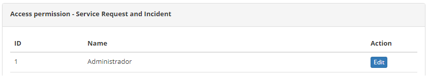

title: Permissão de acesso do gerenciamento de tickets
Description: A funcionalidade de Permissão de Acesso permite definir quem terá acesso às funcionalidades da tela de Gerenciamento de Requisições e Incidentes e qual tipo de acesso é permitido (leitura, gravação e/ou exclusão).

# Permissão de acesso do gerenciamento de tickets

A funcionalidade de Permissão de Acesso permite definir quem terá acesso às
funcionalidades da tela de Gerenciamento de Requisições e Incidentes e qual tipo
de acesso é permitido (leitura, gravação e/ou exclusão).

Como acessar
-----------

1.  Acesse a funcionalidade de Permissão de Acesso do Gerenciamento de
    Requisições e Incidentes através da navegação no menu principal **Acesso e
    Permissão  > Gerência de Requisições/Incidentes.**

Pré-condições
-------------

1.  Ter o perfil de Acesso cadastrado (ver conhecimento [Cadastro e pesquisa de
    perfil de acesso](1)).

Filtros
-------

1.  Não se aplica.

Listagem de itens
----------------

1.  Os seguintes campos cadastrais estão disponíveis ao usuário para facilitar a
    identificação dos itens desejados na listagem padrão da funcionalidade: ID
    e Nome;

2.  Existe um botão de ação disponível ao usuário em relação a cada item da
    listagem, é ele: *Editar;*

3.  Será apresentada a tela para definição da **Permissão de Acesso** às
    funcionalidades da tela de **Gerenciamento de Requisições e Incidentes**, na
    qual exibe os **Perfis de Acesso** já registrados no sistema. A figura a
    seguir ilustra essa tela:

    
    
    **Figura 1 - Tela de permissão de acesso - Gerenciamento de requisições e
incidentes**

1.  Clique no botão *Editar* do Perfil de Acesso para o qual irá definir o tipo
    de acesso às funcionalidades da tela de Gerenciamento de Requisições e
    Incidentes. Feito isso, serão apresentadas as funcionalidades do
    Gerenciamento de Requisições e Incidentes, conforme ilustrado na figura
    abaixo:

    
    
    **Figura 2 - Definição do tipo de acesso**

2.  Para cada funcionalidade do Gerenciamento de Requisições e Incidentes,
    selecione as ações (visualizar, gravar e/ou deletar) que o Perfil poderá
    realizar;

3.  Após definição da permissão de acesso, clique no botão *Gravar* para efetuar
    o registro, onde a data, hora e usuário serão gravados automaticamente para
    uma futura auditoria.

Preenchimento dos campos cadastrais
---------------------------------

1.  Não se aplica.

[1]:/pt-br/citsmart-platform-7/initial-settings/access-settings/profile/user-profile.html

!!! tip "About"

    <b>Product/Version:</b> CITSmart | 8.00 &nbsp;&nbsp;
    <b>Updated:</b>07/26/2019 – Anna Martins
