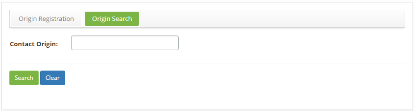
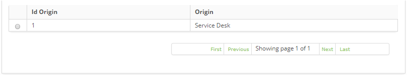
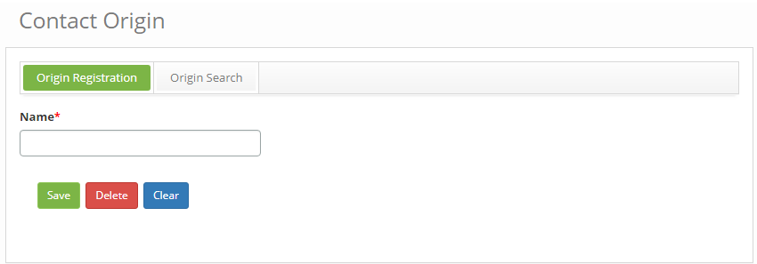

title:Cadastro e pesquisa de origem de tickets
Description:Tem o objetivo de registrar diversos tipos de equipes ou áreas que podem gerar um ticket.

# Cadastro e pesquisa de origem de tickets

Esta funcionalidade tem o objetivo de registrar diversos tipos de equipes ou
áreas que podem gerar um ticket.

Como acessar
------------

1.  Acesse a funcionalidade de Origem de Tickets através da navegação no menu
    principal **Processos ITIL > Gerência de Ticket > Origem de
    Solicitações**.

Pré-condições
------------

1.  Não se aplica.

Filtros
-------

1.  O seguinte filtro possibilita ao usuário restringir a participação de itens
    na listagem padrão da funcionalidade, facilitando a localização dos itens
    desejados:

    -   Origem.

1.  Na tela de **Origem**, clique na guia **Pesquisar Origem**, será apresentada
    a tela de pesquisa conforme ilustrada na figura abaixo:

    

    **Figura 1 - Tela de pesquisa de origem**

1.  Realize a pesquisa de origem:

    -   Informe o nome da origem que deseja pesquisar e clique no botão *Pesquisar*.
    Após isso, será exibido o registro da origem conforme o nome informado.

    -   Caso deseje listar todos os registros de origem, basta clicar
        diretamente no botão *Pesquisar*.

Listagem de itens
----------------

1.  Os seguintes campos cadastrais estão disponíveis ao usuário para facilitar a
    identificação dos itens desejados na listagem padrão da funcionalidade:** ID
    Origem e Origem**.

    

    **Figura 2 - Tela de listagem de origem**

1.  Após a pesquisa, selecione o registro desejado. Feito isso, será direcionado
    para a aba de cadastro exibindo o conteúdo referente ao registro
    selecionado;

2.  Para alterar os dados do registro de origem, basta procurar a origem,
    selecioná-la, modificar as informações dos campos desejados e clicar no
    botão *Gravar* para que seja gravada a alteração realizada no registro, onde
    a data, hora e usuário serão gravados automaticamente para uma futura
    auditoria.

Preenchimento dos campos cadastrais
------------------------------------

1.  Na tela de **Origem**, clique na guia **Cadastro Origem**, será apresentada
    a tela de **Cadastro de Origem de Solicitações**, conforme ilustrada na
    figura abaixo:

    

     **Figura 3 - Tela de cadastro de origem**

1.  Informe o nome da origem de tickets de serviço e clique no
    botão *Gravar* para efetuar o registro, onde a data, hora e usuário serão
    gravados automaticamente para uma futura auditoria.

!!! tip "About"

    <b>Product/Version:</b> CITSmart | 8.00 &nbsp;&nbsp;
    <b>Updated:</b>07/10/2019 – Anna Martins
