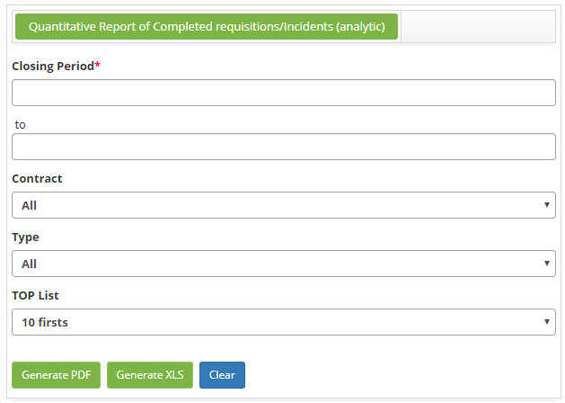
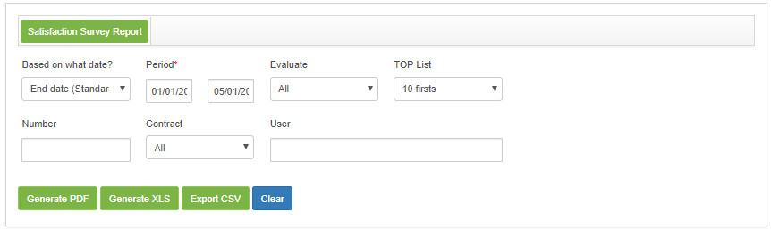

title:  Geração de relatórios - Gerência de Incidentes e Requisições
Description: Esse relatório tem o objetivo de apresentar as causas e soluções das solicitações de serviços. 
# Geração de relatórios - Gerência de Incidentes e Requisições

Gerando relatório de causas e soluções
---------------------------------------

Esse relatório tem o objetivo de apresentar as causas e soluções das solicitações de serviços.

*Como acessar*

1. Acesse a funcionalidade de Controle de Causas e Soluções através da navegação no menu principal 
**Relatórios > Gerência de Incidentes/Requisição > Controle de Causas e Soluções**.

*Filtros*

1. Os seguintes filtros possibilitam ao usuário restringir a participação de itens na listagem padrão da funcionalidade, 
facilitando a localização dos itens desejados:

    - **Período de Fechamento**: informe o período de fechamento desejado;
    - **Contrato**: informe o contrato desejado;
    - **Tipo**: selecione o tipo de serviço;
    - **Situação**: selecione a situação das solicitações de serviço;
    - **Nome Requisição/Incidente**: informe o nome do serviço. Escolha um serviço específico ou deixe em branco para todos os
    serviços;
    - **Requisição/Incidente**: serão listados todos os serviços escolhidos no campo anterior, “Nome Requisição/Incidente”;
        - Se desejar retirar algum serviço, basta seleciona-lo e clicar no botão "Remover". Mas caso deseje retirar todos os 
        serviços, basta clicar diretamente no botão "Remover Todos".
    - **Selecionar Grupo**: é apresentado uma lista de grupos ativos referente ao contrato selecionado, onde permite selecionar
    o(s) grupo(s) desejado(s);
        - Selecione o grupo desejado e clique no botão "Adicionar", o mesmo será adicionado no campo "Grupo(s)". Mas caso deseje 
        adicionar todos os grupos, basta clicar diretamente no botão "Adicionar Todos";
        - Se desejar retirar algum grupo, basta selecioná-lo e clicar no botão "Remover". Mas caso deseje retirar todos os grupos,
        basta clicar diretamente no botão "Remover Todos".
    - **Selecionar Causa**: é apresentado uma lista de causas, onde permite selecionar a(s) causa(s) desejada(s);
       - Para listar itens sem causa, marque a opção “**Listar itens sem causa**”;
       - Selecione a causa desejada e clique no botão "Adicionar", a mesma será adicionada no campo "Causa". Mas caso deseje 
       adicionar todas as causas, basta clicar diretamente no botão "Adicionar Todos";
       - Se desejar retirar alguma causa, basta selecioná-la e clicar no botão "Remover". Mas caso deseje retirar todas as 
       causas, basta clicar diretamente no botão "Remover Todos".
   - **Selecionar Solução**: é apresentado uma lista de soluções, onde permite selecionar a(s) solução(ões) desejada(s);
       - Para listar itens sem solução, marque a opção “**Listar itens sem solução**”;
       - Selecione a solução desejada e clique no botão "Adicionar", a mesma será adicionada no campo "Solução". Mas caso deseje
       adicionar todas as soluções, basta clicar diretamente no botão "Adicionar Todos";
       - Se desejar retirar alguma solução, basta selecioná-la e clicar no botão "Remover". Mas caso deseje retirar todas as 
       soluções, basta clicar diretamente no botão "Remover Todos".
       
2. Será apresentada a tela de **Relatório de Controle de Causas e Soluções**, conforme ilustrada na figura a seguir:

   
   **Figura 1 - Tela de geração do relatório de controle de causas e soluções**
   
3. Defina os filtros conforme sua necessidade;

4. Para gerar relatório gráfico, clique no botão "Gerar gráfico PDF" para gerar o relatório em formato PDF e/ou no botão "Gerar 
gráfico XLS" para gerar o relatório em formato Excel;

5. Para gerar relatório com informações detalhadas, clique no botão "Gerar relatório analítico PDF" para gerar o relatório 
detalhado em formato PDF e/ou no botão "Gerar relatório analítico XLS" para gerar o relatório detalhado em formato Excel.

Gerando relatório de Gantt
-----------------------------

Esse relatório tem o objetivo de apresentar os incidentes e requisições de serviço em gráfico de Gantt.

*Como acessar*

1. Acesse a funcionalidade de Gantt através da navegação no menu principal 
**Relatórios > Gerência de Incidentes/Requisição > Gantt**.

*Filtros*

1. Os seguintes filtros possibilitam ao usuário restringir a participação de itens na listagem padrão da funcionalidade, 
facilitando a localização dos itens desejados:

    - **Período**: informe o período que deseja visualizar as solicitações;
    - **Data inicial**: informe a data inicial referente ao período selecionado;
    - **Data final**: informe a data final referente ao período selecionado;
    - **Tipo**: selecione o tipo de serviço;
    - **Grupo**: informe o grupo para visualizar suas solicitações específicas;
    - **Situação**: informe a situação da solicitação que deseja visualizar.
    
2. Será apresentada a tela de **Relatório de Gantt**, conforme ilustrada na figura a seguir:

    
    
    **Figura 2 - Tela de geração de relatório de Gantt**
    
3. Defina os filtros conforme sua necessidade;

4. Clique no botão "Filtrar" para gerar o gráfico de Gantt, conforme o filtro escolhido.

Gerando relatório de carga horária trabalhada
-----------------------------------------------

Esse relatório tem o objetivo de apresentar o cálculo da quantidade de horas trabalhadas por cada colaborador e/ou por grupo.

*Como acessar*

1. Acesse a funcionalidade de Carga Horária Trabalhada através da navegação no menu principal 
**Relatórios > Gerência de Incidentes/Requisição > Relatório Carga Horária Trabalhada**.

*Filtros*

1. Os seguintes filtros possibilitam ao usuário restringir a participação de itens na listagem padrão da funcionalidade, 
facilitando a localização dos itens desejados:

    - **Tipo**: informe o período que deseja visualizar;
    - **Data Início**: informe a data inicial referente ao período selecionado;
    - **Data Fim**: informe a data fim referente ao período selecionado;
    - **Contrato**: informe o contrato que deseja verificar a carga horária trabalhada;
    - **Grupo**: informe o grupo que deseja verificar a carga horária trabalhada;
    - **Tipo de Usuário**: informe o tipo de relatório, usuário ou grupo. Relatório do tipo usuário mostrará a carga horária 
    trabalhada de cada colaborador e Relatório do tipo grupo mostrará a carga horária trabalhada pelo grupo.
    
2. Será apresentada a tela de **Relatório de Carga Horária Trabalhada**, conforme ilustrada na figura a seguir:

    
    
    **Figura 3 - Tela de geração de relatório de carga horária trabalhada**
    
3. Defina os filtros conforme sua necessidade.

   !!! info "IMPORTANTE"
   
       Quando uma pessoa "captura" uma solicitação ou clica em "gravar e manter tarefa", o tempo começa a ser contabilizado para 
       essa pessoa, pois são armazenadas as informações de data, hora e usuário, parando apenas quando a solicitação é pausada, 
       cancelada, concluída ou quando outra pessoa captura essa solicitação.
       
Gerando relatório quantitativo
---------------------------------

Esse relatório tem o objetivo de apresentar a quantidade de solicitações de serviço de acordo com a situação informada.

*Como acessar*

1. Acesse a funcionalidade de Relatório Quantitativo através da navegação no menu principal
**Relatórios > Gerência de Incidentes/Requisição > Quantitativo**.

*Fltros*

1. Os seguintes filtros possibilitam ao usuário restringir a participação de itens na listagem padrão da funcionalidade, 
facilitando a localização dos itens desejados:

    - **Tipo**: informe o período desejado;
    - **Data Início**: informe a data inicial referente ao período selecionado;
    - **Data Fim**: informe a data fim referente ao período selecionado;
    - **Contrato**: informe o contrato referente ao ticket que deseja gerar o relatório quantitativo, caso seja necessário;
    - **Situação**: informe a situação referente ao ticket que deseja gerar o relatório quantitativo, caso seja necessário;
    - **Tipo de usuário**: informe o tipo de usuário para verificar a quantidade de solicitações/incidentes que foram registrados 
    pelo mesmo:
        - **Usuário Vip**: usuário que tem definida a prioridade 1 no acordo de nível de serviço;
        - **Usuário Normal**: usuário que tem a prioridade padrão estabelecida.
        
2. Será apresentada a tela de **Relatório Quantitativo**, conforme ilustrada na figura a seguir:

    
    
    **Figura 4 - Tela de geração do relatório quantitativo de incidentes/solicitações**
    
3. Defina os filtros conforme sua necessidade.

Gerando relatório quantitativo por serviços concluídos (sintético)
---------------------------------------------------------------------

Esse relatório tem por objetivo apresentar a quantidade de serviços concluídos.

*Como acessar*

1. Acesse a funcionalidade de Relatório Quantitativo por Serviços Concluídos (Sintético) através da navegação no menu principal **Relatórios > Gerência de Incidentes/Requisição > Quantitativo por Serviços Concluídos (Sintético)**.

*Filtros*

1. Os seguintes filtros possibilitam ao usuário restringir a participação de itens na listagem padrão da funcionalidade, 
facilitando a localização dos itens desejados:

    - **Período de Encerramento**: informe o período desejado;
    - **Contrato**: informe o contrato referente ao serviço que deseja gerar o relatório quantitativo;
    - **TOP List**: informe a quantidade de registros que deseja visualizar no relatório.
    
2. Será apresentada a tela de **Relatório Quantitativo de Serviços Concluídos (Sintético)**, conforme ilustrada na figura a 
seguir:

    
    
    **Figura 5 - Tela de geração de relatório quantitativo de serviços concluídos**
    
3. Defina os filtros conforme sua necessidade.

Gerando relatório quantativo de serviços concluídos (analítico)
-----------------------------------------------------------------

*Como acessar*

1. Acesse a funcionalidade de Relatório Quantitativo de Serviços Concluídos (Analítico) através da navegação no menu principal **Relatórios > Gerência de Incidentes/Requisição > Quantitativo de Serviços Concluídos (Analítico)**.

*Filtros*

1. Os seguintes filtros possibilitam ao usuário restringir a participação de itens na listagem padrão da funcionalidade, 
facilitando a localização dos itens desejados:

    - **Período de Encerramento**: informe o período desejado;
    - **Contrato**: selecione o contrato;
    - **Tipo**: selecione o tipo de serviço;
    - **TOP List**: informe a quantidade de registros que deseja visualizar no relatório.
    
2. Será apresentada a tela de **Relatório Quantitativo de Serviços Concluídos (Analítico)**, conforme ilustrada na figura a 
seguir:

    
    
    **Figura 6 - Tela de geração de relatório quantitativo de serviço**
    
3. Defina os filtros conforme sua necessidade.

Gerando relatório de pesquisa de satisfação
----------------------------------------------

Esse relatório tem o objetivo de apresentar as informações sobre a pesquisa de satisfação em relação ao atendimento das 
solicitações de serviços.

*Como acessar*

1. Acesse a funcionalidade de Relatório de Pesquisa de Satisfação através da navegação no menu principal 
**Relatórios > Gerência de Incidentes/Requisição > Pesquisa Satisfação**.

*Pré-condições*

1. Ter chamados abertos e fechados que possuam a pesquisa de satisfação vinculada.

*Filtros*

1. Os seguintes filtros possibilitam ao usuário restringir a participação de itens na listagem padrão da funcionalidade, 
facilitando a localização dos itens desejados:

    - **Com base em qual data?**: selecione o critério de pesquisa do período da solicitação, ou seja, se período é de abertura 
    ou de encerramento;
    - **Período**: informe o período da pesquisa de satisfação referente ao atendimento do serviço solicitado;
    - **Avaliação**: informe o critério de avaliação para verificar as solicitações de serviços relacionadas ao mesmo;
    - **TOP List**: informe a quantidade de registros que deseja visualizar no relatório;
    - **Número**: informe o número da solicitação de serviço que deseja verificar a avaliação de seu atendimento;
    - **Contrato**: informe o contrato que deseja verificar a avaliação do atendimento de seus serviços solicitados;
    - **Solicitante**: informe o nome da pessoa que fez a solicitação de serviço para verificar a avaliação do seu atendimento.
    
2. Será apresentada a tela de **Relatório de Pesquisa de Satisfação**, conforme ilustrada na figura a seguir:

    
    
    **Figura 7 - Tela de geração de relatório de pesquisa satisfação**
    
3. Defina os filtros conforme sua necessidade;

4. Selecione a forma de elaboração do relatório. Para isso, clique em "Gerar PDF" , "Gerar XLS" ou "Exportar CSV".

Gerando relatório de solicitações de serviço
-----------------------------------------------

Esse relatório tem o objetivo de apresentar o histórico dos registros de solicitações de serviços.

*Como acessar*

1. Acesse a funcionalidade de Pesquisa de Solicitações/Incidentes através da navegação no menu principal 
**Relatórios > Gerência de Incidentes/Requisição > Pesquisa Solicitações/Incidentes**.

*Filtros*

1. Os seguintes filtros possibilitam ao usuário restringir a participação de itens na listagem padrão da funcionalidade, 
facilitando a localização dos itens desejados:

    - **Data de abertura**: informe o período que deseja verificar os registros de solicitação de serviço;
    - **Data de encerramento**: informe o período de encerramento da solicitação de serviço para verificar as solicitações que 
    foram fechadas no determinado período;
    - **Número**: informe o número de identificação da solicitação de serviço caso queira verificar uma solicitação específica;
    - **Ordenação**: informe a ordem que as solicitações serão apresentadas;
    - **Contrato**: informe o contrato para verificar as solicitações de serviços relacionadas ao mesmo;
    - **Catálogo**: informe o tipo de catálogo de serviços;
    - **Serviço/Serviço de Apoio**: informe o serviço caso deseje verificar as solicitações referente ao mesmo;
    - **Tipo de solicitação**: informe o tipo de solicitação para verificação das solicitações;
    - **Atividade (Requisição/Incidente)**: informe o serviço caso deseje verificar as solicitações referente ao mesmo;
    - **Considerar Hierarquia**: marque este campo caso queira considerar a hierarquia do serviço;
    - **Item de Configuração**: informe o item de configuração caso queira verificar as solicitações de serviços relacionadas ao 
    mesmo;
    - **Situação**: informe uma situação caso queira verificar as solicitações de serviços referentes;
    - **Prioridade**: informe a prioridade caso queira verificar as solicitações de serviços referentes;
    - **Grupo executor/solucionador**: informe o grupo executor caso queira verificar as solicitações de serviços que foram 
    direcionadas ao mesmo;
    - **Fase**: informe a fase da solicitação caso queira verificar as solicitações de serviços que se encontram na fase 
    determinada;
    - **Origem**: informe a origem da solicitação caso queria verificar as solicitações de serviços relacionadas;
    - **Unidade**: informe a unidade desejada para verificar as solicitações de serviços relacionadas a mesma;
    - **Localidade**: informe a localidade para verificar as solicitações de serviços relacionadas a mesma;
    - **Palavra-chave**: informe a palavra-chave para verificar as solicitações de serviços relacionadas a mesma;
    - **Solicitante**: informe o solicitante de serviços para verificar suas solicitações;
    - **Criada por**: informe o responsável que fez o registro de solicitação para verificar as solicitações de serviços que 
    foram registradas pelo mesmo;
    - **Responsável Atual**: informe responsável pelo atendimento da solicitação para verificar as solicitações de serviços que 
    foram atendidas pelo mesmo;
    - **Exibir Campo Descrição em Relatórios?**: marque este campo caso queira que o conteúdo do campo “Descrição”, da 
    solicitação de serviço, seja exibido no relatório.
    
2. Será apresentada a tela de **Geração de Relatório de Solicitações de Serviço**, conforme ilustrada na figura a seguir:

    
    
    **Figura 8 - Tela de geração de relatório de solicitações de serviços**
    
3. Defina os filtros conforme sua necessidade;

4. Após os filtros definidos, clique no botão "Pesquisar". Feito isso, serão exibidas as solicitações;

    !!! info "IMPORTANTE"
    
        A quantidade de solicitações listadas, por página, é referente a quantidade configurada no parâmetro “261 - Quantidade de 
        Registros retornados na Pesquisa Avançada”.
        
5. Nas solicitações apresentadas na lista, é possível realizar as seguintes ações: consultar histórico do ticket, visualizar 
requisição/incidente, visualizar anexos e reabrir o ticket;

6. Caso queira gerar o relatório com informações resumidas da pesquisa que foi realizada, clique no botão "Gerar XLS" para gerar 
o relatório em formato Excel;

7. Caso queira gerar o relatório com informações detalhadas da pesquisa que foi realizada, clique no botão "Gerar Relatório 
Detalhado PDF" para gerar o relatório detalhado em formato PDF e/ou no botão "Gerar Relatório Detalhado XLS" para gerar o 
relatório detalhado em formato Excel.

Gerando relatório de solicitação por executante
--------------------------------------------------

Esse relatório tem o objetivo de apresentar as solicitações de serviço por executante.

*Como acessar*

1. Acesse a funcionalidade de Solicitação por Executante através da navegação no menu principal 
**Relatórios > Gerência de Incidentes/Requisição > Solicitação por Executante**.

*Filtros*

1. Os seguintes filtros possibilitam ao usuário restringir a participação de itens na listagem padrão da funcionalidade, 
facilitando a localização dos itens desejados:

    - **Período de Fechamento**: informe o período desejado;
    - **Número**: informe o número da solicitação;
    - **Executado por**: informe o responsável pelo atendimento da solicitação;
    - **Contrato**: selecione o contrato;
    - **TOP List**: informar a quantidade de registros que deseja visualizar no relatório.
    
2. Será apresentada a tela de **Geração de Relatório de Solicitações por Executante**, conforme ilustrada na figura a seguir:

    
    
    **Figura 9 - Tela de geração de relatório de solicitação por executante**
    
3. Defina os filtros conforme sua necessidade.

Gerando relatório de aprovação de solicitação
-----------------------------------------------

Esse relatório tem o objetivo de apresentar as solicitações de serviços que foram aprovadas e as que não foram aprovadas.

*Como acessar*

1. Acesse a funcionalidade de Pesquisa de Aprovação de Solicitações através da navegação no menu principal 
**Relatórios > Gerência de Incidentes/Requisição > Pesquisa Aprovação Solicitações**.

*Filtros*

1. Os seguintes filtros possibilitam ao usuário restringir a participação de itens na listagem padrão da funcionalidade, 
facilitando a localização dos itens desejados:

    - **Tipo**: informe o período desejado;
    - **Data Início**: informe a data inicial referente ao período selecionado;
    - **Data Fim**: informe a data fim referente ao período selecionado;
    - **Contrato**: informe o contrato que deseja verificar as aprovações das solicitações relacionadas ao mesmo;
    - **Registros**: informe o tipo de registro (aprovados ou não aprovados) de solicitações que deseja verificar;
    - **TOP List**: informe a quantidade de registros que deseja visualizar no relatório.
    
2. Será apresentada a tela de **Geração de Relatório de Aprovação de Solicitações**, conforme ilustrada na figura a seguir:

    
    
    **Figura 10 - Tela de geração de relatório de aprovação de solicitação**
    
3. Defina os filtros conforme sua necessidade.
    
Gerando relatório de execução de solicitação
----------------------------------------------

Esse relatório tem o objetivo de apresentar os responsáveis por executar as solicitações de serviços.

*Como acessar*

1. Acesse a funcionalidade de Relatório de Execução de Solicitação através da navegação no menu principal 
**Relatórios > Gerência de Incidentes/Requisição > Relatório Execução Solicitação**.

*Filtros*

1. Os seguintes filtros possibilitam ao usuário restringir a participação de itens na listagem padrão da funcionalidade, 
facilitando a localização dos itens desejados:

    - **Período de Abertura**: informe o período de abertura que deseja verificar as solicitações de serviços;
    - **Número**: informe o número de identificação da solicitação que deseja verificar;
    - **Executado por**: pesquise e selecione o responsável por atender solicitações de serviços para verificação;
    - **Contrato**: informe o contrato que deseja verificar as solicitações de serviços;
    - **Grupo aprovador**: informe o grupo aprovador para verificar as solicitações que foram aprovadas pelo grupo;
    - **TOP List**: informe a quantidade de registros que deseja visualizar no relatório.
    
2. Será apresentada a tela de **Geração de Relatório de Execução de Solicitação**, conforme ilustrada na figura a seguir:

    
    
    **Figura 11 - Tela de geração de relatório de execução de solicitação**
    
3. Defina os filtros conforme sua necessidade.

Gerando relatório solicitações reabertas
-----------------------------------------

Esse relatório tem o objetivo de apresentar todas solicitações que foram reabertas em um determinado período.

*Como acessar*

1. Acesse a funcionalidade de Relatório de Solicitações Reabertas através da navegação no menu principal 
**Relatórios > Gerência de Incidentes/Requisição > Solicitação Reaberta**.

*Filtros*

1. Os seguintes filtros possibilitam ao usuário restringir a participação de itens na listagem padrão da funcionalidade, 
facilitando a localização dos itens desejados:

    - **Data de Reabertura**: informe o período que a solicitação de serviço foi reaberta;
    - **Data de Encerramento**: informe o período que a solicitação de serviço foi finalizada;
    - **Contrato**: informe o contrato referente a solicitação de serviço;
    - **Grupo**: informe o grupo responsável por executar solicitação de serviço;
    - **Situação**: informe a situação de solicitações de serviço reabertas que deseja verificar;
    - **Tipo de Serviço**: informe o tipo de serviço que deseja verificar;
    - **TOP List**: informe a quantidade de registros que deseja visualizar no relatório.
    
2. Será apresentada a tela de **Geração de Relatório de Solicitações Reabertas**, conforme ilustrada na figura a seguir:

    
    
    **Figura 12 - Tela de geração de relatórios solicitações reabertas**
    
3. Defina os filtros conforme sua necessidade.

Gerando relatório top 10 incidentes/requisições
--------------------------------------------------

Esse relatório tem o objetivo de apresentar o Top 10 de Incidentes/Requisições de acordo com os filtros escolhidos pelo usuário.

*Como acessar*

1. Acesse a funcionalidade de Relatório Top 10 de Incidentes/Requisições através da navegação no menu principal 
**Relatórios > Gerência de Incidentes/Requisição > Relatório Top 10 Incidentes/Requisições**.

*Filtros*

1. Os seguintes filtros possibilitam ao usuário restringir a participação de itens na listagem padrão da funcionalidade, 
facilitando a localização dos itens desejados:

    - **Relatório**: selecione o tipo de relatório que desejar:
        - Relatório Top 10 solicitantes que mais abriram chamados;
        - Relatório Top 10 grupos solucionadores que mais resolveram requisições/incidentes;
        - Relatório Top 10 Dez incidentes/requisições mais solicitados;
        - Relatório Top 10 unidades que mais abriram requisições/incidentes;
        - Relatório Top 10 localidades que mais abriram requisições/incidentes.
    - **Top List**: selecione a quantidade de dados que deseja retornar no relatório;
    
    !!! info "IMPORTANTE"
    
        Quando o usuário quiser fazer uma análise de todas as solicitações, definindo o valor “Todos” para o filtro “Top List”, 
        pode existir diferença entre o número de solicitações do “Relatório Top10 localidades que mais abriram 
        requisições/incidentes” com o número que foi encontrado nos outros relatórios, devido a não obrigatoriedade de uma 
        solicitação ser vinculada a uma localidade.
        
    - **Período**: informe a data início e data fim;
    
    !!! INFO "IMPORTANTE"
    
        O campo “data de finalização” será usado para filtrar o período do “Relatório Top 10 de grupos solucionadores que mais 
        resolveram requisições/Incidentes”, portanto, poderá ser divergente do número de solicitações abertas no período.
        
    - **Contrato**: selecione o contrato;
    - **Serviço**: informe o serviço executado;
    - **Solicitante**: selecione o solicitante do serviço;
    - **Unidade**: selecione a unidade do contrato;
    - **Situação**: selecione a situação da solicitação de serviço;
    - **Tipo de Serviço**: selecione o tipo de serviço, que pode ser Incidente e/ou Requisição;
    - **Origem do contato**: selecione a origem do contato da solicitação de serviço;
    - **Prioridade**: selecione a prioridade de execução;
    
    !!! note "NOTA"
    
        O sistema irá apresentar todas unidades e serviços ativos referentes ao contrato selecionado.
        
    - Escolha um tipo de visualização para o relatório, que pode ser "Visualização", "Resumida" ou "Analítica".
    
2. Será apresentada a tela de **Geração de Relatório Top 10 de Incidentes/Requisições**, conforme ilustrada na figura a seguir:

    
    
    **Figura 13 - Tela de geração de relatório top 10 incidentes/requisições**
    
3. Defina os filtros conforme sua necessidade.

Gerando relaório de incidente/requisição por serviço
------------------------------------------------------

Esse relatório tem o objetivo de apresentar a quantidade de requisição e incidente que foram solicitados referente ao serviço do 
catálogo do portfólio.

*Como acessar*

1. Acesse a funcionalidade de Relatório de Incidente/Requisição por Serviço através da navegação no menu principal 
**Relatórios > Gerência de Incidentes/Requisição > Relatório Quantitativo de Incidentes/Requisições por Portfólio e Serviço**.

*Filtros*

1. Os seguintes filtros possibilitam ao usuário restringir a participação de itens na listagem padrão da funcionalidade, 
facilitando a localização dos itens desejados:

    - **Período de Encerramento solicitação serviço**: informe o período de encerramento de solicitação de serviço;
    - **Portfólio**: selecione o portfólio para verificação das solicitações dos serviços do mesmo;
    - **Catálogo**: selecione o tipo de catálogo. Se o tipo escolhido for "Negócio", serão apresentados somente os serviços de 
    negócio e se o tipo escolhido for "Técnico", serão apresentados somente os serviços de apoio;
    - **Serviço**: selecione o serviço que deseja verificar. Caso tenha informado o catálogo, os serviços serão apresentados de 
    acordo com o tipo selecionado;
    - **TOP List**: selecione a quantidade de dados que deseja retornar no relatório.
    
2. Será apresentada a tela de **Geração de Relatório de Incidente/Requisição por Portfólio e Serviço**, conforme ilustrada na 
figura a seguir:

    
    
    **Figura 14 - Tela de geração do relatório de incidentes/requisições por serviço**
    
3. Defina os filtros conforme sua necessidade.

!!! tip "About"

    <b>Product/Version:</b> CITSmart | 7.00 &nbsp;&nbsp;
    <b>Updated:</b>08/02/2019 - Larissa Lourenço
