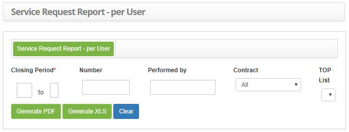

title: Report generation – Incident and request management
Description: Miscellaneous reports

# Report generation – Incident and request management

Generating causes and solutions report
--------------------------------------

This report aims to present the causes and solutions of service requests.

### How to access

1.  Access the Causes and Solutions Control feature by navigating the main
    menu **Reports > Incidents / Request Management > Causes and
    Solutions**.

### Filters

1.  The following filters enables the user to restrict the participation of
    items in the standard feature listing, making it easier to find the desired
    items:

    - **Closing Period**: Enter the desired closing period;

    - **Contract**: inform the desired contract;

    - **Type**: select the type of service;

    - **Status**: select the situation of the service requests;

    - **Name Request/Incident**: Enter the name of the service. Choose a specific service or leave it blank for all services;

    - **Request/Incident**: will be listed all the services chosen in the previous field, "Request Name / Incident";

        - If you want to remove some service, just select it and click the *Remove* button. But if you want to remove all
        the services, just click directly on the *Remove All* button.

    - **Select Group**: a list of active groups for the selected contract is displayed, where you can select the desired group (s);

        - Select the desired group and click the *Add* button, it will be added in the **Group (s)** field. But if you want to 
        add all groups, just click directly on the *Add All* button;

        - If you want to remove a group, just select it and click the *Remove* button. But if you want to remove all groups, 
        just click the Remove All button directly.

    - **Select Cause**: A list of causes is displayed, where you can select the desired cause (s);

        - To list items with no cause, check the "Shows items wihout cause" option;

        - Select the desired cause and click the *Add* button, it will be added in the **Cause** field. But if you want to add all 
        the causes, just click the *Add All* button directly;

        - If you want to remove a cause, simply select it and click 
        the *Remove* button. But if you want to remove all the causes, just click directly on the *Remove All* button.

    - **Select Solution**: a list of solutions is displayed, where you can select  the desired solution (s);

        - To list items without solution, check the option "Show items without solution";

        - Select the desired solution and click the *Add* button, it will be added in the **Solution** field. But if you want to add 
        all the solutions, just click the *Add All* button directly;

        - If you want to remove some solution, just select it and click the *Remove* button. But if you want to remove all the 
        solutions, just click directly on the *Remove All* button.

2. The Causes and Solutions Control Report screen will be displayed, as shown in the following figure:
   
    
   
    **Figure 1 - Generic report of causes and solutions control report**

3.  Set the filters as needed.

4.  To generate a graph report, click the *Generate graph PDF* button to
    generate the report in PDF format and / or the *Generate graph XLS* button
    to generate the report in Excel format;

5.  To generate report with detailed information, click the *Generate analytical
    report PDF* button to generate the detailed report in PDF format and / or
    the *Generate analytical report XLS* button to generate the detailed report
    in Excel format;

Generating Gantt report
-----------------------

This report is intended to present service incidents and requests in the Gantt
chart.

### How to access

1.  Access the Gantt feature by navigating through the main
    menu **Reports > Incidents/Request Management > Gantt Chart**.

### Filters

1.  The following filters enables the user to restrict the participation of
    items in the standard feature listing, making it easier to find the desired
    items:

    - **Period**: enter the period you want to view the requests;

    - **Start date**: Enter the start date for the selected period;

    - **Final date**: Inform the end date for the selected period;

    - **Type**: select the type of service;

    - **Group**: inform the group to view your specific requests;

    - **Status**: Enter the status of the request you want to view.

2.  The Gantt Report screen will be displayed, as shown in image below:

    
   
    **Figure 2 - Gantt**

3.  Set the filters as needed.

4.  Click on the *Filter* button to generate the Gantt chart, according to the
    chosen filter;

Generating workload report
--------------------------

This report aims to present the calculation of the number of hours worked by
each employee and / or group.

### How to access

1.  Access the Working Hours feature by navigating through the main
    menu **Reports > Incidents/Request Management > Worked Hours Report**.

### Filters

1.  The following filters enables the user to restrict the participation of
    items in the standard feature listing, making it easier to find the desired
    items:

    - **Type**: enter the period you want to view;

    - **Start date**: Enter the start date for the selected period;

    - **End date**: Enter the end date for the selected period;

    - **Contract**: inform the contract that you want to verify the workload worked;

    - **Group**: inform the group that wishes to check the workload;

    - **Type of User**: Enter the report type, user, or group. User type report will show the workload of each employee and 
    Report group type will show the workload worked by the group.

2.  The Working Hours Report screen will be displayed, as shown in image below:

    
   
    **Figure 3 - Worked hours report screen**

3.  Set the filters as needed.

!!! info "IMPORTANT"

     When a person "captures" a request or clicks "record and maintain task", the
     time starts to be counted for that person, because the date, time and user
     information is stored, stopping only when the request is paused, Canceled,
     completed, or when another person captures this request.

Generating quantitative report
------------------------------

This report aims to present the number of service requests according to the
situation reported.

### How to access

1.  Access the Quantitative Report feature by navigating through the main
    menu **Reports > Incidents/Request Management > Quantitative**.

### Filters

1.  The following filters enables the user to restrict the participation of
    items in the standard feature listing, making it easier to find the desired
    items:

    - **Type**: enter the desired period;

    - **Start date**: Enter the start date for the selected period;

    - **End date**: Enter the end date for the selected period;

    - **Contract**: inform the contract regarding the request / incident that you want to generate the quantitative report, if 
    necessary;

    - **Situation**: inform the situation regarding the request / incident that you want to generate the quantitative report, if 
    necessary;

    - **Type of user**: Enter the type of user to check the amount of requests / incidents that have been logged by the user.

        - **Vip user**: user who has priority 1 defined in the service level agreement;

        - **Standard user**: user that has the default priority set.

2.  The Quantitative Report screen will be displayed, as shown in image below:
  
    
   
    **Figure 4 - Generation of incident / requests quantitative reporting screen**

3.  Set the filters as needed.

Generating quantitative reporting for completed services (synthetic)
--------------------------------------------------------------------

This report aims to present the quantity of services completed.

### How to access

1.  Access the Quantitative Reporting for Completed Services (Synthetic) feature
    by navigating the main menu **Reports > Incidents/Request Management > Service Completed (Quantitative - Synthetic Report)**.

### Filters

1.  The following filters enables the user to restrict the participation of
    items in the standard feature listing, making it easier to find the desired
    items:

    - **Closing Period**: enter the desired period;

    - **Contract**: inform the contract regarding the service that wants to generate the quantitative report;

    - **TOP List**: enter the number of records you want to see in the report.

2.  The Completed Services Quantitative Report (Synthetic) screen will be
    displayed, as shown in image below:
 
    
    
    **Figure 5 - Complete services quantitative report generation screen**

3.  Set the filters as needed.

Generating quantitative reporting of completed services (analytical)
--------------------------------------------------------------------

### How to access

1.  Access the Quantitative Reporting of Completed Services (Analytical)
    functionality by navigating the main menu Reports > Incidents/Request
    Management > Service Completed (Quantitative - Analytic Report).

### Filters

1.  The following filters enables the user to restrict the participation of
    items in the standard feature listing, making it easier to find the desired
    items:

    - **Closing Period**: enter the desired period;

    - **Contract**: select the contract;

    - **Type**: select the type of service;

    - **TOP List**: enter the number of records you want to see in the report.

2.  The Quantitative Report of Completed Services (Analytic) screen will be
    displayed, as shown in Image below:
   
    
   
    **Figure 6 - Generation of quantitative service reporting screen**

3.  Set the filters as needed.

Generating satisfaction survey report
-------------------------------------

This report has the objective of presenting the information about the
satisfaction survey in relation to service requests.

### How to access

1.  Access the Satisfaction Survey Report feature by navigating through the main
    menu **Reports > Incidents/Request Management > Satisfaction
    Survey**.

### Preconditions

1.  Have open and closed tickets / tasks that have linked satisfaction survey.

### Filters

1.  The following filters enables the user to restrict the participation of
    items in the standard feature listing, making it easier to find the desired
    items:

    - **Based on what date?**: select the search criteria of the request period, ie whether the period is opening or closing;

    - **Period**: report the period of the satisfaction survey regarding the attendance of the requested service;

    - **Evaluate**: enter the evaluation criteria to verify the requests for related services;

    - **TOP List**: enter the number of records you want to view in the report;

    - **Number**: enter the number of the service request that you want to check the evaluation of your service;

    - **Contract**: inform the contract that you want to verify the evaluation of the service of your requested services;

    - **User**: enter the name of the person who requested the service to verify the evaluation of your service.

2.  The Satisfaction Survey Report screen will be displayed, as shown in image
    below:
 
    
   
    **Figure 7 - Satisfaction survey report generation screen**

3.  Set the filters as needed.

4.  Select the form in which report is elaborated. To do this, click *Generate
    PDF*,* Generate XLS* or *Export CSV*.

Generating report service requests
----------------------------------

This report is intended to present the history of service request records.

### How to access

1.  Access the Requests/Incidents Search feature by navigating through the main
    menu **Reports > Incidents/Request Management > Search
    Incidents/Reports**.

### Filters

1.  The following filters enables the user to restrict the participation of
    items in the standard feature listing, making it easier to find the desired
    items:

    - **Opening Date**: enter the period you want to check the service request records;

    - **Closing date**: enter the service request closure period to check the requests that were closed in the given period;

    - **Number**: enter the service request ID number if you want to verify a specific request;

    - **Order by**: enter the order that the requests will be displayed;

    - **Contract**: inform the contract to verify the requests of related services;

    - **Catalog**: report the type of services catalog;

    - **Service/Enabling Service**: inform the service if you want to check the requests regarding the same;

    - **Type**: enter the type of request to verify the requests;

    - **Activity (Request/Incident)**: inform the service if you want to verify the requests regarding the same;

    - **Consider Hierarchy**: check this field if you want to consider the hierarchy of the service;

    - **Configuration Item**: inform the configuration item if you want to check the service requests related to it;

    - **Situation**: report a situation if you want to check the related service requests;

    - **Priority**: Inform the priority if you want to check the related service requests;

    - **Execution/Solver Group**: inform the executing group if you want to check the service requests that were directed to it;

    - **Phase**: inform the phase of the request if you want to verify the requests for services that are in the determined phase;

    - **Origin**: Enter the origin of the request if you want to check the related service requests;

    - **Unit**: enter the desired unit to check the related service requests;

    - **Location**: inform the locality to check the requests for related services;

    - **Keywords**: enter the keyword to check the service requests related to it;

    - **User**: inform the service requestor to verify your requests;

    - **Created by**: inform the responsible party who registered the request to verify the service requests that were registered
    by the same;

    - **Current Responsible**: inform the person responsible for the request.

2.  The Service Requests Report Generation screen will be displayed, as shown in
    Image below:

    
   
    **Figure 8 - Generation report service requests screen**

3.  Set the filters as needed;

4.  After the filters are set, click the *Search* button. Once this is done, the
    requests will be displayed;

    !!! info "IMPORTANT"

        The number of requests listed, per page, refers to the quantity configured in parameter "261 - Number of Registers
        returned in Advanced Search".

5.  In the requests listed, you can perform the following actions: consult
    request / incident history, view request / incident, view attachments and
    reopen request / incident;

6.  If you want to generate the report with summary information of the survey
    that was performed, click the *Generate XLS* button to generate the report
    in Excel format;

7.  If you want to generate the report with detailed information of the survey
    that was performed, click the *Generate Detailed Report PDF *button to
    generate the detailed report in PDF format and/or the *Generate Detailed
    Report XLS *button to generate the detailed report in Excel format.

Generating request per performer report
---------------------------------------

This report is intended to present service requests per performer.

### How to access

1.  Access the Peer-to-Peer feature by navigating through the main
    menu **Reports > Incidents/Request Management > Request by
    User**.

### Filters

1.  The following filters enables the user to restrict the participation of
    items in the standard feature listing, making it easier to find the desired
    items:

    - **Closing Period**: enter the desired period;

    - **Number**: enter the request number;

    - **Performed by**: inform the person responsible for the request;

    - **Contract**: select the contract;

    - **TOP List**: enter the number of records you want to see in the report.

2.  The Execution Requests Report Generation screen will be displayed, as shown
    in the following image:

    
   
    **Figure 9 - Generate request per user report generation screen**

3.  Set the filters as needed.

Generating request approval report
----------------------------------

This report is intended to present service requests that have been approved and
those that have not been approved.

### How to access

1.  Access the Request Approval Search feature by navigating through the main
    menu **Reports > Incidents/Request Management > Search Approved
    Requests**.

### Filters

1.  The following filters enables the user to restrict the participation of
    items in the standard feature listing, making it easier to find the desired
    items:

    - **Type**: enter the desired period;

    - **Start date**: enter the start date for the selected period;

    - **End date**: enter the end date for the selected period;

    - **Contract**: inform the contract that you want to verify the approvals of the requests related to the same;

    - **Records**: enter the type of record (approved or unapproved) of requests you want to verify;

    - **TOP List**: enter the number of records you want to see in the report.

2.  The Generation of Requests Report Generation screen will be displayed, as
    shown in the Image below:

    
   
    **Figure 10 - Generation of approval report generation screen**

3.  Set the filters as needed.

Generating request execution report
-----------------------------------

This report aims to introduce those responsible for executing service requests.

### How to access

1.  Access the Request Execution Report feature by navigating through the main
    menu **Reports > Incidents/Request Management > Request Execution
    Report**.

### Filters

1.  The following filters enables the user to restrict the participation of
    items in the standard feature listing, making it easier to find the desired
    items:

    - **Opening Period**: enter the opening period that you want to check for service requests;

    - **Number**: Enter the identification number of the request you want to verify;

    - **Performed by**: search and select the person responsible for service requests for verification;

    - **Contract**: inform the contract that you want to check the service requests;

    - **Approver Group**: inform the approving group to verify the requests that have been approved by the group;

    - **TOP List**: Enter the number of records you want to see in the report.

2.  The Generation of Requests Execution Report screen will be displayed, as
    shown in the following Image:
  
    
   
    **Figure 11 - Generation of request execution report generation screen**

3.  Set the filters as needed.

Generating report reopened request
----------------------------------

This report is intended to present all requests that have been reopened in a
given period.

### How to access

1.  Access Reopen Requests Reporting functionality by navigating the main
    menu **Reports > Incidents/Request Management > Reopened Requests
    Report**. After that, the Reopened Requests Report Generation screen will be
    displayed, as shown in the Image below:

### Filters

1.  The following filters enables the user to restrict the participation of
    items in the standard feature listing, making it easier to find the desired
    items:

    - **Date of Reopening**: enter the period that the service request was reopened;

    - **Closing Date**: enter the period that the service request ended;

    - **Contract**: report the contract regarding service request;

    - **Group**: inform the group responsible for executing service request;

    - **Status**: report the status of reopened service requests that you want to check;

    - **Type of Service**: enter the type of service you want to check;

    - **TOP List**: enter the number of records you want to see in the report.
   
    
   
    **Figure 12 - Report generation screen reopened requests**

2.  Set the filters as needed.

Generating report top 10 incidents/requests
-------------------------------------------

This report aims to present the Top 10 Incidents/Requests according to the
filters chosen by the user.

### How to access

1.  Access the Top 10 Incident/Request report functionality by navigating the
    main menu **Reports > Incidents/RequestManagement > Top 10
    Incidents/Requests Report**.

### Filters

1.  The following filters enables the user to restrict the participation of
    items in the standard feature listing, making it easier to find the desired
    items:

    - **Report**: Select the type of report you want:

        -   Report Top 10 Applicant who opened most calls;

        -   Report Top 10 Groups that solved more requests/incidents;

        -   Report Top 10 most opened requests/incidents;

        -   Report Top 10 Units that opened more requests/incidents;

        -   Report Top 10 locations that opened more requests/incidents.

    - **Top List**: Select the amount of data you want to return in the report;

    !!! info "IMPORTANT"

        When the user wants to analyze all requests by setting the "All" value for the "Top List" filter, there may be a difference 
        between the number of requests in the "Report Top10 most open requests / incidents" requests with. The number that was
        found in other reports, because a request is not required to be linked to a location.

    - **Opening Period**: enter the start date and end date;

    !!! info "IMPORTANT"

        The "end date" field will be used to filter the "Top 10 Report of solver groups that have solved most requests / Incidents", 
        so it may be different from the number of requests opened in the period

    - **Contract**: select the contract;

    - **Service**: report the service performed;

    - **User**: select the requestor of the service;

    - **Unit**: select the unit of the contract;

    - **Status**: select the status of the service request;

    - **Service Type**: Select the type of service, which may be Incident and / or Request;

    - **Contact Origin**: Select the contact origin of the service request;

    - **Priority**: Select the execution priority.

    !!! note "NOTE"

        The system will present all active units and services related to the selected contract.

    - Choose a view type for the report, which can be either "Preview", "Brief" or "Analytical".

2. The Incident/Requests Top 10 Report Generation screen will be displayed, as shown in the Image below:

    
     
    **Figure 13 - Report generation screen Top 10 incidents / requests**

3.  Set the filters as needed.

Generating incident report/service request
------------------------------------------

This report has the purpose of presenting the quantity of Request and incident
that was requested regarding the portfolio catalog service.

### How to access

1.  Access the Incident Report / Service Request feature by navigating through
    the main menu **Reports > Incidents /
    RequestManagement > Quantitative Incident /Requests by Portfolio and
    Service Report**.

### Filters

1.  The following filters enables the user to restrict the participation of
    items in the standard feature listing, making it easier to find the desired
    items:

    - **Closing Period**: report the service request closure period;

    - **Portfolio**: select the portfolio to verify the services requests of the same;

    - **Catalog**: Select the catalog type. If the type chosen is "Business", only the business services will be presented and if 
    the type chosen is "Technical", only the support services will be presented;

    - **Service**: Select the service you want to check. If you have informed the catalog, the services will be presented
    according to the type selected;

    - **TOP List**: Select the amount of data you want to return in the report.

2.  The Incident / Request Report by Portfolio and Service screen will be displayed, as shown in Image below:

    

    **Figure 14 - Quantitative incident/requests by portfolio and service report screen**

3.  Set the filters as needed.

!!! tip "About"

    <b>Product/Version:</b> CITSmart | 7.00 &nbsp;&nbsp;
    <b>Updated:</b>08/29/2019 - Anna Martins
