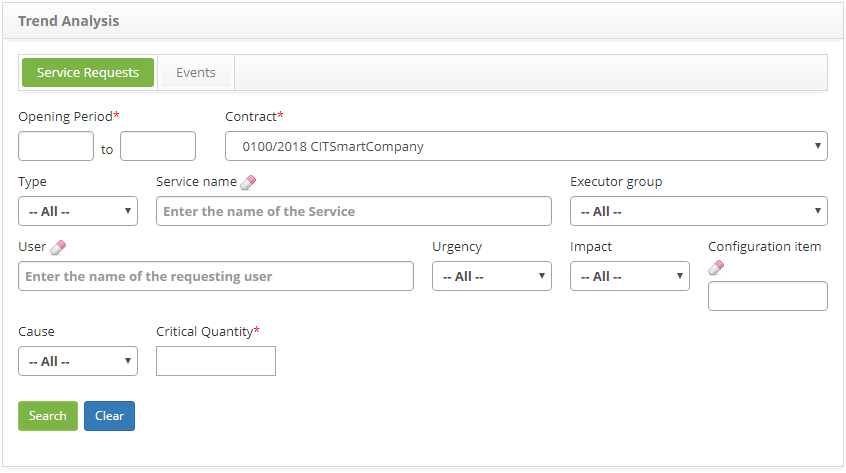

title: Trend analysis of service requests
Description: This functionality is intended to perform a critical quantity-based request analysis to identify which items will influence a launch of a new request.

# Trend analysis of service requests

This functionality is intended to perform a critical quantity-based request
analysis to identify which items will influence a launch of a new request.

How to access
-------------

1.  Access the main menu **Process Management > Ticket
    Management > Trend Analysis, Service Requests tab**.

Preconditions
-------------

1.  Have a registered contract and active (see knowledge [Contract registration and search][1]);

2.  Have a registered ticket (see knowledge [Ticket management (services)][2] Ticket registration section) and be linked by the contract (see knowledge [Service Attributes configuration][3]) Linking contracts to the service section).

Filters
-------

1.  The following filters enables the user to restrict the participation of
    items in the standard feature listing, making it easier to find the desired
    items:

   -   **Opening Period**: inform the period of registration of service requests;

   -   **Contract**: inform the contract to verify the service requests related to
    the same;

   -   **Type**: select the type of request you want to check;

   -   **Service Name**: inform the service to verify the amount of requests
    related to the same;

   -   **Executor Group**: select the executor group to check the service requests
    that were directed to it;

   -   **User**: inform the requesting user name to verify the service requests
    requested by the same;

   -   **Urgency**: select the degree of urgency to verify the service requests
    related to the same;

   -   **Impact**: select the degree of impact to verify service requests related
    to it;

   -   **Configuration Item**: inform the configuration item to check the service
    requests related to it;

   -   **Cause**: inform the cause to verify the service requests caused by it;

   -   **Critical Quantity**: report the critical number of service requests that
    deserve attention and analysis.

   
   
   **Figure 1 - Service requests trend analysis screen**

2.  Fill in the filters as needed;

3.  After the filters are entered, click on the *Search* button.

Items list
----------

1.  The following cadastral fields are available to the user to facilitate the
    identification of the desired items in the standard feature listing: **ID,
    Service **and **Critical Quantity**;

2.  There are action buttons available to the user for each item in the listing,
    they are: *Generate Graphic* and *Create Problem*;

3.  Once this is done, the system will filter and total the number of requests
    that satisfy the selected filters and generate three results guides;

   
   
   **Figure 2 - Results for trend analysis**

   !!! warning "ATTENTION"

      The critical amount of requests equal to or greater than the minimum
      critical amount reported in the filter will be displayed on each tab
      (Service, Cause and Configuration Item).

4.  Each tab will display the results for each type (service, cause and
    configuration item) and in each item two buttons will be displayed, one
    to **Generate Graphic **(as shown in the previous figure) which shows the
    dates that comprise the reported period and the number of occurrences on
    that date, and another one for **Create Problem**, where the problem
    register screen will be displayed to record the required information of the
    problem.

    
    
    **Figure 3 - Gantt chart of service request trends analysis**

    -   When you choose to register a problem from the **Service**, the problem
    registration screen will be displayed with the "Description" field fed with
    the corresponding service name;

    
    
    **Figure 4 - Create problem screen - Service tab**

    -   When you choose to register a problem from the **Cause**, the problem
    register screen will be displayed with the fields "Description" and "cause"
    fed with the description of the corresponding cause;

     
     
     **Figure 5- Create problem screen - Cause tab**

    -   When you choose to register a problem from the **Configuration item**, the
    problem registration screen will be displayed with the "description" field
    fed with information from the corresponding configuration item.

**Figure 6- Create problem screen - Configuration item tab**

Filling in the registration fields
----------------------------------

1.  No applicable.

See also
--------

-   [Event trend analysis][4])

-----------

[Análise de tendência de eventos](4).

[1]:/en-us/citsmart-platform-7/additional-features/contract-management/use/register-contract.html
[2]:/en-us/citsmart-platform-7/processes/tickets/ticket-management.html
[3]:/en-us/citsmart-platform-7/processes/portfolio-and-catalog/configure-service-attribute.html
[4]:/en-us/citsmart-platform-7/processes/tickets/event-trends.html

!!! tip "About"

    <b>Product/Version:</b> CITSmart | 8.00 &nbsp;&nbsp;
    <b>Updated:</b>08/27/2019 – Anna Martins
