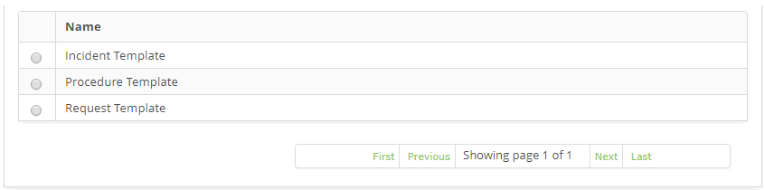

title: Incidents, requests and procedures template registration and search
Description: This feature aims to register a template to facilitate the opening of a new request.

# Incidents, requests and procedures template registration and search

Esta funcionalidade tem por objetivo cadastrar um template para facilitar a
abertura de uma nova solicitação.

How to access
------------

1.  Access the Incident/Request/Procedures Template functionality by navigating the main menu **Process Management > Ticket Management > Templates Incidents/Requests/Procedures**.

Preconditions
-------------

1.  Have access to the Incidents, Requests and Procedures Template functionality (see knowledge [Access profile registration and search][1]);

2.  Have the group registered (see knowledge [Group registration and search][2]);

3.  Have the contract registered (see knowledge [Contract registration and search][3]);;

4.  Have the unit registered (see knowledge [Unit registration and search][4]);

5.  Have the group bound to the contract (see knowledge [How to relate group to contract?][5]);

6.  Have the unit bound to the contract (see knowledge [How to relate unit to contract?][6]);

7.  Have the portfolio with the service and the request and incident activities registered (see knowledge [Service portfolio registration][7], [Service registration][8], [Service attributes configuration][9]);

8.  Have the time of attendance of the request and incident activities defined (see knowledge [Time attendance registration and search][10]);

9.  Have the contract bound to the service (see knowledge [Service attributes configuration][11]);

10. Have request and incident activities bound to the service contract (see knowledge [Service contract attributes configuration][12]);

11. Enter the content below into the parameter (see knowledge [Parameterization rules - Ticket][13]):

    -   Parameter 9: set the 1st level group to service the request.

12.  The requestor must be included in the group that is bound to the contract so that the request can be registered.

Filters
-------

1.  The following filter enables the user to restrict the participation of items in the standard feature listing, making it easier to find the desired items:

    -   Nome.

    

    **Figure 1 - Incident templates search/requests/procedures screen**

2.  Perform template search;

-   Enter the name of the template you want to search and click the Search button. After this, the template registration will be displayed according to the name entered;

-   If you want to list all the template records, just click directly on the Search button.

Items list
-----------------

1.  The following cadastral field is available to the user to facilitate the identification of the desired items in the standard feature listing: **Name**.

    

    **Figure 2 - List screen of incident templates/requests/procedures**

2.  After searching, select the desired record. Once this is done, it will be directed to the registration tab displaying the contents of the selected record;

3.  To change the data of the template record, simply modify the information of the desired fields and click on the Save button to save the change made in the record, where the date, time and user will be saved automatically for a future audit.

Filling in the registration fields
-----------------------------------

1.  The Templates Incidents/Requests/Procedures screen will be displayed, as shown in the figure below:
    
    

    **Figure 3 - Template master screen**

2.  Fill in the fields as directed below:

    -   **Name**: enter the name of the Incident, Request or Procedure;

    -   **Applicant Name**: state the name of the applicant, ie the name of the person requesting the opening of an incident or service request;

    -   **E-mail**: inform the requestor's e-mail;

    -   **Contact Origin**: enter the origin of the request;

    -   **Catalog**: this field will be established by the system after informing the applicant and contract. If the selected contract is of the type "contract", the information in the "Business" Service Catalog will be displayed in this field and if the selected contract is of the type "support agreement" or "operational level agreement", it will be displayed in this field The information in the "Technical" Service Catalog;

    -   **Service**: inform the service regarding the service catalog. If the service catalog is a "business", the business services for selection will be available in this field, but if the service catalog is "technical", the support/technical services for selection will be available in this field;

    -   **Use the service category**: check this field if you choose to search the services by category;

    -   **Service Category**: if you have chosen to search for services by category, enter the category of service you want. The service category will identify the nature of the service, positioning it within similar groups of service, placing it in the hierarchy of its category;

    -   **Type**: enter the type of request, whether it is an incident opening, service request or procedure;

        -   **Incident**: if the situation presented is an unplanned outage, a reduction in the quality of service, or failure of any configuration item that has not yet impacted an IT service. e.g.: The network link is out, the network is slow, the server is inaccessible, etc.

        -   **Request**: refers to requests for demands made by users within the Information Technology environment. They can range from access requests to suggestions for improvement at low cost. e.g.: network access request for a new user, request for configuration of some equipment, request to add some software to the workstation, etc..

        -   **Procedure**: refers to the IT service continuity procedure, in case of critical incident occurrence.

    -   **Incident/Request/Procedure**: inform the service that will be performed;

    -   **Contract**: state the contract for which the request will be made;;

    -   **Unit**: report the unit of the applicant;

    -   **Urgency**: indicate the speed at which the service needs to be performed;

    -   **Impact**: indicate the impact to the business;

    -   **Description**: enter the description of the request. The description must be objective, including all the information necessary to fulfill the request;

    -   **Configuration Item**: enter the configuration item for the request.

3.  After the data has been entered, click the Save button to register, where the date, time and user will be saved automatically for a future audit

[1]:/en-us/citsmart-platform-7/initial-settings/access-settings/profile/user-profile.html
[2]:/en-us/citsmart-platform-7/initial-settings/access-settings/user/group.html
[3]:/en-us/citsmart-platform-7/additional-features/contract-management/use/register-contract.html
[4]:/en-us/citsmart-platform-7/plataform-administration/region-and-language/register-unit.html
[5]:/en-us/citsmart-platform-7/processes/tickets/relate-group.html
[6]:/en-us/citsmart-platform-7/processes/tickets/relate-unit.html
[7]:/en-us/citsmart-platform-7/processes/portfolio-and-catalog/register.html
[8]:/en-us/citsmart-platform-7/processes/portfolio-and-catalog/services.html
[9]:/en-us/citsmart-platform-7/processes/portfolio-and-catalog/configure-service-attribute.html
[10]:/en-us/citsmart-platform-7/processes/service-level/time-attendance.html
[11]:/en-us/citsmart-platform-7/processes/portfolio-and-catalog/configure-service-attribute.html
[12]:/en-us/citsmart-platform-7/processes/portfolio-and-catalog/contract-attributes.html
[13]:/en-us/citsmart-platform-7/plataform-administration/parameters-list/parametrizaion-ticket.html

!!! tip "About"

    <b>Product/Version:</b> CITSmart | 8.00 &nbsp;&nbsp;
    <b>Updated:</b>07/10/2019 – Anna Martins
