title: Ticket management (services)
Description: This knowledge aims to elucidate in a clear and didactic way the
ticket functionality as a whole, explaining concisely its options.

# Ticket management (services)

The screen below shows the main screen of the tickets module:

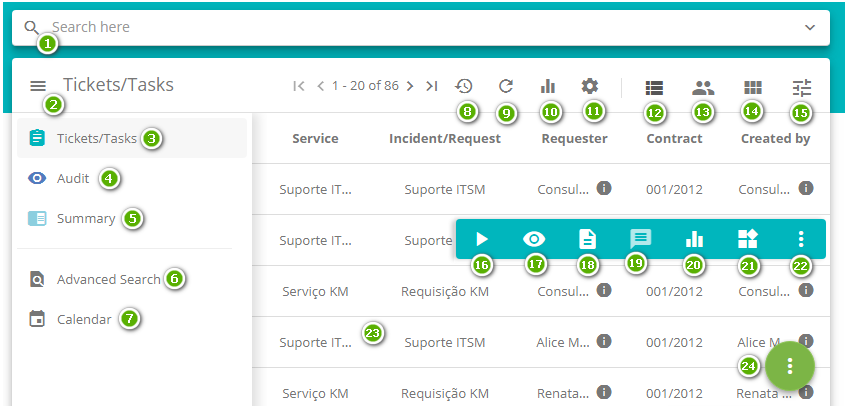

**Figure 1 - Request management screen (Requests and Incidents)**

- **1**: Search field - allows you to search for tickets;

- **2**: Menu button - displays the menu items of the management screen;

- **3**: Tickets - the records of service requests and incidents are presented for
treatment and management;

- **4**: Audit - presents the logs generated in the various actions related to the
tickets;

- **5**: Summary - displays the quantity of tickets per various items;

- **6**: Advanced search - allows you to perform an advanced search of the
tickets;

- **7**: Calendar - allows the visualization of the periodic activities schedule, in
which are verified the activities related to tickets that have been scheduled to
be attended on a given date;

- **8**: Automatic update - feature to, when triggered, update the list of tickets
automatically. The automatic update time of the ticket list is *30 seconds*.
Currently, this time can not be changed;

- **9**: Manual update - feature used to update the tickets list ;

- **10**: Reports - allows access to reports of the global type, that is, those not
linked to a specific ticket, and the user can analyze all of them (in the
creation of the report via Smart Reports this option is available)

- **11**: Options - features the "Suspend/Reactivate" functionality (which allows you to
suspend all tickets with status "In progress" of a certain executor group and
reactivate them) and the "Change columns" functionality (which allows changing
the column layout in the list of tickets; set of defined columns remains even
after the user's session is closed);

- **12**: List - filters the ticket view by listing;

- **13**: By Operator - filters the ticket view per attendant in kanban mode;

- **14**: By SLA status - filters the ticket view by SLA status. For this option to be
visible it is necessary to enable the access permission for the logged in user,
check the item "Team Management" (see knowledge [Ticket Management Module access
permissions][1]);

- **15**: By flow status - filters the ticket view by flow status;

- **16**: Click to capture and be responsible for the ticket;

- **17**: Click to show all the basic information regarding the ticket, it's not possible
on this screen to make any kind of change in the data;

- **18**: Click to show only the description of the ticket;

- **19**: Click to make available the Message functionality, which allows the exchange of
messages between the the ticket requester and the person responsible for its
resolution;

- **20**: Click to access reports of the specific type, that is, those linked to the
current ticket (in the creation of the report via Smart Reports this option is
defined);

   !!! warning "ATTENTION"

       Viewing these reports depends on the configuration (registration) of
       specific reports in the Reports > Smart Reports > Smart Report Generator
       (see knowledge [Smart Report generator][2])

- **21**: Click to show the flow referring to the ticket, being possible then to observe
the position of the user inside it;

- **22**: Click to open other actions, such as: Delegate, Suspend, Change SLA, Reclassify,
Create sub-requests, Display (show) sub-requests, Schedule activity, Create
related request and Print request.

- **23**: Requests - ticket log listing;

- **24**: Options Button - when triggered displays the button to register new
tickets and the button to register the ticket via template.

The list below shows the 28 possible operations of this screen, in alphabetical
order:

1.  Approve
2.  Cancel
3.  Capture
4.  Change SLA
5.  Close
6.  Delegate
7.  Direct
8.  Link to a Change
9.  Link to a Problem
10. Link to a Project
11. Link to a related ticket
12. Link to a Release
13. Link to a sub-ticket
14. Manage team attendance by Kanban board
15. Perform auditing
16. Print
17. Reactivate
18. Reclassify
19. Record execution
20. Register
21. Register (via e-mail reading)
22. Register (via template)
23. Register an occurrence
24. Reopen
25. Schedule activities
26. Search (fast and advanced)
27. Suspend
28. Suspend and reactivate multiple

The other sections of this knowledge explain in detail the guidelines for using
these operations through the menus, links and buttons available on the screen.

Sections are arranged in order of layout on the screen to facilitate
self-development.

Ticket registration
-------------------

### How to access

1.  Access the main menu **Process Management > Ticket Management > Ticket**.

### Preconditions

1.  Have permission to register service request (see knowledge [Group
    registration and search][3]);

2.  Have the staff registered (see knowledge [Staff registration and
    search][3]);

3.  Have the group registered (see knowledge [Group registration and
    search][4]);

4.  Have the contract registered (see knowledge [Contract registration and
    search][5]);

5.  Have the unit registered (see knowledge [Unit registration and
    search][6]);

6.  Have the user linked to the unit;

7.  Have the user linked to the group;

8.  Have the group bound to the contract (see knowledge [How to relate group to
    contract?][7]);

9.  Have the unit bound to the contract (see knowledge [How to relate unit to
    contract?][8]);

10. Have the portfolio with the service and the ticket activities registered
    (see knowledge [Service Portfolio registration][9], [Service registration][10], [Service
    Attributes configuration][11]);

11. Have the time of attendance of the ticket activities defined (see
    knowledge [Time Attendance registration and search][12]);

12. Have the contract bound to the service (see knowledge [Service attributes
    configuration][11]);

13. Have ticket activities bound to the service contract (see knowledge [Service
    contract attributes configuration][13]);

14. The requestor must be included in the group that is bound to the contract so
    that the request can be registered;

15. Enter the contents below into the parameters (see
    knowledge [Parameterization rules - ticket][14]):

-   Parameter 9;

-   Parameter 40;

-   Parameter 41;

-   Parameter 260: default 1-List without restriction;

-   Parameter 343: default: "Y".

### Filters (quick search)

1.  The following filter enables the user to restrict the participation of items
    in the standard feature listing, making it easier to find the desired items:

   -   Search here: on the search field, it is possible to search by number,
    description of the task and responsible for the service;

   
   
   **Figure 2 - Quick search**

2.  To perform a search using other filters, just click on the 
     icon by the search field. A screen with multiple filters will be displayed,
    thus allowing the search refinement . The figure below illustrates these
    filters:

   

   **Figure 3 - Expanded quick search screen**

   -   **Number**: inform the ticket identification number if you want to check a
    specific ticket;

   -   **Requester**: inform the service requester to check their tickets;

   -   **Request Type**: inform the type of ticket for the ticket verification;

   -   **Status**: inform the situation to verify the related tickets;

   -   **Contrac**t: inform the contract to verify the tickets related to it;

   -   **Executor group**: inform the executor group to verify the tickets that
    were directed to the same;

   -   **Current work**: inform the task type to verify the tickets related to it;

   -   **Responsible**: inform the responsible for the ticket attendance to verify
    the tickets that were attended by him;

   -   **SLA Status**: inform the SLA situation to verify the tickets related to
    the selected situation;

   -   **Sort by**: allows you to set the order in which tickets will be displayed;

   -   **View**: inform the form of the ticket visualization according to the
    actions available to the eventual responsible for the ticket, such as:
    execution and visualization only;

   -   **Exhibition**: allows you to filter the ticket of the requests considered
    critical and requests opened by the chat;

   -   **Show Sub Requests**: if it is marked with *Yes*, the search result will
    also bring the sub-tickets of each result item.

!!! warning "ATTENTION"

    The search effectiveness depends on the following of some rules of
    permission by the filter, such as: execution, delegation, monitoring,
    visualization, user groups, contract link, units and logged in collaborator.

### Items list

1.  The following cadastral fields are available to the user to facilitate the
    identification of the desired items in the standard feature
    listing: Ticket, Priority, Service, Incident/Request, Requester, Contract,
    Created by, Creation date, Task and Current Group.

2.  The **Service Ticket Management** screen will be displayed. The image below
    illustrates this field:

   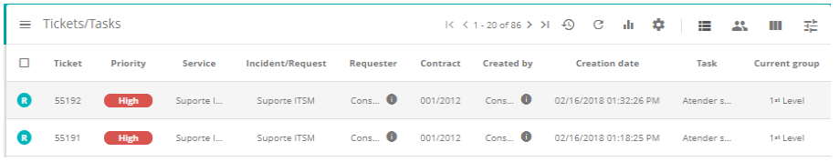

   **Figure 4 - List of tickets screen**

### Filling in the registration fields - Ticket registration

1.  When accessing functionality, the **Ticket Management** screen will be
    displayed;

2.  Click the options button  located in the lower right corner of the screen,
    then click the register button  ;

3.  Once this is done, the **Ticket Registration** screen will be displayed, as
    shown in the following figure:

   
   
   **Figure 5 - Ticket registration screen**

4.  Fill in the fields as described below:

    a)  Record the information of the applicant:

      -  **User**: enter the name of the requester, that is, the name of the person
    requesting the opening of the ticket;

    !!! warning "ATTENTION"

        After reporting the requester, a statistical summary of the calls of him is
        shown (per situation), as well as another statistical summary of
        satisfaction (per type of response) about the services already requested by
        him. These two summaries are paginated, thus it is possible to move
        forward/backward to view all the information preserving performance and
        screen lay-out.

-   **Phone**: enter the telephone number of the applicant;

-   **Extension**: enter the extension number of the applicant, if applicable;

-   **E-mail**: inform the requestor's e-mail;

-   **Contact Origin**: inform the contact origin for ticket registration;

-   **Unit**: select the unit on which the requester is positioned on;

-   **Location**: state the applicant's location;

-   **Other Information**: describe the observations about the applicant, if
    necessary.

    !!! warning "ATTENTION"

        If there is a questionnaire (Satisfaction) linked to the activity, the user
        will respond through the automatic satisfaction survey e-mail.

    b)  Record the ticket information:

     - **Catalog**: select the catalog of services;

     -  **Service**: enter the service for the selected service catalog. If the
          service catalog is "**Business**", the business services for selection
          will be available in this field, but if the service catalog is
          "**Technical**", the support/technical services for selection will be
          available in this field;

    -  **Type**: select the ticket type, whether it is an incident opening or
          service request:

       -  **Incident**: if the situation presented is an unplanned outage, a reduction
          in the quality of the service or failure of any configuration item that has
          not yet impacted an IT service. E.g: The network link is out, the network is
          slow, the server is inaccessible, etc.;

       -   **Request**: refers to requests for demands made by users within the
           Information Technology environment. They can range from access requests to
           suggestions for improvement at low cost. e.g.: request of access to the
           network for a new user, request of configuration of some equipment, request
           to add some software in the workstation, etc.

   -   **Category**: enter the category of service to facilitate the search of the
    activity (Request/incident). The category will identify the nature of the
    activity, positioning it within similar groups of action, placing it in the
    hierarchy of its category;

   -   **Activity (Request/Incident)**: inform the activity that will be performed
    regarding the ticket type. If the reported activity has a "Guidance Script"
    associated with it, it will be displayed in the "Scripts" tab represented by
    the icon  located in the upper right corner of the screen;

   -   **Contract**: after informing the activity (Request/incident), the contract
    will be displayed for which the opening of an incident or service request
    will be made;

   -   **Impact**: after informing the activity (Request/incident), the impact
    information of the service to the business will be displayed;

   -   **Urgency**: after informing the activity (Request/incident), the urgency
    information will be displayed which indicates the speed at which the service
    needs to be performed;

   !!! warning "ATTENTION"

       After informing the ticket activity, the expected time to fulfill the
       request will be established, as configured in the record of the time of
       service related to the activity. The service time will be counted according
       to what was defined in the calendar linked to the unit, but if the unit does
       not have a linked calendar, it will be accounted according to the calendar
       linked to the service. However, when closing the expected time of attendance
       is counted the delay in time, being disregarded the calendar.

   -   **Title**: inform the ticket title;

   -   **Description**: enter the ticket´s description. The description must be
    objective, including all the information necessary to attend to it;

   -   **Escalate to group**: inform the group to which the ticket will be
    directed. If you do not inform the group, the ticket will be directed to the
    group defined in the request/incident flow. If the group is not defined in
    the flow, the ticket will be directed to the group defined in the link
    record of the request/incident activity to the contract. But if the group is
    not defined in the activity link record to the contract, the ticket will be
    directed to the group defined in the parameter "Group ID Level 1" (for this
    field to be enabled you need to configure the functionality - see
    knowledge [Workflow maintenance][14]),
    section Implementing the functionality escalate to group the flow on the
    activity);

   -   **Notifications**: check the options for sending notification of the
    ticket to be sent to the applicant;

   -   **Register Execution**: it is not necessary to complete this field, as it is
    indicated for the technician who will answer the ticket and will describe
    about the execution of his activity;

   -   **Status**: select the option that fits with the current ticket
    status: Registered.

5.  After the data is entered, click the radio button  and then click the record
    button  to register, where the date, time and user will be automatically
    saved for a future audit.

Possible links to ticket
------------------------

1.  To inform the complementary data of the ticket (request or incident), click
    the menu button. After that, the items will be displayed, as shown in the
    figure below:

    

    **Figure 6 - Ticket registration - side menu**

   -   To add files to the ticket, click **Attachments**;

   -   To relate a problem to the ticket, click **Problem**;

   -   To relate a change request to the ticket, click **Change**;

   -   To relate a release request to the ticket, click **Release**;

   -   To relate an IC to the ticket, click **Configuration Items**;

   -   To relate a project to the ticket, click **Project**;

   -   To relate a knowledge to the ticket, click **Knowledge**.

!!! warning "ATTENTION"

    The knowledge related to the ticket registration of the incident/request
    activity will be displayed in the Smart Portal, if the request/incident
    activity is available in the Smart Portal.

Linking the applicant's configuration item (CI)
-----------------------------------------------

### Preconditions

1.  Have at least one Configuration Item registered (see
    knowledge [Configuration item management][16]).

### Linking a applicant configuration item (CI)

1.  Locate the desired ticket, press on it and then click on the icon ;

2.  The registration screen regarding the given ticket will be displayed. Click
    the menu  button and then click Applicant's CI;

3.  The Applicant Configuration Items screen wil appear, as shown below:

   
   
   **Figure 7 - User configuration items**

4.  It's possible to view information about this CI by clicking on the icon . To
    link the CI, just click on  to perform the operation.

Linking sub-requests
-----------------

1.  Locate the desired ticket, press on it and then click on the icon  ;

2.  The registration screen regarding the given ticket will be displayed. Click
    the menu  button and then click **Sub- request**;

3.  The **Sub-tickets** screen will appear, click the *Search Requests* button
    and a list of registered tickets will be displayed, as shown below:

   
   
   **Figure 8 - Sub-tickets link screen**

4.  Select the desired ticket and click *Link requests* to perform the
    operation.

Linking attachments
-------------------

1.  Locate the desired ticket, press on it and then click on the icon  ;

2.  The registration screen regarding the given ticket will be displayed. Click
    the menu  button and then click Attachments;

3.  The Attachments screen will be displayed, link the desired file, as shown
    below:

**Figure 9 - Attachment linking screen**

Periodic activities verification
--------------------------------

1.  Locate the desired ticket, press on it and then click on the icon  ;

2.  The registration screen regarding the given ticket will be displayed. Click
    the menu  button and then click **Calendar**;

3.  The **Activity Schedule** screen will be displayed. It is displayed in
    calendar format, where you can view the activities. The figure below
    illustrates this screen:

   
   
   **Figure 10 - Activity schedule**

-   **Activity Group**: select the periodic activities performer group to view
    its scheduled activities;

-   **Search Group**: select the management which intends to view its scheduled
    activities;

-   The activities can be viewed Monthly, Weekly or Daily. To define the
    view mode, click on one of the buttons located above the
    calendar: Monthly, Weekly or Daily.

Linking problems
----------------

### Preconditions

1.  Have at least one problem registered (see knowledge [Problem
    registration][17]).

### Filters

1.  The following filter enables the user to restrict the participation of items
    in the standard feature listing, making it easier to find the desired items:

-   Search Problem.

   
   
   **Figure 11 - Related problems search screen**

2.  In the search field , it is allowed to search for the title of problem
    previously registered;

3.  If you wish to delete the problem link with the ticket, simply click on the
    icon  .

### Items list

1.  The following cadastral fields are available to the user to facilitate the
    identification of the desired items in the standard listing of the
    functionality: ID and Title;

2.  There is one action button available to the user in relation to each item in
    the listing, it is: Remove.

### Linking problems

1.  Locate the desired ticket, press on it and then click on the icon  ;

2.  The registration screen regarding the given ticket will be displayed. Click
    the menu  button and then click **Problem**;

3.  The Related Problems screen appears, click the Register
    Problem button, and the problem log screen appears, as shown in the figure
    below:

   
   
   **Figure 12 - Problem registration screen**

4.  Fill in the fields with the required information and click on
    the *Save* button to register.

Linking change request
----------------------

### Preconditions

1.  Have at least one registered change request (see knowledge [Change request
    registration][18]).

### Filters

1.  The following filter enables the user to restrict the participation of items
    in the standard feature listing, making it easier to find the desired items:

-   Search for change number.

   
   
   **Figure 13 - Search for related changes screen**

2.  In the search field, the search for the change number is allowed;

3.  If you want to delete the link from the change request with the ticket,
    simply click the  .

### Items list

1.  The following cadastral fields are available to the user to facilitate the
    identification of the desired items in the standard listing of the
    functionality: Change number and Title;

2.  There is one action button available to the user in relation to each item in
    the listing, it is: Remove.

### Linking a change

1.  Locate the desired ticket, press on it and then click on the icon ;

2.  The registration screen regarding the given ticket will be displayed. Click
    the menu  button and then click **Change**;

3.  The **Related Changes** screen will appear, click the *Register
    Change* button, and then the change request registration screen appears, as
    shown in the figure below:

   

   **Figure 14 - Change request registration screen**

4.  Fill in the fields with the required information and click on
    the *Save* button to register.

Linking of release request
--------------------------

### Preconditions

1.  Have at least one registered release request (see knowledge [Release record
    registration and search][19]).

### Filters

1.  The following filter enables the user to restrict the participation of items
    in the standard feature listing, making it easier to find the desired items:

-   Search Release.

   

   **Figure 15 - Related release search screen**

2.  In the search field, the search for the release title or its number is
    allowed. The releases previously registered are searched;

3.  If you want to delete the link from the release request with the ticket,
    simply click the .
    

### Items list

1.  The following cadastral fields are available to the user to facilitate the
    identification of the desired items in the standard listing of the
    functionality: ID and Title;

2.  There is one action button available to the user in relation to each item in
    the listing, it is: Remove.

### Release linking

1.  Locate the desired ticket, press on it and then click on the icon  ;

2.  The registration screen regarding the given ticket will be displayed. Click
    the menu  button and then click Release;

3.  The Related Releases screen will appear, click on the Register
    Release button, and then the release request registration screen appears,
    as shown in the figure below:

   
   
   **Figure 16 - Release request registration screen**

4.  Fill in the fields with the required information and click the *Save* button
    to register.

Linking related CI (configuration item)
---------------------------------------

### Preconditions

1.  Have at least one Configuration Item registered (see
    knowledge [Configuration item management][20]).

### Filters

1.  The following filter enables the user to restrict the participation of items
    in the standard feature listing, making it easier to find the desired items:

-   Identification;

-   Group;

-   Start date;

-   End date;

-   Status;

-   Service Criticality;

-   Show Related Items.

   
   
   **Figure 17 - Related configuration item search screen**

2.  Perform the search for configuration item:

-   If you want to list all the configuration items, simply click
    the Search button directly.

### Items list

1.  The following cadastral fields are available to the user to facilitate the
    identification of the desired items in the standard listing of the
    functionality: ID and Identification;

2.  There are action buttons available to the user in relation to each item in
    the listing, they are: *View* and *Select*.

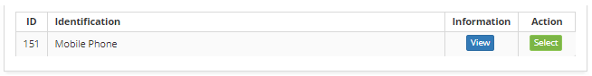

**Figure 18 - Related configuration item listing screen**

### Linking related configuration item

1.  Locate the desired ticket, press on it and then click on the icon  ;

2.  The registration screen regarding the given ticket will be displayed. Click
    the menu  button and then click **Related CI**;

3.  The Related Configuration Items screen appears, click the *Search
    Configuration Item* button, and the related Configuration Item Search screen
    appears;

4.  Perform the search and select the desired configuration item and click
    the *Select* button to perform the linking;

5.  If you want to delete the link from the configuration item with the ticket,
    simply click on the icon .

Linking project
---------------

### Preconditions

1.  Have permission to run the service request (see knowledge [Group
    registration and search][3]);

2.  Have at least one project registered (see knowledge [Project registration
    and management][21]).

### Filters

1.  The following filter enables the user to restrict the participation of items
    in the standard feature listing, making it easier to find the desired items:

   -   Project.

   
   
   **Figure 19 - Project search screen**

2.  To show the available projects, just click on the filter.

### Items list

1.  The following cadastral fields are available to the user to make it easier
    to identify the desired items in the default list of functionality: ID
    Project, Project Name, Responsible and Process (see previous
    figure).

### Project linking

1.  Locate the desired ticket, press on it and then click on the icon  ;

2.  The registration screen regarding the given ticket will be displayed. Click
    the menu  button and then click **Project**;

3.  The **Projects** screen will appear, click the mouse over the filter. Once
    this is done, a list of the available Projects will be displayed;

4.  Select the desired project to link to the ticket;

5.  If you want to delete the project link with the service request, just click
    on the service icon .

Linking knowledge
-----------------

### Preconditions

1.  Have at least one registered knowledge (see knowledge [Knowledge
    management][22]).

### Filters

1.  The following filter enables the user to restrict the participation of items
    in the standard feature listing, making it easier to find the desired items:

   -   Title;

   -   Content;

   
   
   **Figure 20 - Knowledge search screen**

2.  Search the desired knowledge.

### Items list

1.  The following cadastral fields are available to the user to facilitate the
    identification of the desired items in the standard listing of the
    functionality: ID, Title, Version, Published and Retired.

   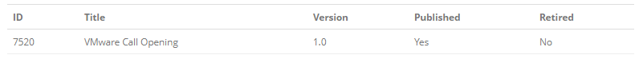
   
   **Figure 21 - Knowledge listing screen**

### Linking a knowledge

1.  Locate the desired ticket, press on it and then click on the icon  ;

2.  The registration screen regarding the given ticket will be displayed. Click
    the menu  button and then click **Knowledge**;

3.  The** Knowledge** screen will appear, click the *Search Knowledges* button.
    The knowledge base Search screen wil be open;

4.  Search and select the desired knowledge to link to the ticket;

5.  If you wish to delete the knowledge link to the ticket, simply click the .

Linking read e-mails
--------------------

### Preconditions

1.  Have permission to register service request (see knowledge [Group registration and search][3]);

2.  Have the staff registered (see knowledge [Staff registration and search][4]);

3.  Have the group registered (see knowledge [Group registration and search][3]);
    
4.  Have the contract registered (see knowledge [Contract registration and search][23]);

5.  Have the unit registered (see knowledge [Unit registration and search][6]);

6.  Have the group bound to the contract (see knowledge [How to relate group to contract?][7]);

7.  Have the unit bound to the contract (see knowledge [How to relate unit to contract?][8]);

8.  Have the portfolio with the service and the request and incident activities registered (see knowledge [Service Portfolio registration][9]), [Service registration][10], [Service Attributes configuration][11]);

9.  Have the time of attendance of the request and incidentt activities defined
    (see knowledge [Time Attendance registration and search][12]);

10. Have the contract bound to the service (see knowledge [Service Attributes configuration][11]);

11. Have ticket activities bound to the service contract (see knowledge [Service Contract Attributes configuration][13]);

12. Configure the parameter 9 (see knowledge [Parameterization rules - ticket][24]);

13. The requestor must be included in the group that is bound to the contract so that the request can be registered;

14. Configure the parameters 23,24,25,26,27,28 e 72 (see knowledge [Parameterization rules - e-mail][25]).

### Linking of e-mail reading

!!! info "IMPORTANT"

    E-mail reading will only be performed if the parameters are set correctly.

1.  Locate the desired ticket, press on it and then click on the icon  ;

2.  The registration screen regarding the given ticket will be displayed. Click
    the menu  button and then click E-mails;

3.  A screen will appear to check incoming e-mails, as shown in the figure
    below:

   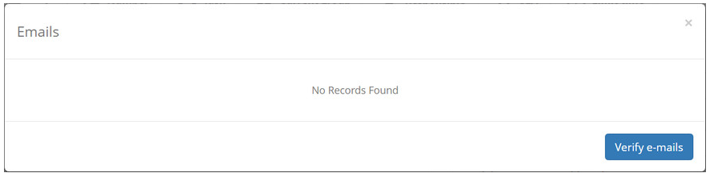
   
   **Figure 22 - E-mail reading screen**

4.  Click on the *Check E-mails* button. The e-mails will be displayed, as shown
    in the figure below:

   
   
   **Figure 23 - Reading e-mails**

5.  Click on the e-mail icon  to create the ticket based on it. Once this is
    done, the ticket register screen will be displayed;

6.  If the sender of the chosen e-mail is a collaborator registered in the
    system, after clicking the icon , the fields to fill in the information of
    the requester will be filled by the system. But if the sender is not a
    registered employee in the system, he / she must fill in the fields with the
    necessary information;

7.  Regardless of whether the sender is a collaborator registered in the system,
    the **Description** field will be filled with the content of the e-mail, as
    shown in the figure below:

    

    **Figure 24 - Ticket registration screen**

8.  Record the remaining information of the request, click on the button  and
    then click the record button to register , where the date, time and user
    will be saved automatically for a future audit.

Ticket capture
--------------

### Preconditions

1.  Have permission to execute the service request (see knowledge [Group
    registration and search][3]).

### Capturing ticket

1.  The Ticket Management screen will be displayed;

2.  Locate the desired ticket, press on it and then click on the icon ;

3.  The screen will appear to confirm the capture of the ticket, that is, to
    confirm that it is responsible for executing the ticket, as shown in the
    following figure:

   
   
   **Figure 25 - Ticket capture confirmation screen**

4.  Confirm the capture of the ticket. After that, the ticket registration
    screen will be displayed to verify your information.

!!! warning "ATTENTION"

    Once the ticket is captured, it will be possible to execute the linking
    with several other items: Requestor configuration items, related requests,
    sub-requests, attachments, schedule, problem, change, release, related
    configuration items, project , knowledge and e-mail readings (see figure 6),
    as explained in the following sections.

Ticket execution registration
-----------------------------

### Preconditions

1.  Have permission to execute the service request (see knowledge [Group
    registration and search][3]);

2.  Have the cause of incidents registered (see knowledge [Incident cause
    registration and search][26]);

3.  Have the registered solution category (see knowledge [Solution category
    registration and search][27]).

### Registering the ticket execution

1.  The **Ticket Management** screen will be displayed;

2.  Locate the desired ticket, press on it and then click on the icon ;

3.  The registration screen regarding the given ticket will be displayed. Record
    the necessary information regarding its execution;

   
   
   **Figure 26 - Registration of the execution of the ticket**

-   If you have completed service for the ticket, change the status of the
    request to "*Resolved*", just click on the situation to change. After that,
    enter the data about the solution that was performed:

    -   If the ticket type is **Incident**, complete the fields:

        -   Cause: select the cause of the incident;

        -   Solution Category: select the incident solution category;

        -   Cause Detail: describe the details of the cause of the incident;

        -   Solution: describe the details of the solution that was
            performed to deal with the incident;

        -   Record Solution/Aswer in the Knowledge Base: if you want to save
            the "answer solution" in the knowledge base, check this field and
            inform the title of the new knowledge;

        -   Temporary Solution: indicate if the activity performed to attend
            the incident was a temporary solution.

    -   If the ticket type is Request, complete the Response
        Solution field, describe what has been accomplished to service the
        service request.

-   To attach a file related to the execution of the request, simply click on
    the menu icon  and click Attachments;

-   To record a request occurrence, click the icon  in the upper-right corner of
    the screen.

4.  After recording the information about the execution of the activity to
    fulfill the request, click on the options button  and then click on the
    button  to save and advance the flow, where the request will be forwarded to
    the validation and closing phase. But if you want to save only the logged
    information about the execution of the request and keep the current task,
    click the button .

!!! warning "ATTENTION"

    If you have chosen to "Save the Solution/Response in the Knowledge Base",
    when recording the ticket, the knowledge will be created and linked to the
    ticket.

Ticket validation and termination
---------------------------------

### Preconditions

1.  Have permission to validate the service request (see knowledge [Group
    registration and search][3]).

### Validating the ticket

1.  Locate the desired ticket, press on it and then click on the icon  ;

2.  The registration screen for the specific ticket will be displayed. Make sure
    that the ticket request has been fulfilled as requested and records the
    necessary information about it's validation;

    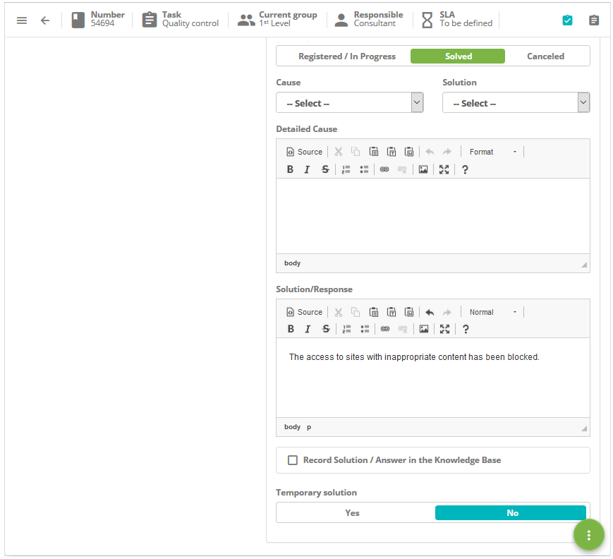
    
    **Figure 27 - Ticket registration**

3.  In the Execution Record field, describe the information about the
    execution of your activity;

4.  After the ticket has been validated, click the radio button  and then click
    the button  to record and advance the flow, where the ticket will be
    successfully completed. But if you want to save only the registered
    information about the ticket validation and keep the current job, click the
    button  .

Ticket occurrence registry
--------------------------

### Preconditions

1.  Have permission to run the Service Request (see knowledge [Group
    registration and search][3]).

### Registering ticket occurrence

1.  The **Ticket Management** screen will be displayed. Locate the ticket in
    which to record the occurrence, click on it and then click on the icon ;

2.  When recording the ticket, click the icon  in the upper right corner of the
    screen. After that, the occurrences of the ticket will be displayed, with
    the example shown in the figure below:

   
   
   **Figure 28 - Ticket occurrences**

3.  Click *Add Occurrence*. Once this is done, the **Occurrences** screen will
    be displayed, click on the **Register of Occurrences** tab;

   
   
   **Figure 29 - Ticket occurrences registration**

4.  Fill in the fields as directed below:

    -   **Category**: enter the category of the occurrence. If the category is not
    found, it is possible to perform a quick registration from this screen, just
    click on the icon 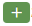;

    -   **Origin**: enter the source of the occurrence. If the source is not found,
    it is possible to perform a quick registration from this screen, just click
    the icon  ;

    -   **Recorded by**: inform by whom the occurrence is being recorded;

    -   **Spent Time**: enter the amount of minutes spent on the occurrence;

    -   **Description**: provide a brief description of the occurrence;

    -   **Occurrence**: describe occurrences;

    -   **User Information**: describe the contact information;

    -   **Notify Applicant**: check this field if you wish to communicate to the
    requestor the registration of the occurrence, so an e-mail of notification
    of occurrence will be sent to the requestor using the e-mail template linked
    to the parameter that defines it.

5.  After the data has been entered, click on the *Save* button to perform the
    operation, as a complement to the operation, the date, time and user will be
    saved automatically for a future audit.

Ticket approval
---------------

### Preconditions

1.  Have permission to approve the service request (see knowledge [Group
    registration and search][3]).

### Approving the ticket

!!! note "NOTE"

    In some cases, tickets of type "request" will go through an approval phase
    to execute them. This will depend on the ticket workflow, which is linked to
    the service request activity.

1.  The **Ticket Management** screen will be displayed;

2.  Locate the ticket you will approve for the service, click on it and then
    click on the icon ;

3.  The registration screen regarding the given ticket will be displayed. Check
    the ticket and record the necessary information regarding its approval;

   
   
   **Figure 30 - Ticket approval record**

   -   Check one of the approval options: Approved or Not Approved;

   -   If you have marked "Approved", describe the observations, if necessary;

   -   If you have marked "Not approved", describe the observations, inform the
    justification and complement the justification.

4.  After you have registered the information about the approval of the ticket,
    click the radio button  and then click the button  to         record and advance the flow. Once the ticket has been approved, it will be sent to the execution phase, that is, to attend  the request. But, if the ticket is not approved, it will be closed.

Ticket cancellation
-------------------

### Preconditions

1.  Have permission to cancel the service request (see knowledge [Group
    registration and search][3]).

### Canceling the ticket

1.  The Ticket Management screen will be displayed;

2.  Locate the desired ticket, press on it and then click on the icon  ;

3.  The registration screen regarding the given ticket will be displayed. Record
    the necessary information regarding its cancellation;

   
   
   **Figure 31 - Recording the ticket cancellation**

-   Change the ticket situation to "Canceled", just click on the situation to
    change;

-   In the **Solution** field, describe why you are canceling the ticket.

4.  After you have logged the ticket cancellation information, click the radio
    button  and then click the button  to save and advance       the flow, where the ticket will be canceled. But if you want to save only the logged information about canceling the ticket and keep the current job, click the .

Ticket direction
----------------

### Preconditions

1.  Have permission to run the Service Request (see knowledge [Group  registration and search][3]).

### Directing the ticket for service

1.  The **Ticket Managemen**t screen will be displayed.Locate the desired
    ticket, press on it and then click on the icon ;

2.  The ticket registration screen will be displayed with the fields filled,
    with the contents of the selected ticket;

3.  In the **Escalate to group** field, select the group to which the ticket
    will be directed to perform the attendance;

4.  Click on the radio button  and then click on the button  to save and advance the flow, where the ticket will be forwarded to the service phase. But if you want to save only the information about the the ticket validation and keep the current task, click the button .

Ticket delegation
-----------------

### Preconditions

1.  Have permission to delegate the service request (see knowledge [Group
    registration and search][3]);

2.  In order for this option to be visible, it is necessary to configure it in
    the linked flow (see knowledge [Workflow maintenance][15],
    section Implementing the functionality delegating the flow on the activity).

### Delegating a ticket

1.  Locate the ticket you will delegate, click on it and then click on the
    "options" icon and on Delegate, as indicated in the figure below:

   
   
   **Figure 32 - Delegate the ticket**

2.  The assignment screen will be displayed, as shown in the figure below:

   
   
   **Figure 33 - Assignment screen**

3.  Tell the group or user that you want to delegate the ticket;

4.  Describe the justification for delegating the ticket;

   !!! info "IMPORTANT"

      In the "Assign to group" field, only the groups in which you belong will
      be available. In the field where the user is informed, only the members of
      the groups in which they belong will be available.

5.  After entering the data, click the Save button. Once this is done, a
    message will appear asking the delegation of the task, just click *Ok* to
    carry out the operation;

6.  The ticket record will be updated, displaying the name of the group or user
    to which the ticket was delegated, according to the example shown in the
    following figure:

**Figure 34 - Ticket delegated**

Ticket suspension
-----------------

### Preconditions

1.  Permission to suspend the ticket (see knowledge [Group registration and
    search][3]);

2.  Register a ticket suspension justification (see knowledge [Service Request
    Justification registration and search][28]).

### Suspending the ticket

1.  Select the ticket which will be suspended, click on it and then click on the
    "Options" button and on *Suspend*, as illustrated on the image below:

   
   
   **Figure 35 - Suspending ticket**

2.  The ticket suspension justification entry screen will be displayed;

  
  
  **Figure 36 - Justification record of the ticket suspension**

   -   **Justification**: select the ticket suspension justification;

   -   **Justification Complement:** describe the selected justification
    complement, if necessary.

3.  After inserting the data, click on the *Save* button to perform the
    operation, at which date, time and user will be automatically stored for a
    future audit;

4.  After suspending the ticket, it will be refreshed and its status will be
    changed to "Suspended", as illustrated on the example below:

**Figure 37 - Ticket suspended**

Suspension and reactivation of multiple ticket
----------------------------------------------

### Preconditions

1.  Permission to suspend and reactivate multiple ticket (see knowledge [Group
    registration and search][3]);

2.  Have the contract registered (see knowledge [Contract registration and
    search][5]);

3.  Have the staff registered (see knowledge [Staff registration and
    search][4]);

4.  Have the group registered (see knowledge [Group registration and
    search][3]);

5.  Have the justification of the ticket registered (see knowledge [Service
    request justification registration and search][28]).

### Suspending multiple tickets

1.  The Request/Incident Management screen will be displayed;

2.  Click on the icon   and on *Suspension/Reactivation*, as indicated on the
    image below:

   
   
   **Figure 38 - Tickets suspension**

3.  The Multiple Ticket Suspension screen will be displayed as illustrated
    on the immage below:

   
   
   **Figure 39 - Multiple tickets suspension screen**

4.  All fields on this screen are actually filters,that is, the user who will
    suspend mass filters:

-   **Contract**: select the contract (the system filters through the contracts
    that the logged in user has access permission), in which the ticket
    suspension will be performed;

-   **Suspension Applicant**: insert the responsible for requesting the ticket
    suspension (this field filters the requests that the applicant is in). Just
    click on the text box and type the applicant’s initials that the users
    linked to the selected contract will be searched. Another way to perform a
    search is to use the *Advanced Search* button, which will display a search
    screen where the necessary data can be inserted to search for users and
    after inserting it, click on Search and select the staff member responsible
    for the suspension ticket;

-   **Group**: select the group responsible for attending the requests which
    will be suspended. On this field, only the active Service Desk groups
    belonging to the applicant will be available;

    !!! warning "ATTENTION"

        When registering the group of which the user is a member (via the Access
        and Permission > Group feature), in the "Suspend/Reactivate" field select
        the value "No". The fact that user selects "No" for this field
        Suspend/Reactivate the group register screen does not influence the
        appearance of the "Suspension/Reactivation" button of the ticket screen.

   -  **Justification**: select a ticket suspension justification;

   - **Justification Complement**: describe the selected justification complement.

!!! warning "ATTENTION"

    The logged in user is always placed in charge of suspending or
    reactivating the ticket.

5.  After inserting the data, click on the *Suspend* button to perform the
    operation, at which all the ticket from the selected performer group in
    execution will be suspended.

### Reactivating multiple suspended ticket

1.  On the **Request/Incident Management** screen, click on the  icon and
    on *Suspension/Reactivation*, as indicated on the image below:

   
   
   **Figure 40 - Tickets reactivation**

2.  The **Multiple Tickets Suspension/Reactivation** screen will be displayed.
    Select the “*Reactivate Request*” option. Afterwards, the ticket
    reactivation screen will be displayed, as illustrated on the image below:

   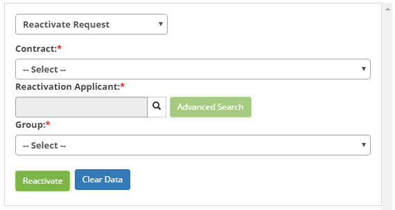
   
   **Figure 41 - Suspended tickets reactivation**

   -   **Contract**: select the contract, in which the suspended ticket
    reactivation will be performed;

   -   **Reactivation Applicant**: insert the responsible for requesting the
    reactivation. Just click on the textbox and type the applicant’s initials
    that users linked to the contract will be searched. Another way to perform a
    search is to use the *Advanced Search* button, which will display a search
    screen where the necessary data can be inserted to search for users and
    after inserting it, click on Search and select the staff member responsible
    for the ticket reactivation;

   -   **Group**: select the group responsible for attending the ticket which will
    be reactivated. On this field, only the active Service Desk groups belonging
    to the applicant will be available.

3.  After inserting the data, click on the Reactivate button to perform the
    operation, at which all the suspended ticket from the selected performer
    group will be reactivated.

Reactivating a suspended ticket
-------------------------------

### Preconditions

1.  Permission to reactivate the suspended request (see knowledge [Group
    registration and search][3]).

### Reactiving the ticket

1.  The Ticket Management screen will be displayed;

2.  Select the suspended ticket which will be reactivated, click it and then
    click on the “options” icon and on *Reactivate*.

   
   
   **Figure 42 - Reactivate the ticket**

3.  A message confirming the ticket reactivation will be displayed, just click
    on *Confirm* to perform the operation.

Changing the ticket SLA
-----------------------

### Preconditions

1.  Have permission to change the SLA of the ticket (see knowledge [Group
    registration and search][3]);

2.  Have the ticket justification registered (see knowledge [Service request
    justification registration and search][28]).

### Changing the SLA

1.  Locate the ticket that will modify the service time, click on it and then
    click the options icon and *Change SLA*, as indicated in the figure below:

   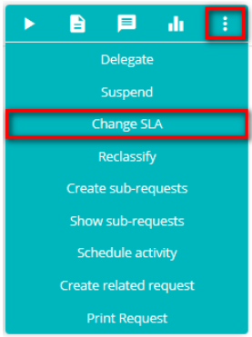
   
   **Figure 43 - Attendance time change**

2.  The screen will appear to modify the service time of the given ticket, fill
    the fields:

   
   
   **Figure 44 - Altering the SLA of the ticket**

   -   **SLA type**: define the type of service level agreement;

   -   **Time**: set the amount of hours it will take to meet the ticket;

   -   **Calendar**: inform the calendar that will follow to account the time of
    service;

   -   **Justification**: select the justification for changing the time of service
    of the ticket;

   -   **Justification Complement**: describe the details of the justification
    selected, if necessary.

3.  After the data is entered, click on the *Save* button to perform the
    operation, where the date, time and user will be saved automatically for a
    future audit.

Ticket reclassification
-----------------------

### Preconditions

1.  Belong to the executor group of the ticket.

2.  Be allowed to "create" in the flow of the target activity if the
    reclassification includes change of activity and if it is a scenario of flow
    change. In this same scenario, be allowed to "run" in the flow of the target
    activity to maintain the responsible;

3.  It is not allowed to delegate the r to an attendant if her situation
    is Resolved.

### Reclassfying the ticket

1.  Locate the ticket which will be reclassified, click on it and then click on
    the options icon. Click on *Reclassify*.

   
   
   **Figure 45 - Reclassify ticket**

2.  The intended request registry screen will be displayed;

3.  Reclassify the service information. Afterwards, click on the options  button
    and then on the save   button. Afterwards, the request will be reclassified.

!!! warning "ATTENTION"

    After editing the ticket (incident) information, an e-mail will be sent to
    the applicant notifying on the changes made. If the description is edited,
    it will be displayed in the e-mail notification, the changes made to the
    description. This e-mail will only be sent if the parameter "Activate - Send
    an e-mail when an incident is edited" is activated. The reclassification
    process includes an implicit delegation to the target Group or Attendant, in
    earlier versions the user had to: reclassify, capture the activity and
    delegate to another group.

Sub-request creation and visualization
--------------------------------------

### Preconditions

1.  Have permission to register ticket (see knowledge [Group registration and
    search][3]);

2.  Have the staff registered (see knowledge [Staff registration and
    search][4]);

3.  Have the unit registered (see knowledge [Unit registration and
    search][6]).

### Creating sub-requests

1.  Locate the ticket that will create a sub-ticket, click on it and then click
    the "options" icon and *Create sub-requests*, as indicated in the figure
    below:

   
   
   **Figure 46 - Create sub-ticket**

2.  The Sub-Request Creation screen will be displayed, as shown in the figure
    below:

   
   
   **Figure 47 - Sub-ticket registration**

3.  Fill in the fields with the applicant's information:

   -   **Applicant Name**: enter the name of the applicant, that is, the name of
    the person requesting the service for the ticket;

   !!! note "NOTE"

      If the applicant already has the personal data (telephone, e-mail and/or
      unit) registered in the system, after informing it, the data fields will be
      filled with the respective information.

  
   -   **Phone**: inform the contact's telephone number for contact;

   -   **E-mail**: inform the requestor's e-mail address for contact;

   -   **Contact Origin**: enter the origin of the contact for registration of the
    sub-ticket;

   -   **Unit**: report the unit of the applicant;

   -   **Location**: state the location of the applicant;

   -   **Other Information**: describe the observations about the applicant, if
    necessary.

4.  After the data is entered, click on the record button to perform the
    operation, where the date, time and user will be saved automatically for a
    future audit.

### Viewing sub-requests

1.  Locate the ticket that will view the sub-ticket, click on it and then click
    on the "options" icon and on Display sub-requests, as indicated in the
    figure below:

   
   
   **Figure 48 - Display sub-ticket**

2.  You will see a screen containing the sub-ticket, as shown in the figure
    below:

**Figure 49 - Sub-ticket**

Ticket activity schedule
------------------------

### Preconditions

1.  Have periodic activity groups registered to schedule the ticket activities
    (see knowledge [Periodic activity group registration and search][29]).

### Scheduling activity

1.  Locate the ticket you want to schedule an activity, click on it, and then
    click on the options icon and on Schedule Activity.

   
   
   **Figure 50 - Schedule ticket activity**

2.  The **Schedule Activities** screen will appear, click on
    the Scheduling Creation tab, and fill in the fields:

   
   
   **Figure 51 - Scheduling activities**

   -   **Activity Group**: select the group that will be responsible for performing
    the activity;

   -   **Technical Guidelines**: describe the technical orientation needed to
    perform the activity;

   -   **Schedule for**: inform the date and time, period that will be scheduled
    the activity for its execution;

   -   **Estimated Time**: enter the estimated duration in minutes, ie the time it
    will take to complete the activity.

3.  After the data is entered, click on the Save button to perform the
    operation, where the date, time and user will be saved automatically for a
    future audit.

!!! info "IMPORTANT"

    The activities that have been scheduled can be viewed in the Activities
    Schedule. To access the schedule, click Schedule, located in the Ticket
    Management menu, or in the main menu, Integrated Management > IT Operations
    Automation > Schedule Activate. Periodicals.

Registration and linking of related ticket
------------------------------------------

### Preconditions

1.  Have permission to register service request (see knowledge [Group registration and search][3]);

2.  Have the staff registered (see knowledge [Staff registration and search][4]);

3.  Have the contract registered (see knowledge [Contract registration and search][5]);

4.  Have the unit registered (see knowledge [Unit registration and search][6]);

5.  Have the group bound to the contract (see knowledge [How to relate group to  contract?][7]);

6.  Have the unit bound to the contract (see knowledge [How to relate unit to contract?][8]);

7.  Have the portfolio with the service and the request and incident activities
    registered (see knowledge [Service Portfolio registration][9], [Service
    registration][10], [Service Attributes configuration][11]);

8.  Have the time of attendance of the request and incident activities defined
    (see knowledge [Time Attendance registration and search][12]);

9.  Have the contract bound to the service (see knowledge [Service Attributes configuration][11]);

10. Have request and incident activities bound to the service contract (see knowledge [Service Contract Attributes configuration][13]);

11. Enter the content below into the parameter (see knowledge [Parameterization rules - system][30]):

   -   Parameter 385: with the value "Y".

!!! note "NOTE"

    There are two ways to register a ticket in the functionality. While a form
    allows a more complete registration, filling in more detailed fields within
    the ticket itself (more information in the next section). The other allows a
    more superficial registration through a shortcut that is located outside the
    ticket (explained in the section Creating the ticket related by the
    shortcut).

### Linking related ticket

1.  Locate the desired ticket, press on it and then click on the icon ;

2.  The registration screen regarding the given ticket will be displayed. Click
    the menu  button and then click Related ticket;

3.  The **Related Ticket** screen will appear, as shown in the figure below:

   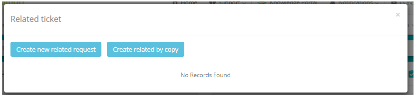
   
   **Figure 52 - Related requests screen**

4.  By clicking the Create new related request button, the related ticket
    registration screen will appear, as shown in the figure below:

   
   
   **Figure 53 - Related ticket registration screen**

5.  Fill in the fields with the required information and click on
    the *Save* button to register;

   !!! warning "ATTENTION"

      The completion of the answers of any questionnaire previously registered
      can only be answered on this screen as it provides a larger ticket
      register.

6.  Selecting the *Create related by copy* button, the fields described in the
    original (parent) request are reused.

   !!! warning "ATTENTION"

      The Create related by copy button is only available if parameter 385 is
      enabled.

   -  The Applicant (with their automatic extension, telephone and unit actions)
    and Description fields are automatically filled in;

   -  The tabs are also automatically filled in: Attachment, Configuration Items
    and Knowledge Base;

   !!! info "IMPORTANTE"

       The information entered automatically comes from the request considered as
       the parent, that is, the request that enabled the origin of the related
       request.

-   Inform the activity and if it has a questionnaire, the system will make the
    questionnaire available for answer;

-   Click the *Save* button and then the open ticket number will be available.

### Creating the related ticket by the shortcut

1.  Locate the ticket that will register a related ticket, click on it and then
    click on the "options" icon and on *Create related request;*

   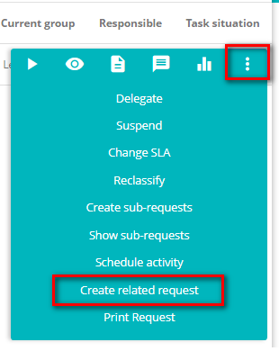
   
   **Figure 54 - Create related ticket**

2.  The **Related Request** Master screen will be displayed. Fill in the fields
    as directed below:

   
   
   **Figure 55 - Related ticket registration**

3.  Fill in the fields as directed below:

-   **User**: enter the applicant's name, that is, the name of the person
    requesting the opening of an incident or service request:

    -   : by clicking the icon, allows to link the ticket related to the user
        logged in;

    -   : by clicking the icon, allows you to link the user-related responsible
        for the main task.

   !!! note "NOTE"

     If the applicant already has the personal data (telephone, extension,
     e-mail and/or unit) registered in the system, after informing it, the data
     fields will be filled with the respective information.

   -  **Phone**: enter the applicant's telephone number;

   -  **E-mail**: inform the requestor's e-mail;

   -  **Contact Origin**: enter the contact origin of the ticket;

   -  **Catalog**: select the catalog of services;

   -  **Service**: inform the service regarding the service catalog. If the
    service catalog is "Business", the business services for selection will be
    available in this field, but if the service catalog is "Technical", the
    support/technical services for selection will be available in this field;

   -  **Category**: report the service category to facilitate the search of the
    activity (request/incident);

   -  **Type**: select the ticket type, if it is an incident or request;

       -  **Incident**: if the situation presented is an unplanned outage, a
        reduction in the quality of the service or failure of any configuration
        item that has not yet impacted an IT service. e.g.: The network link is
        out, the network is slow, the server is inaccessible, etc.

       -  **Request**: refers to requests for demands made by users within the
        Information Technology environment. They can range from access requests
        to suggestions for improvement at low cost. e.g.: network access request
        for a new user, request for configuration of some equipment, request to
        add some software to the workstation, etc.

   -  **Activity (Request/Incident)**: inform the activity that will be performed
    referring to the ticket type;

   -  **SLA**: after informing the activity (request/incident) will be established
    the time of attendance of the same;

   -  **Contract**: after informing the activity (request/incident), the contract
    will be displayed for which the opening of an incident or service request
    will be made;

   -  **Unit**: report the applicant's unit ;

   -  **Impact**: after informing the activity (request/incident), the business
    impact information will be displayed;

   -  **Urgency**: after informing the activity (request/incident), the urgency
    information will be displayed, which indicates the speed that service
    activity needs to be performed;

   -  **Title**: enter the ticket title;

   -  **Description**: enter the ticket description. The description must be
    objective, including all the information necessary to attend to it;

   -  **Escalate to Group**: allows you to choose a group, linked to the ticket,
    so that the related request is directed;

   -  If you want to link a Configuration Item, click on the Search Configuration
    Item button, perform the search and select the IC;

   -  **Status**: select the option that fits with the current status of the
    request: Registered, Solved and Canceled.

4.  After the data is entered, click the . After that, the related request will
    be created successfully and an icon representing the main request will be
    displayed in the same order, as shown in the following figure.

   !!! info "IMPORTANT"

       The related ticket will be directed to the executor group defined in the
       link record of the request/incident activity to the service contract. But if
       the executor group is not defined in the activity link register, it will be
       directed to the executor group defined in parameter "Group ID Level 1".

   
   
   **Figure 56 - Related ticket**

5.  To view the main ticket (source ticket), simply click the  .

!!! info "IMPORTANT"

    The system will send notification e-mails regarding creation, scheduling,
    capturing, closing, and other changes to related ticket for the executing
    group of the primary ticket.

Ticket printing
---------------

1.  Locate the ticket which will be printed, click on it and then click on the
    "options" icon and on *Print Request*, as illustrated on the image below:

   
   
   **Figure 57- Printing the ticket**

2.  The selected ticket entry will be printed.

!!! info "IMPORTANT"

    To view the print it is necessary to disable the browser pop-up for the
    product.

Kanban frame
------------

This option aims to assist managers in tracking and verifying their ticket
attendance queues using a management technique called Kanban. According to the
website [Leankit][31]), Kanban helps you harness the power of visual information by using sticky notes on a
whiteboard to create a “picture” of your work.

In these cards, indications are given about a certain task, for example "to
execute"/"in execution"/"done", and whenever the flow advances its positioning
changes to the right in the frame.

This technique is part of the common management strategy called "Management at a
Glance", which emphasizes the progress transparency of the work for the entire
team.

### Preconditions

1.  Have a ticket registered;

2.  Give permission for the desired Access Profile (see knowledge [Ticket
    management module access permission][33]).

### Explaining the Kanban frame

1.  The Kanban frame retrieves the tickets of each attendant (user) that makes
    up the selected group. These tickets are grouped by attendant in a didactic
    and dynamic graphic form;

2.  Information are structured with display mode, filters, captions, and swin
    lanes that group the tickets of each attendant;

3.  Click the icon . The main screen of the feature will be displayed in the
    "kaban frame" view, as shown in the figure below:

   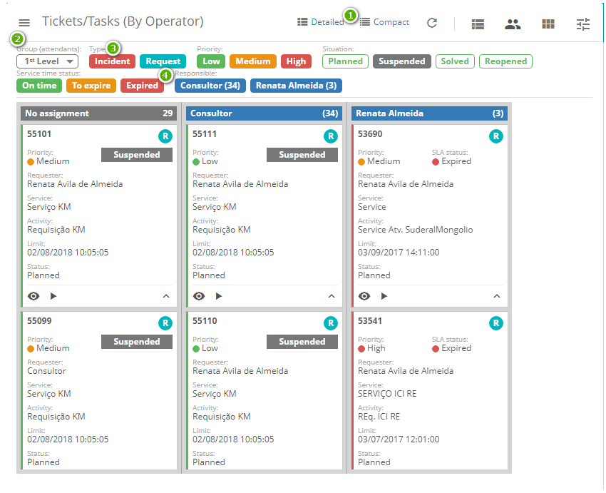
   
   **Figure 58 - Kanban board**

   -  **1**: Dispay mode - choose between  (shows all fields of the ticket) and  (hides most of those details)

   -   **2**: Group (attendants) - select the group of attendants (users) that you
    whish to follow

   -   **3**: Subtitles - set of didactic subtitles about: Type, Priority, Situation
    and Service Time Status

   -   **4**: Responsible - specific subtitle about the responsibles for the tickets,
    indicating the name of the people who are in the selected *Group*

!!! info "IMPORTANT"

    To assign the ticket to an attendant, simply use the mouse by clicking and
    dragging (simulating the concept of moving a post-it into a real
    wall-mounted frame)

### Ticket (detailed mode)

   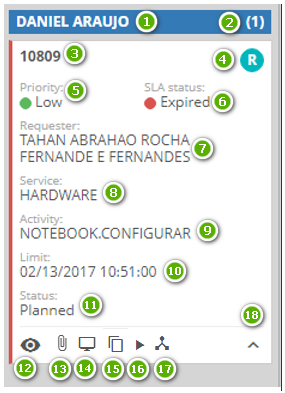
   
   **Figure 59 - Details**

-   **1**: Responsible - indicates to which attendant it was assigned

-   **2**: Amount - counts the tickets assigned to the attendant

-   **3**: ID - identification

-   **4**: Type - indicates if it is a request or an incident

-   **5**: Priority - indicates the level of urgency (Low, Medium or High)

-   **6**: SLA Status - indicates the situation in relation to its solution deadline
    (On time, To expire, Expired)

-   **7**: Requester - It's who asked for the execution.

-   **8**: Service - indicates the type of service binded

-   **9**: Activity - indicates the type of activity binded

-   **10**: Limit - indicates the date and time threshold of its completion

-   **11**: Status - indicates the general stage of the ticket (In attendance,
    Solved, etc.)

-   **12**: click to show a summary of ticket data

-   **13**: click to show the attachments

-   **14**: click to show the linked configuration items

-   **15**: shows the initial request (son request)

-   **16**: click to show the request occurrences from the beginning

-   **17**: indicates that the request has other related tasks (parent request)

-   **18**: click for change display mode to compact

Ticket audit
------------

### How to access

1.  On the **Ticket Management** screen, click the menu button  and then click
    the *Audit* item;

   
   
   **Figure 60 - Ticket auditing option**

### Filters

1.  The following filters enable the user to restrict the participation of items
    in the standard feature listing, making it easier to find the desired items,
    as shown below:

   -   Number;

   -   Start date;

   -   Final date.

   
   
   **Figure 61 - Ticket audit screen**

2.  After completing the search, click the icon  to set the filters required to
    check the ticket history (incident and request) instances for the audit.

### Items list

1.  The following cadastral fields are available to the user to facilitate the
    identification of the desired items in the standard listing of the
    functionality: Description, Registered by, Date/Time, Origin, Contract,
    Service, Situation, Responsible, SLA and Description.

   
   
   **Figure 62 - Ticket audit screen**

### Performing the ticket audit

1.  On the **Ticket Management** screen, enter the filters according to your
    needs (according to the previous figure) and click on the search icon to
    perform the operation. After this, the data of the ticket for audit will be
    presented.

Advanced search
---------------

### How to access

1.  In the Ticket Service screen, click on the menu button  and afterwards,
    click on the *Advanced Search* option.

### Preconditions

1.  Have open calls in any situation;

2.  Enter the contents below into the parameters (see
    knowledge [Parameterization rules - ticket][24]):

    -   Parameter 40;

    -   Parameter 41;

    -   Parameter 260: default 1-List without restriction;

    -   Parameter 261;

    -   Parameter 343: default: "Y".

3.  Configure the parameter 378 (see knowledge [Parameterization rules -
    system][32]).

!!! note "NOTE"

    If the user enters the value equal to 0 (Zero), the system will always
    download in the background. If the user leaves the field blank, the system
    limits the download in the background to five thousand records. If the user
    places a value greater or less than five thousand records, the system
    considers the value informed by the user.

### Filters

1.  The following filters enable the user to restrict the participation of items
    in the standard feature listing, making it easier to find the desired items:

   -   **Opening date**: insert the intended period of the ticket search;

   -   **Closing date**: insert the ticket closure date to check for ticket which
    were closed in the given period;

   -   **Number**: insert the ticket identification number to check for specific
    ticket;

   -   **Order By**: determine the order in which the ticket will be displayed;

   -   **Contract**: insert the contract to check for ticket related to it;

   -   **Catalog**: insert the service catalog type to check for ticket related to
    it;

   -   **Service/Enabling Service**: insert the service to check for ticket related
    to it;

   -   **Type**: insert the ticket type to check for ticket;

   -   **Activity (Request/Incident)**: insert the service to check for ticket
    related to it;

   -   **Consider Hierarchy**: check this box to consider the service hierarchy;

   -   **Configuration Item**: insert the configuration item to check for ticket
    related to it;

   -   **Situation**: insert the situation to check for ticket related to it;

   -   **Priority**: insert the priority to check for related ticket;

   -   **Execution/Solver group**: insert the executor group to check for ticket
    that were forwarded to it;

   -   **Phase**: insert the ticket phase to check for ticket which are in a
    certain stage;

   -   **Origin**: insert the source of the ticket contact to check for related
    ticket;

   -   **Unit**: insert the unit to check for related ticket;

   !!! note "NOTE"

      If the parameter 61 "Link contract to units" is enabled, only units linked
      to the contract which has ties to the group it belong to will be
      available.

   -   **Location**: insert the location to check for related ticket;

   -   **Keywords**: insert the keyword to check for related ticket;

   -   **User**: insert the ticket applicant name to search their ticket;

   -   **Created by**: insert the name of the applicant who registered the ticket
    to check for ticket created by them;

   -   **Current Responsible**: insert the current responsible for attending a
    ticket to check for ticket attended by them;

   -   **Would you like to see the description on the report?**: check this box to
    display the content of the ticket “description” field on the report.

!!! info "IMPORTANT"

    The effectiveness of the search depends on following certain permission
    rules through the filter, such as: execution, delegation, monitoring,
    visualization, user groups, contract link, units and logged in collaborator.

   
   
   **Figure 63 - Ticket advanced search**

2.  After setting the filters, click on the Search button. Then, the ticket
    will be displayed according to the filters chosen;

3.  Once the search is done, choose one of the file formats (PDF, XLS and CSV)
    to generate the report. After choosing the format, the system will check
    parameter 261 and finding records larger than the allowed amount, the
    following message will be displayed:

   -   "The amount of records found exceeds the maximum allowed viewing amount.
    Please reset the search filters."

4.  However, if the amount of record returned from the search is less than that
    limited in parameter 261, then the system checks the setting of parameter
    378;

5.  The records quantity to generate the report in the background is checked, if
    the quantity is greater than the parameterized quantity, then the system
    displays the following message:

    -   "The report is being processed. A notification will be sent to you when you
    are ready".

6.  If the file to be generated is too long, the system will trigger a
    notification on the main screen, informing that the download is ending. When
    finished, click the View button and access the report through the link
    provided;

7.  The system returns the number of calls found above the search presentation.

### Items list

1.  The following cadastral fields are available to the user to facilitate the
    identification of the desired items in the standard feature listing: ID,
    Service, Actity (Request/Incident), Type, User, Registered by, Date/Time
    Opening, Service Time, Description, Solution/Answer, Situation, Date/Time
    limit, Group, Date/ime Ending, Remaining Time and Current Responsible.

   
   
   **Figure 64 - Tickets list screen**

2.  In each item on listing it is possible to realize the following actions:

-   To view the ticket history (events), just click the Action button and then
    on Search Ticket History;

-   To view the ticket log, just click on the Action button and then on View
    Ticket;

-   To view a ticket attachments, just click on the Action button and then
    on View Attachments;

-   To reopen a ticket, just click on the Action button and then on Reopen
    Ticket.

### Export of the result of advanced search

1.  To generate a report with *summed* up information on the search:

   -   click on the *Generate PDF* button to generate an PDF format report;

   -  click on the *Generate XLS* button to generate an Excel format report .

2.  To generate a report with *detailed* information on the search:

   -   click on the *Generate Detailed Report (PDF)* button to generate a PDF
    format report;

   -   click on the *Generate Detailed Report (XLS)* button to generate a Excel
    format report.

3.  After performing the advanced search the user inserts one of the required
    filters and can click the Exportar CSV button.

!!! note "NOTE"

    To export the data to CSV, by deleting any special characters, you must,
    when opening the file in Excel, toggle the source of the file that will be
    set in the preview mode Western European (Windows) to Unicode (UFT-8).

   
   
   **Figure 65 - Screen view mode configuration file**

4.  The system exports the result in the desired format, with the following
    fields:

    -   **ID Service Request: **open ticket number;

    -   **Service**: Business Service description;

    -   **Activity (request/Incident)**: activity description ;

    -   **Type**: ticket destination:

        -   Request;

        -   Incident ;

        -   Procedure.

    -   **User**: name of the user who requested the activity;

    -   **Registered by**: name of the user who created the ticket;

    -   **Date/time opening**: date and time the ticket was opened;

!!! note "NOTE"

    The following three fields will only appear if you have an activity that
    has a registered SLA that has been registered and opened in the system.

   -   **Date/Time of capture**: date and time when the analyst performed the first
    of the capture to attend the call;

   -   **Time capture**: time elapsed between the date/time the call was opened and
    the date/time of the first capture;

   -   **Deadline capture (SLA)**: time in hours or minutes inserted in the call
    time record for Call Capture;

   -   **Service Time**: time spent between the closing hour and the opening date
    and time within the calendar;

   !!! info "IMPORTANT"

      In case the SLA has exceeded the service time, the system will count from
      the opening of the call to the closing and will disregard the schedule.

   
   -   **Description**: what was requested in the activity;

   -   **Solution/Response**: what the technician described in response to the
    requested ticket;

   -   **Status**: ticket status;

   -   **Date/Time limit**: time established in the service level agreement;

   -   **Group**: group that is responsible or terminated;

   -   **Closing date/time**: if it exists, it returns the date and time that the
    ticket was placed as resolved or closed;

   -   **Current Manager**: name of the technician who is acting on the ticket or
    name of the technician who terminated the ticket.

   -   **Contract origin**: service channel where the ticket was initiated (e.g.:
    Telephone, Internet, e-mail etc);

   -   **Date and time of suspension**: date and time of last suspension:

       -   precondition: the ticket must have been suspended, otherwise there is no
        information in this field;

       -   a ticket may have multiple suspensions throughout its lifecycle, so this
        field will only return data from the last suspend.

   -   **Date and time of reactivation**: date and time of last reactivation:

       -   precondition: The ticket should be suspended, otherwise there is no
        information in this field;

       -   a ticket may have several reactivations throughout its lifecycle, so
        this field will only return data from the last reactivation.

   -   **Impact**: reflects the level impelled in the ticket,

       -   Impacts may vary if parameter 104 - Calculates the priority of the
        request dynamically using the registered formula. (e.g: Y or N -
        Default: 'N') is active;

       -   Impacts can be: High, Medium or Low (without parameter 104);

       -   The impacts can be: Very High, High, Exalted, Medium, Low (with
        parameter 104);

   -  **Urgency**: reflects how much to the user the open ticket needs immediate treatment;

       -  Urgency may also vary from parameter 104;

       -  The urgencies can be: High, Medium or Low (without parameter 104);

       -  The urgencies can be: Critical, High, Medium or Low (with parameter
        104);

   -  **Cause**: reasons that caused the ticket report;

   -  **Detail of the Cause**: detailed description of what caused the ticket
    report;

   -  **Contract**: Returns the contract number that generated the ticket;

   -  **SLA**: service time for the open activity, according to contract;

   -  **Priority**: obtained by the Impact X Urgency factor, priority is
    represented in numeric terms from 1 to 5 and is a threshold contained when
    registering the Attendance Time;

   -  **SLA out (in time)**: deadline in HH: MM that the SLA is out of the
    deadline established for service;

   -  the SLA out of time is counted by the subtraction between the time of
        service and total time of service, remembering that if the SLA is out of
        time;

   -  the system disregards the calendar.

   -   **Inside SLA ?**: informs if the term of service was within or outside the
    service level agreement (SLA)

       -  Possible values: Yes or No;

   -  **Locality**: where the ticket was opened;

   -  **Main IC**: list of Configuration Items linked to the ticket;

   -  **Applicant's telephone number**: applicant's telephone number:

       -  This field can be changed at the time of registration of the ticket;

   -  **Applicant's extension**: applicant's extension number;

   -  **Applicant's e-mail**: information about the applicant's e-mail address;

       -  This field can be changed at the time of registration of the ticket;

   -  **Unit**: locality to which the applicant belongs;

   -  **SLA overdue justification**: description of reason why service time was
    not sufficient;

       -  If the service time has been exceeded, this field is mandatory;

   -  **Catalog Type**: Business/Technical;

   -  **Request Parent (Sub-Request)**: subscriber's parent ticket number;

   -  **Request Parent**: The service ticket parent number of the related ticket
    that had the data described;

   -  **Solution Category**: solution description given when you terminate a
    ticket.

   -  **Number of attachments**: number of attachments that have the ticket;

       -  This quantity can be increased or decremented during the life cycle of
        the ticket, so it must reflect the quantity at the time the report is
        printed.

Ticket reopening
----------------

### How to access

1.  Click the menu button  and after that, click the *Advanced Search* item.

### Reopening a ticket

1.  The Tickets search screen appears;

2.  Search for the intended ticket which will be reopened. Afterwards, click on
    the *Actions and on Reopen Ticket buttons of the ticket;

3.  A message to confirm the ticket reopening will be displayed, just click
    on *Ok* to perform the operation;

4.  The ticket will be reopened and displayed on the ticket list.

**Figure 66 - Ticket reopened**

Ticket registration via template
--------------------------------

### Preconditions

1.  Have the templates registered to register a ticket using this functionality
    (see knowledge [Incidents, Requests and Procedures Template registration and
    search][33]);

2.  Have permission to register ticket (see knowledge [Group registration and
    search][3]);

3.  Have the group registered (see knowledge [Group registration and
    search][3]);

4.  Have the unit registered (see knowledge [Unit registration and
    search][6]);

5.  Have the contract registered (see knowledge [Contract registration and
    search][5]);

6.  Have the portfolio with the service and the ticket activities registered
    (see knowledge [Service Portfolio registration][9], [Service
    registration][10], [Service Attributes configuration][11]);

7.  Have the time of attendance of the ticket activities defined (see
    knowledge [Time Attendance registration and search][12]);

8.  Have the contract bound to the service (see knowledge [Service Attributes
    configuration][11]);

9.  Have ticket activities bound to the service contract (see knowledge [Service
    Contract Attributes configuration][13]);

10. Have the group bound to the contract (see knowledge [How to relate group to
    contract?][7]);

11. Have the unit bound to the contract (see knowledge [How to relate unit to
    contract?][8]);

12. Have the user linked to the unit;

13. Have the user linked to the group.

### Registering the ticket via template

1.  Click the radio button  located in the lower right corner of the screen,
    then click on the template button via template  . Once this is done, the
    template screen containing the listed templates will be displayed, as shown
    in the figure below:

   
   
   **Figure 67 - Template screen**

2.  Select the desired template and will be directed to the Ticket
    Register screen with the fields filled in according to the chosen
    template;

3.  Fill in the fields with the required information;

4.  After the data is entered, click the radio button  and then click the record
    button  to register, where the date, time and user will be automatically
    saved for a future audit.

[1]:/en-us/citsmart-platform-7/processes/tickets/permission.html
[2]:/en-us/citsmart-platform-7/additional-features/reports/create/smart-reports/configuration/generate-report.html
[3]:/en-us/citsmart-platform-7/initial-settings/access-settings/user/group.html
[4]:/en-us/citsmart-platform-7/initial-settings/access-settings/user/employee.html
[5]:/en-us/citsmart-platform-7/additional-features/contract-management/use/register-contract.html
[6]:/en-us/citsmart-platform-7/plataform-administration/region-and-language/register-unit.html
[7]:/en-us/citsmart-platform-7/processes/tickets/relate-group.html
[8]:/en-us/citsmart-platform-7/processes/tickets/relate-unit.html
[9]:/en-us/citsmart-platform-7/processes/portfolio-and-catalog/register.html
[10]:/en-us/citsmart-platform-7/processes/portfolio-and-catalog/services.html
[11]:/en-us/citsmart-platform-7/processes/portfolio-and-catalog/configure-service-attribute.html
[12]:/en-us/citsmart-platform-7/processes/service-level/time-attendance.html
[13]:/en-us/citsmart-platform-7/processes/portfolio-and-catalog/contract-attributes.html
[14]:/en-us/citsmart-platform-7/plataform-administration/parameters-list/parametrizaion-ticket.html
[15]:/en-us/citsmart-platform-7/workflow/workflow-management.html
[16]:/en-us/citsmart-platform-7/processes/configuration/IC-management.html
[17]:/en-us/citsmart-platform-7/processes/problem/register-problem.html
[18]:/en-us/citsmart-platform-7/processes/change/register-change.html
[19]:/en-us/citsmart-platform-7/processes/release/requisition.html
[20]:/en-us/citsmart-platform-7/processes/configuration/IC-management.html
[21]:/en-us/citsmart-platform-7/additional-features/project-management/use/project-management.html
[22]:/en-us/citsmart-platform-7/processes/knowledge/management.html
[23]:/en-us/citsmart-platform-7/processes/portfolio-and-catalog/contract.html
[24]:/en-us/citsmart-platform-7/plataform-administration/parameters-list/parametrizaion-ticket.html
[25]:/en-us/citsmart-platform-7/plataform-administration/parameters-list/parametrization-email.html
[26]:/en-us/citsmart-platform-7/processes/portfolio-and-catalog/cause-incident.html
[27]:/en-us/citsmart-platform-7/processes/portfolio-and-catalog/solution-category.html
[28]:/en-us/citsmart-platform-7/processes/portfolio-and-catalog/request-justification.html
[29]:/en-us/citsmart-platform-7/additional-features/automation-of-operation/configuration/periodic-activity-group.html
[30]:/en-us/citsmart-platform-7/plataform-administration/parameters-list/parametrization-system.html
[31]:https://www.planview.com/resources/articles/what-is-kanban/
[32]:/en-us/citsmart-platform-7/processes/tickets/template-incident.html
[33]:/en-us/citsmart-platform-7/processes/tickets/permission.html

!!! tip "About"

    <b>Product/Version:</b> CITSmart | 8.00 &nbsp;&nbsp;
    <b>Updated:</b>07/23/2019 – Anna Martins
