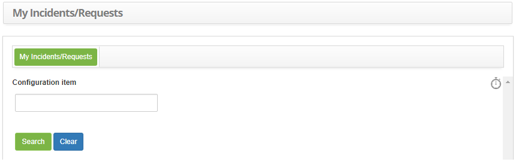
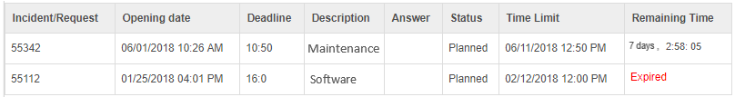

title: My tickets check
Description: This functionality is intended to provide a summary of service
requests (tickets) made by the user.

# My tickets check

Access to user requests can also be performed in the Smart Portal, making the
query faster without having to enter the system.

How to access
-------------

1.  Access the My Requests feature by navigating the main menu **Processes
    Management > Ticket Management> My Request**.

Preconditions
-------------

1.  Have a registered configuration item (see knowledge [Configuration item
    management][1] section Registering a new configuration item) and be linked to a service request
    (see knowledge [Ticket management (services)][2] section Linking the aplicant's configuration item (CI));

2.  Have registered service requests (see knowledge [Ticket management (services)][3] section Ticket registration).

Filters
-------

1.  The following filter allows the user to restrict the participation of items
    in the standard listing of the functionality, facilitating the location of
    the desired items, as shown in the figure below:

    -   Configuration Item.

2.  The Tickets screen will be displayed, as shown in the figure below:

    

    **Figure 1 - Ticket check screen**

-   Enter the Configuration Item and click *Search*. Once this has been done,
    the summaries of the service requests (tickets) related to the configuration
    item will be listed;

-   If you want to check all service requests (tickets), click directly on
    the *Search* button.

!!! info "IMPORTANT"

    In this screen has a timer (watch figure)  that, when activated with a
    click, displays a timer on the time spent and the remaining time to finish
    the request in the Remaining time field of the item list.

Items list
----------

1.  The following cadastral fields are available to the user to facilitate the
    identification of the desired items in the standard listing of the
    functionality: Ticket, Opening Date, Deadline, **Description, Answer, Status, Time
    limit and Remaining Time.

**Figure 2 - Items screen**

Filling in the registration fields
----------------------------------

1.  Not applicable.

[1]:/en-us/citsmart-platform-7/processes/configuration/IC-management.html
[2]:/en-us/citsmart-platform-7/processes/tickets/ticket-management.html
[3]:/en-us/citsmart-platform-7/processes/tickets/ticket-management.html

!!! tip "About"

    <b>Product/Version:</b> CITSmart | 8.00 &nbsp;&nbsp;
    <b>Updated:</b>07/23/2019 – Anna Martins
