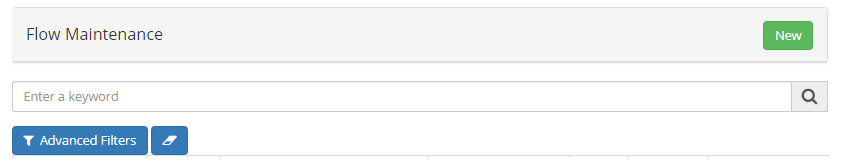
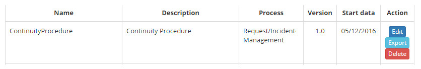
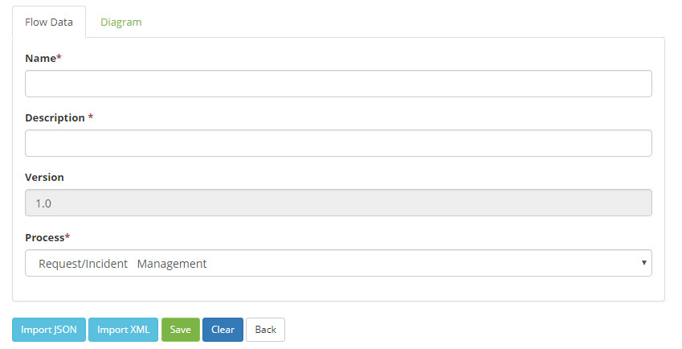
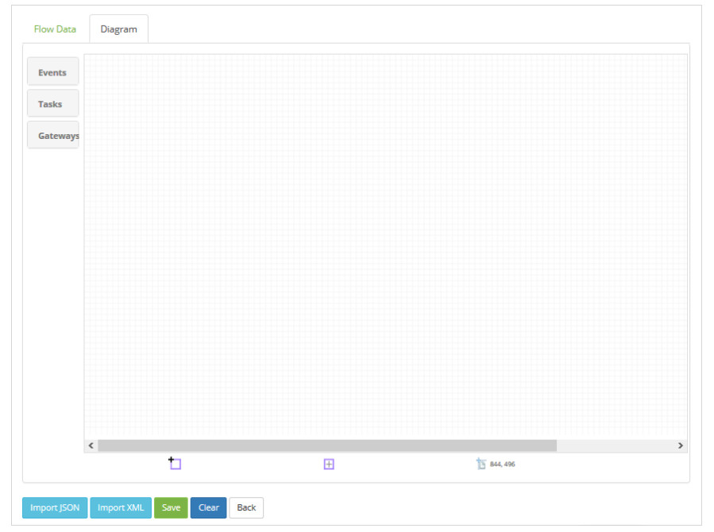
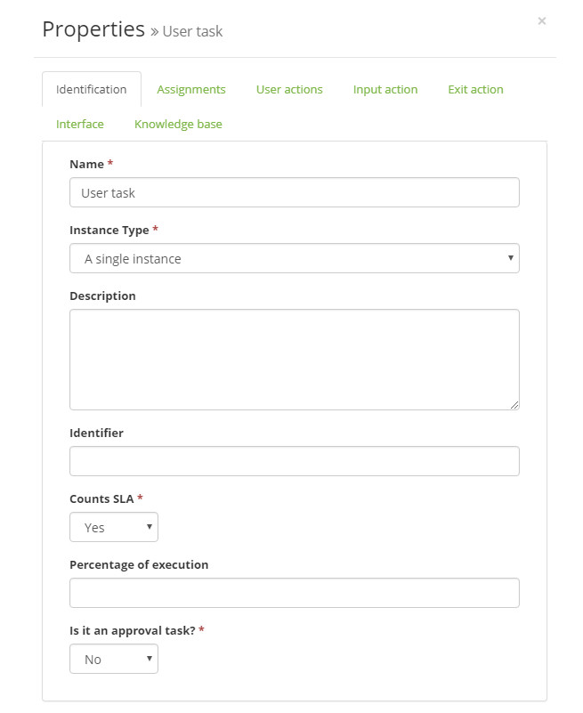
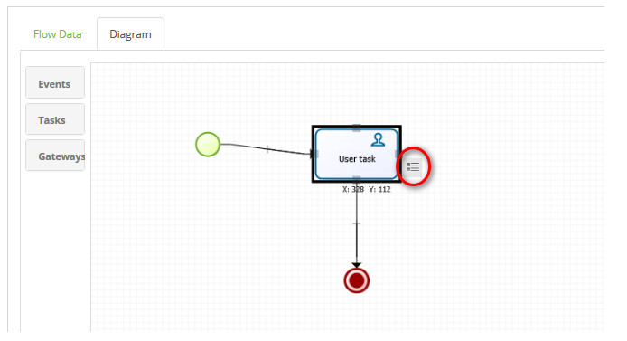
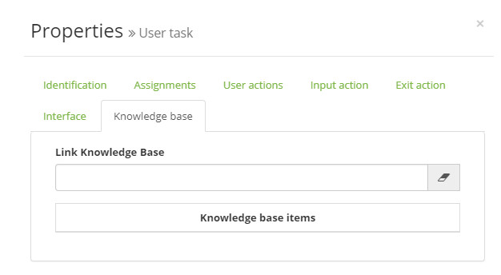
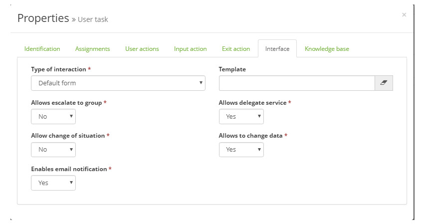
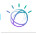

title: Workflow maintenance

Description: A funcionalidade de Manutenção de Fluxos tem a finalidade de modelar seus objetivos de negócio.

# Workflow maintenance

The Flow Maintenance feature is intended to model your business objectives, describing the steps that need to be taken to achieve 
those goals through a flowchart.

How to acess
-----------

1. Access the main menu **System > Flow Maintenance**.

Preconditions
------------

1. No applicable.

Filters
---------

1. The following filter enables the user to restrict the participation of items in the standard feature listing, making it easier to find the desired items:

    - Search.

    
    
    **Figure 1 - Flow search screen**

Items list
----------------

1. The following cadastral fields are available to the user to facilitate the identification of the desired items in the standard 
feature listing: **Name, Description, Process, Version** and **Start data**.

2. There are action buttons available to the user for each item in the listing, they are: *Edit, Export* and *Delete*.

    
    
    **Figure 2 - Flow listing screen**

Flow creation
----------------

### Filling in the registration fields

1. Click the *New* button. After that, the screen will be displayed to define the flow information, as shown in the figure below:

    
    
    **Figure 3 - Flow information record**

2. Enter flow data:

    - **Name**: enter the name of the stream;

    - **Description**: provide a brief description of the flow;

    - **Version**: the version of the stream in this field is displayed;

    - **Process**: select the process for which to design the flow.

3. After the recorded flow data, click the Flow Chart **Diagram** tab. After that, the drawing area will be displayed, as shown 
in the figure below

    
   
    **Figure 4 - Flow information record**

    - **Events**: presents the elements of events to be used in the flow design;

    - **Tasks**: presents the elements of tasks to be used in the design of the flow;

    - **Gateways**: presents the elements of conditions to be used in flow design.

        - To insert the elements, simply click on the desired element and drag it to the drawing area. Dragging and dropping the 
        element into the drawing area will display a screen for setting properties, as shown in the figure below:

    
    
    **Figure 5 - Definition of the properties of the "Task" element of the flow**

    - The properties of an element can also be defined by double-clicking on the element or clicking on the element and then 
    clicking on the icon next to it as shown in the figure below:

    
    
    **Figure 6 - Flow element**

      - If you want to delete an element that was inserted in the drawing of the flow, click on it and press the Ctrl + Delete 
      screen.

4. After the stream is set, click the *Save* button to perform the operation.

Linking to a knowledge
---------------------------

1. By clicking on the tab "Knowledge Base" the user can fill the filter field with part of the title or number of the desired 
knowledge. Once selected, this knowledge will be recorded associated with the activity of the flow,

!!! note "NOTE"

     The main purpose of this knowledge binding is to allow the attendant of a request/incident to have easy access to it. As 
     soon as the flow arrives at the flow activity bound to a knowledge, the icon  is shown in 
     the upper right corner of the Request/Incident screen to give read access to the content, for such, such knowledge is 
     usually written in the form of a step at step. 

   
    
   **Figure 7 - Knowledge tab**

Implementing the functionality in the flow on the activity
------------------------------------------------------------------

1. When you click on the properties of the User Task located in the stream, selecting the **Interface** tab, the following screen 
will be displayed:

    
    
    **Figure 8 - Interface tab**

2. Fill in the fields as directed below:

    - **Type of interaction**: is the way the Questionnaire or Neuro interface will be applied in the service request;

    -   **Template**: allows the linking of previously registered service request template (see knowledge [Service request 
    template registration and search][1];

    !!! note "NOTE"

         If there is no binding of a service request template in the interface tab, the system will subtend and apply the 
         settings of a standard form, enabling configuration, change, problem, and request related item linking service.

    - **Allows escalate to group**: enables the activation of the "Escalate to group" option in the registration of a ticket;

    - **Allows change of situation**: allows you to choose the stage in which the ticket is located on the service request screen (Registered, Solved and Canceled).

    -   **Enables e-mail notification**: enables e-mail notification when creating new tickets;

    -  **Allows delegate service**: allows the activation of the "Delegate" option so that it is visible in the options menu of 
    the management of a ticket;

    - **Allows to change data**: allows you to edit questionnaires on the ticket management screen.

    !!! note "NOTE"

        The rules configured in the flow will have priority over the service request template markings, as this is a complement 
        to the flow.

Flow export
------------------

1. On the **Flow Maintenance** screen, search for the flow you want to export. After that, just click on the *Export* tab of the 
flow record.

Flow import
-------------------

1. On the **Flow Maintenance** screen, click the *New* button. After that, the registration screen will be displayed, as shown in 
figure 2.

2. Click the *Import JSON* button to import the file in the ".txt" format or click the *Import XML* button to import the file in 
the ".xml" format.

3. After importing the stream, click the *Save* button to perform the operation.

IBM WATSON component
-----------------------

1. Starting with version 7.2.2.0 a new component that interacts with the IBM Watson Conversation API is now available on the 
taskbar (Task group), called **Watson conversation** .

2. The IBM Watson solution is a natural language answering system that does not use prepared answers, but determines its 
associated answers and confidence scores, which are based on acquired knowledge.

3. When you include this component in a flow, you must fill in its properties:

    -   **Name**: name that is filled in with "Watson Conversation" by default

    -   **ID Workspace**: indentifier for references;

    -   **Version date**: date to be completed in the format yyyy-mm-dd;

    -   **Username for connection**: connection credential;

    -   **Password for connection**: connection credential;

    -   **Input text**: text that will appear in the input.

!!! info "IMPORTANT"

      To use this component, the organization must have the IBM BlueMIX architecture, thus allowing access to the Watson           API Conversation.

!!! note "NOTE"

     IBM Bluemix is an implementation of IBM's open cloud architecture based on Cloud Foundry that enables you to quickly 
     create, deploy, and manage your applications in the cloud. Because Bluemix is based on Cloud Foundry, you can leverage      the ecosystem of frameworks and runtime services.

See also
----------

-   [Ticket management (services)](/en-us/citsmart-platform-7/processes/tickets/ticket-management.html).

[1]:/en-us/citsmart-platform-7/plataform-administration/questionnaires/ticket-template.html

!!! tip "About"

    <b>Product/Version:</b> CITSmart | 8.00 &nbsp;&nbsp;
    <b>Updated:</b>09/12/2019 – Larissa Lourenço
