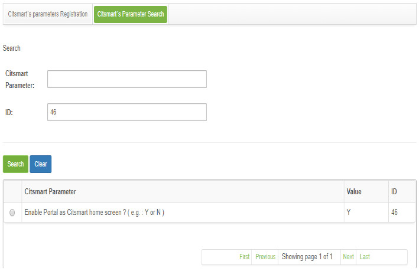
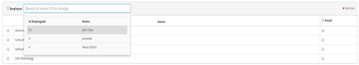

Title: FAQ
Description: Here you have the answers to the most common questions when talking about the CITSmart tool.

# Frequently Asked Questions - FAQ

!!! Question "Error: digital certificate not signed by the authority (CA)"

    Export SSL Certificates from the target application, import it into the Stash JVM TrustStore server, and then restart Stash so that Stash relies on the target application.
   
    a. Resolution of a self-signed certificate or a certificate not signed by a CA authority
   
    Default password: The Java TrutstStore password is: changeit.
   
    b. Export the Application Certificate (JIRA, Crowd, Bamboo, etc.) you want to connect to:
   
    The command syntax:

    keytool-exportação-alias <existing_alias_in_keystore>-file

    <any_filename_here>-keystore <path/to/keystore>

    For example:
   
    - Windows:
    % JAVA_HOME% \ bin \ keytool-export-apelido jira_tomcat-file jira_cert.cerkeystore C: \ Users \ jira_user \ jira.keystore
   
    - Linux:

    $ JAVA_HOME / bin / keytool-export-apelido jira_tomcat-file jira_cert.cerkeystore / home / jira_user / jira.keystore
   
    *Import the application certificate to the TrustStore server Stash*:

    The default TrustStore file (cacerts) is located in the Java home directory in this folder:
   
    <Java directory> home / jre / lib / security
   
    The command syntax:
   
    keytool-import-alias <new_unique_alias>-file
   
    <any_filename_here_from_above>-keystore <path/to/truststore>
   
    For example:
   
    - Windows:
    % JAVA_HOME% \ bin \ keytool-import-alias do jira_tomcat-file jira_cert.cer-keystore% JAVA_HOME% \ jre \ lib \ security \ 
    cacerts

    - Linux:
    $ JAVA_HOME / bin / keytool-import-alias do jira_tomcat-file jira_cert.cerkeystore $ JAVA_HOME / jre / lib / security / 
    cacerts
  
    (OPTIONAL) If you changed the default TrustStore location be sure to set the JAVA_OPTS environment variable before restarting:
  
    - Windows:
    set JAVA_OPTS =% JAVA_OPTS%-Djavax.net.ssl.trustStore = "c: \ my \ caminho \ \ aqui cacerts"-Djavax.net.ssl.trustStorePassword = "changeit"
   
    - Linux:
   
    JAVA_OPTS exportação = "$ JAVA_OPTS-Djavax.net.ssl.trustStore = / meu / path / here / cacerts-Djavax.net.ssl.trustStorePassword = changeit"
    
    Restart Stash
   
!!! Question "[Environment] Error: search does not find a document even after the base has been reindexed by system"
    
    After structural changes in the collections of the SolR, it is not enough to update SolR by the application ITSM, it is necessary to update the configsset of the SolR.
    
    Here are the steps to update:
    
    1. Remove any existing collection in configset “base_conhecimento_configs”
    2. Stop the Solr server with the command: solr stop –all
    3. Access the root folder of the $PATH_SOLR/server/solr/configsets/
    4. Delete the "base_config_configs" folder"
    5. Copy the new config that is attached to this folder
    6. Upload the Solr server with the command: solr start -noprompt
    7. Run the command to create the collection: solr create -c base_conhecimento -d base_conhecimento_configs
    8. Access the Citsmart system on the way: System > Settings > Knowledge Management (Indexing) (see knowledge [Knowledge indexing](/en-us/citsmart-platform-7/plataform-administration/data-indexing/knowledge-indexing.html))
    9. Click the button: Index Knowledge Base

!!! Question "[Environment] Loss of source path"
    
    a. Description
    
    It is not possible to generate the native report "Execution Report Request".
    
    b. Solution / Answer

    Assign ("setar") via the command line on the server the correct path of the fonts.
       
!!! Question "How do I access the service request from the e-mail notification?"
    
    To access the service request from the e-mail notification, proceed as follows:

    1. Make sure you are logged in to the system.
    2. Open the e-mail notification for the service request;
    3. The notification will have the request number with a hyperlink, just click on the number, which will then be redirected to the Service Management screen presenting the request information.
    
    !!! note "NOTE"
    
        Features of interactions with Neuro form.
        The app should fully display and interact with all controls on the Neuro form.

!!! Question "How to configure Nagios authentication via LDAP?"
    
    The Nagios authentication configuration via LDAP is:
    
    1. Change the thruk.conf file as follows:
 
    - vim /etc/apache2/conf-available/thruk.conf
    
    - <Location /thruk/>
      Options ExecCGI FollowSymLinks
      AuthName "LDAP Authentication"
      AuthType Basic
      AuthBasicProvider ldap
      AuthLDAPURL ldap://auth01.citsmartcloud.com/dc=citsmart,dc=com?uid?sub?(objectClass=*)
      Require ldap-group ou=people,o=citsmartco,dc=citsmart,dc=com
      Require valid-user
      </Location>
      
    2. Run:
    
    - /etc/init.d/apache2 restart
    
    - /etc/init.d/apache2 restart
    
    - /etc/init.d/nagios reload
      
!!! Question "How to configure the automatic satisfaction survey response?"

    The automatic response mechanism, which will answer automatically all service request satisfaction surveys, kicks in when the satisfaction survey is not filled out by the user within the deadline determined by the systems manager.

    To configure the automatic responses, proceed as instructed below:
    
    1. Configure the following system parameters which determine the behavior of the automatic response mechanism (see knowledge [Parameterization rules - Provisioning and Logistics](/en-us/citsmart-platform-7/plataform-administration/parameters-list/parametrization-provisioning.html)):
    
        - Parameter 139: Determines a deadline, in days, the user has to fill out the satisfaction survey, before it is automatically filled out by the system;
        - Parameter 152: Default rating which will be attributed to surveys that have been automatically filled out. Options: EXCELLENT, GOOD, REGULAR, POOR;
        - Parameter 151: Activates or deactivates system automatic responses. Y to activate and N to deactivate.
        
    2. Access the Batch Processing feature (System > Batch Processing).
     
    3. The batch processing entry screen will be displayed, fill out the fields:
    
        - Description: insert the description which will identify the processing. For example: "Automatic satisfaction survey response";
        - Situation: the situation determines if this processing will be active or inactive. When it is inactive the requests will not be answered;
        - Type: select the “Java Class” type;
        - Schedule: determines when the activity will be executed, it is up to the administrator to determine the best time and recurrence ;
        - Content: insert the text: br.com.centralit.citcorpore.quartz.job.AvaliarSolicitacoesNaoRespondidas;
        
     4. Click on the Save button to confirm the entry.
    
    !!! info "IMPORTANT"
    
        From the moment of the entry, at the scheduled time and date, the unanswered requests (beyond the deadline defined on parameter 139) will automatically be answered (according to the value determined on parameter 152), in case parameter 151 has an "Y" value.
        
!!! Question "How to configure the service request notification e-mails?"

    When registering a service request, perform determined activities and its execution, the petitioner will be notified.

    In order for the notification be sent it is necessary to perform the following procedures :
    
    1. Access the Contract Services related to the business service Portfolio Management > Services Portfolio > Business Service > Contract > Services and technical service Portfolio Management > Service Portfolio > Business Service > Support/Technical Service > Contract > Services e and insert the e-mail template in the fields:
    
        - "Incident/Request Opening E-mail Template"
        - "Incident/Requistion Execution E-mail Template"
        - "Incident/Request Ongoing Activities E-mail Template"
        
        !!! info "IMPORTANT"
    
            If e-mail templates are not inserted, the notification will not be sent.
        
    2. Access the Group Register feature General Registration > Staff Management > Group.

    3. The Group Register screen will be displayed. If the group has already been registered in the system, search for it;
    
    4. Select it;

    5. The intended group entry screen will be displayed, determine if the e-mail notifications (opening, in progress and execution) related to the requests will be mandatory.
    
        !!! warning "ATTENTION"
    
             If it is determined that notifications will be mandatory, when registering a service request, on the Incident/Request                Service entry screen, these options will be selected already, not allowing any changes. But if it has been determined                that notifications will not be mandatory, when registering a service request, these options will be available to be                  determined by the petitioner.
        
    6. On the Incident/Request Service Request screen, when registering a service request the rules related to the e-mail notifications will be established, determined in the group entry.
    
    !!! note "NOTE"
    
         When registering a service request, the notification will only be sent to the performer group, which is responsible for attending to the request. When the activities are in progress and then finished, the notifications will only be sent to the petitioner.
        
!!! Question "How to configure the configuration Items lifecycle phases names?"

    The configuration of the CI lifecycle phases names can be performed through the GCAS Configuration Screen and through the CITSmart parameters screen. To perform this configuration, proceed as instructed below:
    
    **Configuration through the GCAS configuration screen**
    
    1. Access the GCAS Configuration feature navigating through the main menu ITIL Processes > Configuration Management > GCAS Configuration. Afterwards, the service assets and the management parameters (attributes) configuration screen will be displayed;
    
    2. Insert the parameters value (attributes):
     
        - Name of the CIs Group which are in the Development Phase (i.e.: CIs in Development)
        - Name of the CIs Group which are in the Production Phase (i.e.: CIs in Production)
        - Name of the CIs group which are being confirmated (i.e.: CIs Being Confirmated).
        
    3. Click on the Save button to confirm the entry, at which time, date and user will be stored for a future audit.

    4. After configuring the parameters related to the CI lifecycle phases, the CI lifecycle phases' descriptions will be displayed on the Configuration Items Management screen, according to what was specified in the parameter value.
    
    a. Configuration through the GCAS configuration screen
    
    1. Access the Citsmart Parameters feature (Parametrization > Citsmart Parameters).
    
    2. Then, the Citsmart Parameters screen will be displayed, click on the Search tab. The parameter search screen will be displayed;
    
    3. Perform a search for the parameter "92 - Name of The Ci Group is In Development Phase (e.g.: CIs in Development)";
    
    4. Select it. Then, the parameter registry screen featuring the selected entry data will be displayed;
    
    5. On the Value field, insert the name of the CI group in development;
    
    6. Click on the Save button to confirm the entry, at which time, date and user will be stored for a future audit;
    
    7. Search for the parameter "93 - Name of The CIs Group in Production Phase";
    
    8. Select it. Then, the parameter registry screen featuring the selected entry data will be displayed;
    
    9. On the Value field, insert the name of the CI group in production phase;
    
    10. Click on the Save button to confirm the entry, at which time, date and user will be stored for a future audit;
    
    11. Search for the parameter "93 - Name of The CIs Group in Confirmation Phase";
    
    12. On the Value field, insert the name of the CI group in confirmation phase;
    
    13. Click on the Save button to confirm the entry, at which time, date and user will be stored for a future audit.
    
!!! Question "How to define the obligatoriness of the linking change with IC?"

    The requirement of the change link to the CI is determined on the CITSmart Parameter screen. To determine this requirement, proceed as instructed below:
    
    1. Access the CITSmart Parameter feature navigating through the main menu;
    
    2. The CITSmart Parameter screen will be displayed, click on the Search tab.
    
    3. The parameter search screen will be displayed. Search for the parameter "85 - Verification of change link related to the configuration item (Default: Y)"

    4. Select it.

    5. Then, the parameter registry screen featuring the selected entry data will be displayed, on the value field, insert the "Y" value.

    6. Click on the Save button to confirm the entry, at which time, date and user will be stored for a future audit.

    7. After configuring the parameter, when registering a Configuration Item, the change link will be mandatory
    
!!! Question "How do I set a default group for the first level service request?"

    To set the default group for 1st level attendance, proceed as follows:
    
    1. Access the Group Registration feature by navigating in the main menu Access and Permission → Group. The group registration screen will be displayed, displaying the contracts;
    
    2. Make the registration of the group of 1st level, if not registered, and proceed with the completion of the fields;
    
    3. If the 1st level group is already registered in the system, carry out the group search and obtain their identification number (ID);
    
    4. After obtaining the 1st level group ID, access the CITSmart Parameters feature by navigating through the main menu. Parameterization > Parameters CITSmart;
    
    5. The CITSmart Parameters screen appears, click the CITSmart Parameters Search tab;
    
    6. Perform the search for parameter "9 - Group ID Level 1";
    
    7. Select the same;
    
    8. The parameter registration screen with the contents of the selected record will be displayed, in the value field, enter the identification number (ID) of the 1st level group;
    
    9. Click the Record button to perform the operation, in which case the date, time and user will be automatically stored for a future audit.
    
    !!! note "NOTE"
    
        After setting the parameter, when registering a Service Request/Incident, if you have not informed the group to service the service, the group will be scaled, which was defined in the parameter For 1st level service.
        
!!! Question "How do I design the assets that make up my service?"

    The design of the assets that make up the service is done using the Service Map Design tool that provides efficient and 
    effective drawings for managing the service during its life cycle, demonstrating the related configuration items.
 
    To carry out this design, proceed as follows (see knowledge [Service attributes configuration](/en-us/citsmart-platform-7/processes/portfolio-and-catalog/configure-service-attribute.html))
    
    1. Access the Service Map Design feature for the Business Service Portfolio and Catalog Management** > Portfolio and Catalog Management > Support Menu > Advanced Portfolio > Service Catalog > Next Service > Service Map;
    
    2. The screen for designing the assets that make up the business service will be presented;
    
    3. Perform the design;
    
    4. Access the Service Asset Map Design functionality for the Support/Technical Service Portfolio and Catalog Management > Portfolio and Catalog Management > Support Menu > Advanced Portfolio > Service Catalog > Next Service > Service Map.

    5. The screen for designing the assets that make up the support / technical service will be presented;

    6. Perform the design.

!!! Question "How to enable the satisfaction survey?"

    The satisfaction survey is the evaluation of the request fulfillment performed through the e-mail notification.

    To enable the satisfaction survey, proceed as instructed below:
    
    1. Create an e-mail template (the e-mail template must contain the following keyword: ${LINKPESQUISASATISFACAO})
    
    2. Access the CITSmart Parameters feature navigating through the main menu Parametrization > CITSmart Parameters.
    
    3. The CITSmart Parameters screen will be displayed, click on the CITSmart Parameters Search tab;
    
    4. Search for the parameter 31 "Send e-mail when running requests/incidents flows";
    
    5. Select it.;
    
    6. The parameter registry screen will be displayed according to the selected entry, on the Value field, insert the "Y" value to enact sending e-mails related to the service requests.
    
    7. Click on the Save button to confirm the procedure.
    
    8. Access the request, incident and contract services for the business service Portfolio and Catalog Management > Portfolio and Catalog Management > Support Menu > Advanced Portfolio > Service Catalog > Next Service and technical service Portfolio Management and Catalog > Portfolio and Catalog Management > Support Menu > Advanced Portfolio > Service Catalog > Next Service and verify if the e-mail template that has been created is entered in the field "E-mail Template at Completion of Requests/Incidents"
    
    9. When an e-mail notification is received warning the service request has been executed, a link to the satisfaction survey will be displayed. Clicking on the link opens a screen to evaluate the attendance.
    
!!! Question "How to enable the service requests escalation rule?"

    The service request scheduling rule is enabled on the CITSmart Parameter screen. To enable this rule, proceed as follows:
    
    1. In the citsmart.cfg file put the routine START_MONITORA_INCIDENTES=TRUE
    
    2. Access the CITSmart Parameters feature by navigating in the main menu System > CITSmart Parameters;
    
    3. The CITSmart Parameters screen will appear, click the CITSmart Parameters Search tab;
    
    4. Search and change the parameter 190 - Turns on the operation of the scheduling rules (Eg: Y or N - Default: 'N') informing the value "Y" to activate service request scheduling;
    
    5. Search and change the parameter 31 - Sends e-mail in the execution of request/incident flows (Eg: Y or N), informing the value "Y"
    
    6. Search and change the parameter 297 - Disable sending system e-mails (Values:" Y "or" N "Default:" N ") informing the value "N";
    
    7. Also make the necessary changes in the following parameters, according to the need and scenario of the installation:
    
        - 195: E-mail template id for sending deadline request notification (Eg: 1);
        - 197: User login that will receive e-mail regarding service request scheduling rules that are expiring (eg Consultant);
        - 113: E-mail Template ID for Auto Escalation;
        - 10: SMTP SEND - E-mail origin of service request notifications;
        - 33: System access URL.
        
    8. Click the Save button to perform the operation, in which case the date, time and user will be automatically stored for a future audit.
    
!!! Question "How to enable the change module escalation rule?"

    The changes escalating rule is enacted on the CITSmart Parameter screen.

    To enable this rule, proceed as follows:
    
    1. Access the CITSmart Parameters feature navigating through the main menu Parametrization > CITSmart Parameters;
    
    2. The CITSmart Parameters screen will be displayed, click on the CITSmart Parameters Search tab;
    
    3. The CITSmart Parameters search screen will be displayed, search for the parameter "193 - Enable Change Escalation Rules (e.g. : Y or N - Default ´N´)";
    
    4. The parameter registry screen will be displayed according to the selected entry, on the Value field, insert the "Y" value to enact the change escalation;
    
    5. Click on the Save button to confirm the procedure, at which date, time and user will automatically be stored for a future audit.
    
!!! Question "How to enable the scheduling rule of the problems module?"

    The problem scaling rule is enabled on the Citsmart Parameter screen. To enable this rule, proceed as follows:
      
    1. Access the Citsmart Parameters feature by navigating in the main menu Parameterization > Citsmart Parameters.
    
    2. The Citsmart Parameters screen will appear, click the Citsmart Parameters Search tab.
    
    3. It will display the screen for parameter search, perform the parameter search "194 - Enable the problem escalation defined in the scheduling rules (Ex: Y or N - Default 'N')" and select the same.
    
    4. The parameter registration screen with the contents of the selected record will be displayed, in the value field, enter the value "Y" to enable problem escalation;
    
    5. Click the Record button to perform the operation, in which case the date, time and user will be automatically stored for a future audit.
    
!!! Question "How to enable automatic e-mail reading routine?"

    When sending an e-mail to CITSmart support, the automatic e-mail will be read, if the e-mail refers to a request, the title of the e-mail will be verified, if it contains the word 'Request' and the Number of the request, if it contains, the e-mail will be stored as an occurrence in the relevant request.

    For this e-mail reading routine to work perfectly, the following procedures must be followed:
    
    1. Install the java 7 version, if it has lower version the routine will not work;
    
    2. Access the Citsmart Parameters feature by navigating in the main menu Parameterization > Citsmart Parameters;
    
    3. The Citsmart Parameters screen will appear, click the Citsmart Parameters Search tab;
    
    4. It will display the screen for parameter search, search the parameter "23-SMTP READ - Service Desk mail entry server" and select it;
    
    5. The parameter registration screen with the contents of the selected record will be displayed, in the value field, inform the e-mail entry server (eg orion.egrupo.com.br);
    
    6. Click the Record button to perform the operation, in which case the date, time and user will be automatically stored for a future audit.
    
    7. Perform the search for the parameter "24 - SMTP READY - Service Desk mail inbox" and select the same;
    
    8. The parameter registration screen with the contents of the selected record will be displayed in the value field, inform the e-mail or login of the e-mail account (eg support.citsmart);
    
    9. Click the Record button to perform the operation, in which case the date, time and user will be automatically stored for a future audit;
    
    10. Perform the parameter search "25 - SMTP READY - Service Desk E-Mailbox Password" and select the same;
    
    11. The parameter registration screen with the contents of the selected record will be displayed, in the value field, the password of the e-mail account;
    
    12. Click on the Save button to perform the operation, in this case the date, time and user will be stored automatically for a future audit;
    
    13. Perform the search of the parameter "26 - SMTP READY - Service Desk e-mail server provider (imaps, pops, imap, pop, etc)" and select it:
    
    14. The parameter registration screen with the contents of the selected record will be displayed in the value field, inform the protocol that will be used to read e-mails (eg imap or pop) and click the Save button to perform the operation, In this case the date, time and user will be stored automatically for a future audit;
    
    15. Perform the search for the parameter "27 - SMTP READY - Service Desk mail server port" and select the same;
    
    16. The parameter registration screen with the contents of the selected record will be displayed, in the value field, enter the port that will be used to access the mail server (587 for pop server or 995 for imap server);
    
    17. Click the Record button to perform the operation, in which case the date, time and user will be automatically stored for a future audit;
    
    18. Perform the search for the parameter "28 - SMTP READY - Service Desk E-Mailbox Folder" and select it;
    
    19. The parameter registration screen with the contents of the selected record will be displayed, in the value field, inform the folder of the e-mail account's inbox;
    
    20. Click the Record button to perform the operation, in which case the date, time and user will be automatically stored for a future audit;
    
    21. Perform the search for the parameter "200 - Enable routine for reading new e-mails automatically (ex: Y or N - Default 'N')" and select the same one;
    
    22. The parameter registration screen with the contents of the selected record will be displayed, in the value field, enter the "Y" value to activate the automatic reading routine;
    
    23. Click the Record button to perform the operation, in which case the date, time and user will be automatically stored for a future audit.
    
!!! Question "How to enable the portal?"

    In order for users to have access to the Portal or Smart Portal, you must enable it as follows:
    
    1. Access the Citsmart Parameters feature by navigating in the main menu Parameterization > Citsmart Parameters. The Citsmart Parameters screen will appear, click the Citsmart Parameters Search tab. Once this is done, it will display the screen for parameter search;
    
    2. Perform the parameter search "46 - Enable Portal as Citsmart home screen?" And select the same. After that, the parameter registration screen with the contents of the selected registry will be displayed, as shown in the figure below:
    
        
    
        **Figure 1 - Citsmart parameter search screen**
    
    3. In the Value field, enter the value "Y" to enable the portal as the home screen. Once this is done, click on the Save button to perform the operation, in which case the date, time and user will be stored automatically for a future audit.

    4. After setting the parameter, when logging into the system, the Portal will be displayed as the home screen.
    
!!! Question "How to integrate the client company AD into CITSmart Enterprise ITSM that is in the cloud offered by CITSmart Corporation?"

    Regarding the LDAP compliance of CITSmart Enterprise ITSM, there are two scenarios:

    1. On-demand environments: Administrator must connect to the client's directory server.
 
    2. Cloud environment (offered by CITSmart Corporation): Administrator must enable the connection to the client directory server.
    
!!! Question "How to improve the performance of CITSmart Enterprise ITSM?"

    System performance is defined as the time the software takes to perform a given task, since this performance is a strong quality attribute perceived by software users.

    There is the capability of the system to work with more than one instance. For this, it is necessary to use the configuration file (citsmart.cfg), where you can activate or inactivate routines.

    To use this capability, the citsmart.cfg file must exist in the directory:
    
    - \jboss\standalone\configuration\ (quando o Jboss sobe como uma única instância)
    - \jboss\domain\configuration\ (quando é utilizado cluster, tem domains e hosts)
    
    Here are the guidelines you need to complete the configuration:
    
    !!! note "NOTE"
    
        Where ${value} is replaced by the corresponding values.
        
    1. **START_MODE_RULES=${value}** (This parameter defines whether to process scheduling rules. Enter the value TRUE to activate or FALSE to disable).
    
    2. **START_MODE_ITSM=${value}** (This parameter defines whether to display the ITSM interface.) Enter the value TRUE or FALSE, if it is set to FALSE, it will not allow you to open the ITSM (Incident, etc.) functionality.
    
    3. **START_MONITORING_ASSETS= ${value}** (This parameter sets whether asset tracking is enabled. Enter the value TRUE to activate or FALSE to disable).
    
    4. **QUANTITY_BACKUPLOGDADOS = ${value}** (This parameter defines the number of items in the table that are to be backed up. Enter the number of items, eg 1000).
    
    5. The parameters below when not enabled causes the system to go up with threads disabled to improve system performance. It is necessary to configure these parameters before starting Jboss for their operation.
    
    6. **START_MONITORA_INCIDENTES= $ {value}** (This parameter sets whether to disable incident tracking. Enter the value TRUE on or FALSE on).
    
    7. **START_VERIFY_EVENTS = ${value}** (This parameter sets whether to disable event checking. Enter the value TRUE on or FALSE on).
    
    8. Use of the parameters below is optional. They separate the main connection pool with the flow, inventory, and report execution pool.
    
        - **JDBC_ALIAS_BPM = java: / jdbc / $ {value}** (This parameter defines the name of the datasource of the stream. Enter the name of the datasource, eg java: / jdbc / citsmartFlux).
        - **JDBC_ALIAS_INVENTORY = java: / jdbc / $ {value}** (This parameter defines the name of the datasource of the inventory. Enter the name of the datasource, eg java: / jdbc / citsmart_inventory).
        - **JDBC_ALIAS_REPORTS = java: / jdbc / $ {value}** (This parameter defines the name of the datasource of the reports. Enter the name of the datasource, eg java: / jdbc / citsmart_reports).
        
    9. The following parameter separates the processing of the BPM event routine into a separate thread pool from the main system thread pool, to ease the use of database and server resources.
        
        - JDBC_ALIAS_BPM_EVENTOS = java: / jdbc / $ {value} (This parameter defines the name of the BPM event datasource. Enter the name of the datasource, eg java: / jdbc / citsmartBpmEvents).
        
!!! Question "How to navigate the screens using the CITSmart Enterprise ITSM controls?"

    [Navigation](/en-us/citsmart-platform-7/get-started/navigate.html)
    
!!! Question "How can Event Management become a business monitoring tool?"

    a. Webservice scheme for legacy systems (business monitoring)
    
    You can connect the EVM component to any software, even one other than the one the Event Management module normally integrates (Nagios, Zabbix and Inventory) as long as the data sent via webservice follows a pre-set standard.

    Once the data is sent to the CITSmart Event Monitor, rules can be created (for example, with the Esper EPL) so that certain events are triggered according to some condition observed in the data.

    Example "Payroll":
    
    - Let's say it's the rule that one company does not hire more than 5 employees per industry.

    - The payroll program could send the minimum data of each hiring by department (defined in the company's budget plan), so that whenever the contraction number per department exceeds the pre-established limit, an event of "excess hiring "Could be fired.

        
!!! Question "How to relate group to contract?"

    [Relate](/en-us/citsmart-platform-7/processes/tickets/relate-group.html)
    
!!! Question "How to relate unit to contract?"

    [Relate](/en-us/citsmart-platform-7/processes/tickets/relate-unit.html)
    
!!! Question "How are documents ranked at the time of SOLR knowledge base search?"

    To rank the documents at the time of the search, Solr generates a score for each document.

    Thus, the document that has the highest score, is presented first and the others, with lower scores, in sequence.

    To calculate the document score Solr uses a standard algorithm, where the frequency of the searched term is checked. But, it is possible to change the punctuation with the use of the boosts.

    Solr's boosters can be used in two moments at the time of indexing or query, and their use in search is more common.

    Some boosters that may change the calculation of the score at the time of the survey are:
    
    - term^num: where "num" is the importance of the search term, example: incident^2;
    - And the field boosters and dismax and edismax functions can also be used to boost search.
        
    At ITSM, no booster is used, so far, only Solr's standard score calculation is used, and at the end of the search the ranking is done by the score and by the number of times the knowledge was voted / liked.
    
    Boosters are open for use, but to use them requires a better analysis of the importance of fields and documents added to Solr, by the knowledge base.
    
!!! Question "How to link staff members (users) to a group?"

    There are two ways to link staff members (users) to groups, being:
    
    a. From the group´s registry
    
    1. Access the Group Entry feature navigating through the main menu. Place the cursor on the option Access and Permissions, and click on the Group option (see knowledge [Group registration and search](/en-us/citsmart-platform-7/initial-settings/access-settings/user/group.html));
    
    2. The Group Entry screen will be displayed. If the group is already registered in the system, perform a group search and select it. Then, the intended group entry screen will be displayed;

    3. Click on the add icon of the Staff Member field, the staff member search screen will be displayed;

    4. Search for the intended staff member and select the entry to add them to the group. Afterwards, the staff member will be linked to the group as exemplified on the following image:
    
        
        
         **FigurE 1 - Staff screen**
        
    5. After linking, click on the Save button to confirm the entry, at which date, time and user will be automatically stored for a future audit.
    
    b. From the user´s registry
    
      1. Access the User Entry feature navigating through the main menu. Place the cursor on the option General Registration, Staff Management and click on the User option (see knowledge [Staff registration and search](/en-us/citsmart-platform-7/initial-settings/access-settings/user/employee.html));

      2. The User Entry screen will be displayed. If the user is already registered in the system, perform a user search and select it;

      3. Click on the add icon of the Group field, the group search screen will be displayed;

      4. Search for the intended group and select it. Afterwards, the user will be linked to the group;

      5. After linking, click on the Save button to confirm the entry, at which date, time and user will be automatically stored for a future audit
    
!!! Question "[Events] Error: "Failed to connect to monitoring tool" for Zabixx"

    Check the zabbix context

    Example:

    Evm looks for zabbix.

    Zabbix needs to point to the zabbix context.
    
    See also
    
    - [Event monitoring tools registration and search](/en-us/citsmart-platform-7/processes/event/event-monitoring-tools.html)
    
!!! Question "Will the backup be overwritten or will there be a file for every day?"

    If your routine has a daily backup, a file will be created every day, containing the name and date of the file.
    
!!! Question "What does it take to configure an IC that is physically on the client's corporate network to be inventoried by the CITSmart Enterprise ITSM that is in the cloud offered by CITSmart Corporation?"

    [Original] In the cloud, mongodb and EVM / IVN are in the client structure, because it is not possible to connect in an internal range with source from the cloud.

    [For validation] In this particular scenario, the MongoDB, CITSmart EVM, and CITSmart Inventory components must be installed and configured within the client's network framework because CITSmart Enterprise ITSM (Cloud) can not connect to a client's internal range.
    
!!! Question "To which recipient will be sent notifications of ICs?"

    IC notifications will be sent to the recipient defined in the Citsmart Parameter screen.

    To set the recipient, proceed as follows:
    
    1. Access the Citsmart Parameters feature by navigating in the main menu Parameterization → Citsmart Parameters.

    2. The Citsmart Parameters screen will appear, click the Citsmart Parameters Search tab.

    3. It will display the screen for parameter search;

    4. Perform the search for parameter "90 - Sending Notification E-mails from ICs (1-Group, 2-Owner, 3-All)"

    5. Select the same.

    6. The parameter registration screen with the contents of the selected record will be displayed, in the value field, enter the identification number of the recipient (1 - Group, 2 - Owner or 3 - All)

    7. Click the Record button to perform the operation, in which case the date, time and user will be stored automatically for a future audit;

    8. After configuration of the parameter, notifications of IC notifications will be sent to the recipient (group, owner or all), as specified in the parameter value.

    
!!! Question "Why will service request numbering not always follow a strict / perfect sequential order on the service request screen or in some reports?"

    Both the Service Request screen and some reports (such as "Quality of Service - SLA"), the ordering of the number of requests follows an increasing sequential order, except when:
    
    1. The reports group the data by some special criteria (eg, by SLA, which is what happens in the case of the report "Quality of Service - SLA")

    2. When the feature called Sequence Block is impacted by an external factor, this occurs if:

      - There is an application stop for version upgrade, or environment maintenance and later return.
    
      - The environment is clustered.
    
!!! Question "Why in some reports does the same request appear more than once?"

    In some reports such as "Report Incidents / Service Requests - Detailed", both in pdf format and in xls format, the same request may exist more than once, however they are distinct details because it deals with each step of the request, so each time it "repeats" is because it changes the task, or the responsible, or the phase, or the situation, or the group solver or the final hour of service.

    In other reports, such as the "Report Incidents / Service Requests", there is no detail of the request according to the activities and therefore the request is not shown more than once.
    
!!! Question "Why is the result "Empty Report" when generating the reportQuantitativeControlPercentual when selecting in the filter the situation "in progress" and the "solver group"?"

    This is not an error, the solver group field is populated only when the request is terminated, this causes to only brings results to situations such as "Closed", incompatible with what is being requested / reported in the filters.
    
!!! Question "Why are the schedules created by the tool different from the current time?"

    *Scenario*
    
    1. When creating a ticket, the time is different from the actual time, alternating between 1 (one) and 3 (three) hours of delay or advance.
    
    *What to check*
    
    1. Postgresql database configuration file:
    
        - Postgresql.conf
        - timezone = 'BRAZIL/EAST'
        
    2. On the container cloud:

        - Setting timezone on the operating system.
        
    3. Setting up the TimeZone on the JRE:
    
        - https://docs.oracle.com/javase/9/troubleshoot/time-zone-settings-jre.htm#JSTGD362
        
!!! Question "What is the type of permission for the Logdados table backup folder?"

    The folder permissions must be to read and write for the JBoss user.
    
!!! Question "What is the meaning of each inventory status of CIs?"

    - **Inventory** - the inventory was able to read the CI information and ended successfully;
    - **Ignored** - In the citsmart / pages / evmInventoryConfiguracao / evmInventoryConfiguracao.load screen we have an option to ignore the machines being inventoried, this markup appears when this occurs;
    - **Unreachable** - When the server encounters the IC but can not bring the information;
    - **Not inventoried** - When neither it finds the IC in the network, but knows that it already existed;
    - **Running** - While reading the inventory, the IC is in this status.
    
!!! Question "What is the set of scripts indicated for the complete exclusion of a portfolio?"

    Assuming the Portfolio number is 1 just to exemplify.
    
    DELETE FROM ocorrenciaservicocontrato osc WHERE osc.ID IN(
    SELECT osc.id from ocorrenciaservicocontrato osc
    INNER JOIN ocorrenciaservico os ON os.IDOCORRENCIASERVICO = osc.IDOCORRENCIASERVICO
    INNER JOIN servico s on s.idservico = os.idservico 
    INNER JOIN portfolioservico p on p.idportfolioservico = s.idportfolioservico
    WHERE p.idportfolioservico = 2);
    
    DELETE FROM ocorrenciaservicodetalhes osd WHERE osd.ID in (
    SELECT osd.ID FROM ocorrenciaservicodetalhes osd
    INNER JOIN ocorrenciaservico os ON os.IDOCORRENCIASERVICO = osd.IDOCORRENCIASERVICO
    INNER JOIN servico s on s.idservico = os.idservico 
    INNER JOIN portfolioservico p on p.idportfolioservico = s.idportfolioservico
    WHERE p.idportfolioservico = 2);
    
    DELETE FROM ocorrenciaservicorelacionado oscr WHERE oscr.ID IN( 
    SELECT oscr.ID FROM ocorrenciaservicorelacionado oscr
    INNER JOIN ocorrenciaservico os ON os.IDOCORRENCIASERVICO = oscr.IDOCORRENCIASERVICO
    INNER JOIN servico s on s.idservico = os.idservico 
    INNER JOIN portfolioservico p on p.idportfolioservico = s.idportfolioservico
    WHERE p.idportfolioservico = 2);
    
    DELETE FROM ocorrenciaservico os WHERE os.IDOCORRENCIASERVICO IN (
    SELECT os.IDOCORRENCIASERVICO FROM ocorrenciaservico os
    INNER JOIN servico s on s.idservico = os.idservico 
    INNER JOIN portfolioservico p on p.idportfolioservico = s.idportfolioservico
    WHERE p.idportfolioservico = 2);
    
    DELETE FROM avaliacaoservico avs WHERE avs.IDAVALIACAOSERVICO IN (
    SELECT avs.IDAVALIACAOSERVICO FROM avaliacaoservico avs
    INNER JOIN servico s on s.idservico = avs.idservico 
    INNER JOIN portfolioservico p on p.idportfolioservico = s.idportfolioservico
    WHERE p.idportfolioservico = 2);
    
    DELETE FROM acordoservicocontrato acsc WHERE acsc.IDACORDOSERVICOCONTRATO IN(
    SELECT acsc.IDACORDOSERVICOCONTRATO FROM acordoservicocontrato acsc
    INNER JOIN servicocontrato sc ON sc.IDSERVICOCONTRATO = acsc.IDSERVICOCONTRATO
    INNER JOIN servico s on s.idservico = sc.idservico 
    INNER JOIN portfolioservico p on p.idportfolioservico = s.idportfolioservico
    WHERE p.idportfolioservico = 2);
    
    DELETE FROM fluxoservico fs WHERE fs.idfluxoservico IN(
    SELECT fs.idfluxoservico FROM fluxoservico fs
    INNER JOIN servicocontrato sc ON sc.IDSERVICOCONTRATO = fs.IDSERVICOCONTRATO
    INNER JOIN servico s on s.idservico = sc.idservico 
    INNER JOIN portfolioservico p on p.idportfolioservico = s.idportfolioservico
    WHERE p.idportfolioservico = 2);
    
    DELETE FROM servicocontrato sc WHERE sc.IDSERVICOCONTRATO IN(
    SELECT sc.IDSERVICOCONTRATO FROM servicocontrato sc
    INNER JOIN servico s on s.idservico = sc.idservico 
    INNER JOIN portfolioservico p on p.idportfolioservico = s.idportfolioservico
    WHERE p.idportfolioservico = 2);
    
    DELETE FROM servicoautorelacionamento servauto WHERE servauto.IDSERVICOAUTORELACIONAMENTO IN(
    SELECT servauto.IDSERVICOAUTORELACIONAMENTO FROM servicoautorelacionamento servauto
    INNER JOIN servico s on s.idservico = servauto.idservico 
    INNER JOIN portfolioservico p on p.idportfolioservico = s.idportfolioservico
    WHERE p.idportfolioservico = 2);
    
    DELETE FROM servico s WHERE s.idservico IN(
    SELECT s.idservico FROM servico s
    INNER JOIN portfolioservico p on p.idportfolioservico = s.idportfolioservico
    WHERE p.idportfolioservico = 2);
    
    DELETE FROM portfolioservico p WHERE p.idportfolioservico = 2;
    
!!! Question  "What is the set of scripts set to clear all inventory data and configuration items?"

    1. update evm_gerente set iditemconfiguracaopai = null;
    2. update parametrocorpore set valor = 'NAME' where idparametrocorpore = 4;
    3. update recurso set iditemconfiguracao = null where iditemconfiguracao is not null;
    4. update evm_gerente set iditemconfiguracaopai = null
    5. delete from empregadoitemconfiguracao;
    6. delete from eventoitemconfiguracao;
    7. delete from historicotentativa;
    8. delete from justificacaofalha;
    9. delete from usuarioitemconfiguracao;
    10. delete from requisicaomudancaitemconfiguracao;
    11. delete from requisicaoliberacaoitemconfiguracao;
    12. delete from problemaitemconfiguracao;
    13. delete from conhecimentoic;
    14. delete from softwareslistanegraencontrados;
    15. delete from itemconfiguracaoevento;
    16. delete from itemcfgsolicitacaoserv;
    17. delete from imagemitemconfiguracao;
    18. delete from auditoriaitemconfig;
    19. delete from historicovalor;
    20. delete from historicoic;
    21. delete from valor;
    22. delete from caracteristica;
    23. delete from tipoitemcfgcaracteristica;
    24. delete from tipoitemconfiguracao;
    25. delete from itemconfiguracao;
    
!!! Question "What is the attachment upload features file size limit?"

    The attachment upload features specify a 15 MB size limit for each file loaded into the system. However, on the portal screen the size limit remains at 5 MB.
    
!!! Question "What is the meaning of each privacy a knowledge can have in the knowledge base?"

    - **Public**: all users with access to the Knowledge Portal have access, regardless of whether they have access to the knowledge folder.
    - **Confidential**: only author and approver can view knowledge.
    - **Internal**: only people with permission in the knowledge folder can view.
    
!!! Question "When is removed the data from the Logdata table?"

    The backup routine of the LogData table removes the data from the table and saves it to a file, that is, the table becomes clean after processing.
  
!!! Question "When does data synchronization occur with LDAP?"

    The system synchronizes the credential data of its users with LDAP in three different situations:

    1. On application activation, usually in sequence to the product version update procedure;

    2. When the user logs in (access to the system with its login and password), then the system automatically checks the user's authentication and permission;

    3. In the LDAP Configuration menu option, when the user clicks its 'Synchronize' link.
    
!!! Question "[Ticket/task] Error: Ticket / task registration time different from a server"

    *Description*:
    
    The client informs that the time of the creation of a call is with the different time of a server.
    
    *Solution/response*:
    
    To check the time in the database, follow these steps:

    1. Access the scripting functionality by navigating in the main menu System > Database > Scripts Execution;

    2. The Scripts Execution screen will be displayed;

    3. Insert in the SQL Query field the the following query: SELECT CURRENT_TIMESTAMP ;

    4. Click on the Execute;

    5. The system returns the following results:

       - First the result of the date and time of the database;

       - According to the Server's schedule.

    6. Check the times and if they do not match the current time of your location open a call with this evidence to the Infrastructure.
    
!!! tip "About"

    <b>Product/Version:</b> CITSmart | 7.00 &nbsp;&nbsp;
    <b>Updated:</b>09/17/2019 - Anna Martins
    
